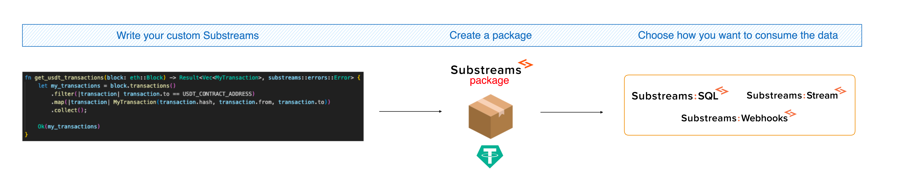

Substreams is a technology that allows you to **extract blockchain data in a fast and reliable way!**

**In order to define which specific data you want to extract from the blockchain, you can use Substreams packages**. For example, consider that you want to retrieve data from the Uniswap v3 smart contract. You can simply use the [Uniswap v3 Substreams Package](https://substreams.dev/streamingfast/uniswap-v3/v0.2.7) and send that data wherever you want!

## Consume Substreams

There are many ready-to-use Substreams packages, so you can simply consume them. Use the **Substreams Registry ([https://substreams.dev](https://substreams.dev)) to explore packages**.

Once you find a package that fits your needs, you only have choose **how you want to consume the data**. Send the data to a SQL database, configure a webhook or stream directly from your application!

<figure></figure>

## Develop Substreams

If you can't find a Substreams package that retrieves exactly the data you need, **you can develop your own Substreams**.

<figure></figure>

## How Does It Work?

The following video covers how Substreams works in less than 2 minutes:


Get an overview of Substreams
