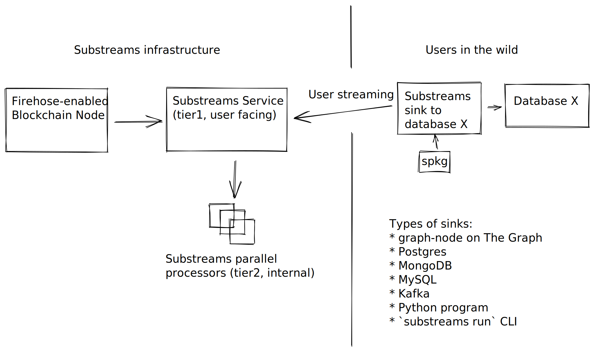

# Substreams

## Welcome to Substreams documentation

Substreams is a powerful blockchain indexing technology, developed for [The Graph Network](https://thegraph.com).

> Substreams enables developers to write Rust modules, composing data streams alongside the community, and provides extremely high-performance indexing by virtue of parallelization, in a streaming-first fashion.
>
> Substreams have all the benefits of StreamingFast Firehose, like low-cost caching and archiving of blockchain data, high throughput processing, and cursor-based reorgs handling.

### Where to start

Learn about Substreams in a short, dense 25-minute intro and understand its impact on the blockchain ecosystem.


A walkthrough of Firehose features, Substreams modules, including a sample Rust module and StreamingFast's vision.


Learn essential facts about Substreams through [reading the Benefits and comparison](concepts-and-fundamentals/benefits.md).

The primary ways to use Substreams include:

* [Installing the `substreams` CLI](getting-started/installing-the-cli.md)
* [Going through the Quickstart](getting-started/quickstart.md)

After installing Substreams and reviewing the Quickstart:

* You can [learn more about modules](concepts-and-fundamentals/modules.md), and then [study the Developer's guide](developers-guide/overview.md).

Find pre-built Substreams by using the following resources:

* The [Substreams Template](https://github.com/streamingfast/substreams-template) helps expedite the process of getting you up and running.
* A [list of maintained Substreams examples](reference-and-specs/examples.md)

### Network model diagram

**You can view Substreams from two perspectives** as illustrated in the high-level visual diagram. It can be viewed through the perspective of the **Substreams engine** itself and also the perspective of the **end-user developer and consumer**.

### Community

Substreams is an open source community effort, so feel free to suggest new topics, report issues, and provide feedback. Contribute through GitHub [pull requests](https://docs.github.com/en/pull-requests/collaborating-with-pull-requests/proposing-changes-to-your-work-with-pull-requests/about-pull-requests).

* [StreamingFast Discord](https://discord.gg/mYPcRAzeVN)
* [The Graph Discord](https://discord.gg/vtvv7FP)
* [StreamingFast on Twitter](https://twitter.com/streamingfastio)
* [StreamingFast on YouTube](https://www.youtube.com/c/streamingfast)

### Contributing

For additional information, [refer to the general StreamingFast contribution guide](https://github.com/streamingfast/streamingfast/blob/master/CONTRIBUTING.md).

### License

Substreams uses the [Apache 2.0](../LICENSE/) license.

### Disclaimer

The content in the Substreams documentation was created through StreamingFast's full effort. It is up to the reader to validate the accuracy of all content presented. Substreams is in active development and, at times, the associated documentation becomes outdated. [Contact StreamingFast](https://discord.gg/mYPcRAzeVN) to report problems or service interruptions.


**Note**: The Substreams documentation uses the [Google developer documentation style guide](https://developers.google.com/style) for its style and formatting.

