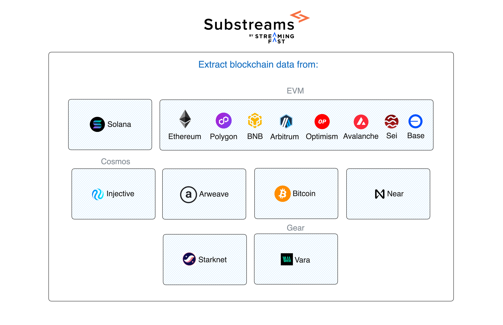

Substreams is a powerful indexing technology, which allows you to:
- Extract data from several blockchains (Solana, Ethereum, Polygon, BNB...).
- Apply custom transformations to the data.
- Send the data to a place of your choice (for example, a Postgres database or a file).

<figure></figure>

**You can use Substreams packages to define which specific data you want to extract from the blockchain**. For example, consider that you want to retrieve data from the Uniswap v3 smart contract. You can simply use the [Uniswap v3 Substreams Package](https://substreams.dev/streamingfast/uniswap-v3/v0.2.7) and send that data wherever you want!

## Consume Substreams

There are many ready-to-use Substreams packages, so you can simply consume them. Use the **([Substreams.dev Registry](https://substreams.dev)) to explore packages**.

Once you find a package that fits your needs, you only have choose **how you want to consume the data**. Send the data to a SQL database, configure a webhook or stream directly from your application!

<figure></figure>

## Develop Substreams

If you can't find a Substreams package that retrieves exactly the data you need, **you can develop your own Substreams**.

You can write your own Rust function to extract data from the blockchain:



The following function extracts Solana instructions from a specific program ID.
```rust
fn map_filter_instructions(params: String, blk: Block) -> Result<Instructions, Vec<substreams::errors::Error>> {
    let filters = parse_filters_from_params(params)?;

    let mut instructions : Vec<Instruction> = Vec::new();

    blk.transactions.iter().for_each(|tx| {
        let msg = tx.transaction.clone().unwrap().message.unwrap();
        let acct_keys = msg.account_keys.as_slice();
        let insts : Vec<Instruction> = msg.instructions.iter()
            .filter(|inst| apply_filter(inst, &filters, acct_keys.to_vec()))
            .map(|inst| {
            Instruction {
                program_id: bs58::encode(acct_keys[inst.program_id_index as usize].to_vec()).into_string(),
                accounts: inst.accounts.iter().map(|acct| bs58::encode(acct_keys[*acct as usize].to_vec()).into_string()).collect(),
                data: bs58::encode(inst.data.clone()).into_string(),
            }
        }).collect();
        instructions.extend(insts);
    });

    Ok(Instructions { instructions })
}
```



The following function extracts USDT transaction from EVM blockchains.
```rust
fn get_usdt_transaction(block: eth::Block) -> Result<Vec<Transaction>, substreams:error:Error> {
    let my_transactions = block.transactions().
        .filter(|transaction| transaction.to == USDT_CONTRACT_ADDRESS)
        .map(|transaction| MyTransaction(transaction.hash, transaction.from, transaction.to))
        .collect();
    Ok(my_transactions)
}
```




## How Does It Work?

The following video covers how Substreams works in less than 2 minutes:


Get an overview of Substreams
