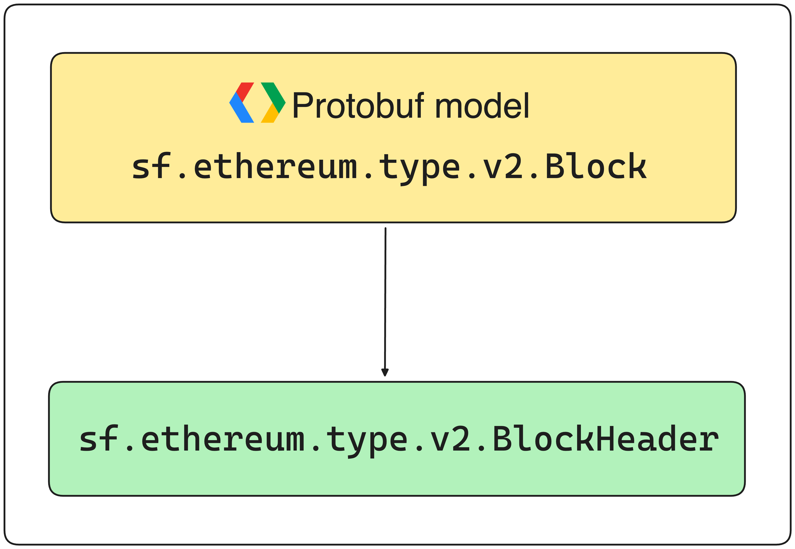

The [Block](https://github.com/streamingfast/firehose-ethereum/blob/develop/proto/sf/ethereum/type/v2/type.proto#L9) model contains very useful information, such as transactions or logs, but you can also find relevant information about the block itself. The [BlockHeader](https://github.com/streamingfast/firehose-ethereum/blob/develop/proto/sf/ethereum/type/v2/type.proto#L58) model contains fields such as `nonce`, `parent_hash` or `gas_used`.

<figure><figcaption><p>EVM-compatible Protobuf Structure - Block Header</p></figcaption></figure>

# Retrieve Block Basic Data

```rust
use substreams::Hex;
use substreams_ethereum::pb::eth::v2::Block;

struct BlockData {
    hash: String,
    number: u64,
    size: u64
}

fn block_data(blk: Block) -> BlockData {
    return BlockData { 
        hash: Hex::encode(blk.hash),
        number: blk.number,
        size: blk.size 
    }
}
```

# Retrieve Block Header Data

```rust
use substreams::Hex;
use substreams_ethereum::pb::eth::v2::Block;

struct BlockHeaderData {
    parent_hash: String,
    gas_limit: u64,
    gas_used: u64,
    nonce: u64,
}

fn block_data(blk: Block) -> BlockHeaderData {
    let header = blk.header.unwrap();

    return BlockHeaderData {
        parent_hash: Hex::encode(header.parent_hash),
        gas_limit: header.gas_limit,
        gas_used: header.gas_used,
        nonce: header.nonce,
    };
}
```