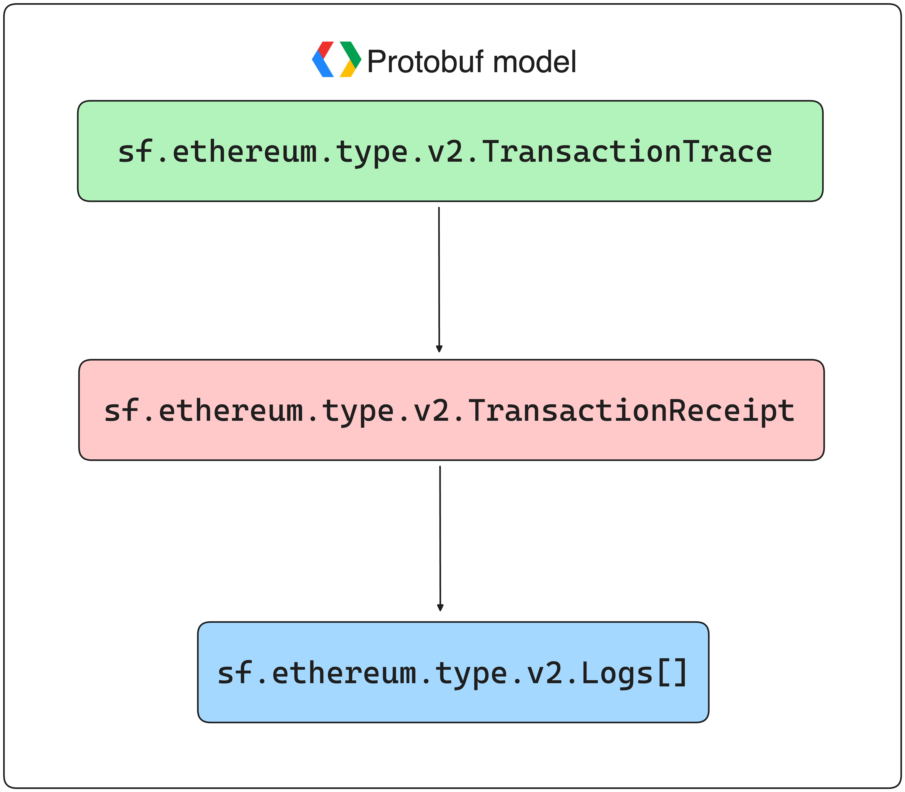

The logs of a transaction are contained in the [TransactionReceipt](https://github.com/streamingfast/firehose-ethereum/blob/develop/proto/sf/ethereum/type/v2/type.proto#L296) model.

There is also a helper method in the [Block](https://github.com/streamingfast/firehose-ethereum/blob/develop/proto/sf/ethereum/type/v2/type.proto#L9) object (`block.logs()`), which retrieves all the logs for the block.

<figure><figcaption><p>EVM-compatible Protobuf Structure - Logs</p></figcaption></figure>

# Retrieving the Logs of a Transaction

Given a [TransactionTrace](https://github.com/streamingfast/firehose-ethereum/blob/develop/proto/sf/ethereum/type/v2/type.proto#L157):
1. Get TransactionReceipt (`receipt` property)
2. Get logs from TransactionReceipt (`receipt.logs` property) 

```rust
use substreams::Hex;
use substreams_ethereum::pb::eth::v2::TransactionTrace;

struct Log {
    address: String,
    topics: Vec<String>,
    tx_hash: String
}

fn transaction_logs(transaction: &TransactionTrace) -> Vec<Log> {
    return transaction.receipt.unwrap().logs
        .iter()
        .map(|log| Log {
            address: Hex::encode(log.address),
            topics: log.topics.into_iter().map(Hex::encode).collect(),
            tx_hash: Hex::encode(&transaction.hash),
        })
        .collect();
}
```

# Retrieving the Logs of a Smart Contract

Given a [Block](https://github.com/streamingfast/firehose-ethereum/blob/develop/proto/sf/ethereum/type/v2/type.proto#L9) and a smart contract address (`String`):
1. Use the `logs()` method to get all the logs for the corresponding block.
2. Filter every log by its address (`address` property).

```rust
use substreams::Hex;
use substreams_ethereum::pb::eth::v2::Block;

struct ContractLog {
    address: String,
    topics: Vec<String>,
    tx_hash: String
}

fn get_contract_logs(contract_address: String, blk: Block) -> Vec<ContractLog> {
    let events: Vec<ContractLog> = blk
        .logs()
        .filter(|log| log.address().to_vec() == Hex::decode(&contract_address).unwrap())
        .map(|log| ContractLog {
            address: Hex::encode(log.address()),
            topics: log.topics().into_iter().map(Hex::encode).collect(),
            tx_hash: Hex::encode(&log.receipt.transaction.hash),
        })
        .collect();

    return events;
}
```

