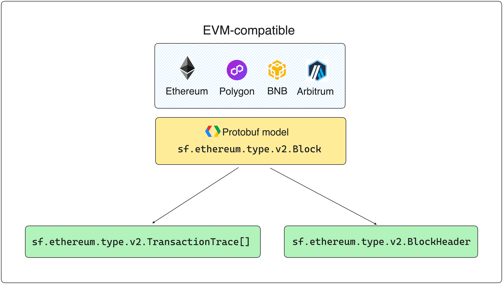

All EVM-compatible chains (Ethereum, BNB, Polygon and Arbitrum) share the same Protobuf model. A blockchain block is represented by the [Block](https://github.com/streamingfast/firehose-ethereum/blob/develop/proto/sf/ethereum/type/v2/type.proto#L9) object, which you can use to retrieve transactions, logs, or calls, among other information.

<figure><figcaption>
EVM-compatible Protobuf Structure
</figcaption></figure>

The following sections include ready-to-use examples with the most common transformations you can perform with Substreams.