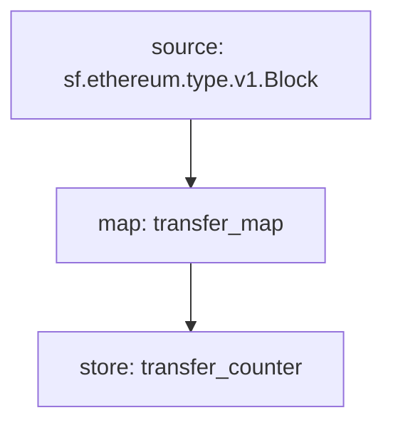

# Substreams Concepts

- [Definition](#definition)
- [Comparison](#comparison)
- [Modules](#modules)
- [A `map` module](#a-map-module)
- [A `store` module](#a-store-module)
Substreams introduce a few new concepts to The Graph ecosystem, inspired by traditional large scale data systems and fused with the novelties of blockchain.

## Definition

Substreams **is**:

* A streaming first system
  * Based on gRPC and protobuf
  * Based on the StreamingFast Firehose
* A remote code execution framework, that is:
  * highly cacheable
  * highly parallelizable
* Composable down to individual modules, and allows a community to build higher order modules with great ease
  (more on that later)

Substreams **is not**:
* A relational database
* A REST service
* Concerned directly with how the data is stored

## Comparison

Substreams is a streaming engine, that can be compared to Fluvio,
Kafka, Apache Spark, RabbitMQ and other suchs technologies, where a
blockchain node, a deterministic data source, acts as the _producer_.

It has a logs based architecture (the Firehose), and allows for
user-defined custom code to be sent to a Substreams server(s), for
streaming and/or ad-hoc querying of the available data.

## Modules

Modules are small pieces of code, running in a WebAssembly virtual
machine, amidst the stream of blocks arriving from a blockchain name,
with a blockchain network's history awaiting to be processed in flat
files.

The top-level source of a module tree will be blockchain data, in the
form of Firehose Blocks for each supported blockchain protocol. See
the [Firehose documentation](http://firehose.streamingfast.io/) for
more details.

Modules may one or more inputs (from multiple modules, be them `map`s
or `store`s, and/or from the blockchain's data in the form of a
_Block_).

> Multiple inputs are made possible because a blockchains have a
> clock, and allows synchronization between multiple execution
> streams, opening up great performance improvements even over your
> comparable traditional streaming engine.

Modules have a single output, that can be typed, to inform consumers
what to expect and how to interprete the bytes coming out.

There are two types of modules, a `map` module, and a `store` module.

Modules can form a graph of modules, taking each other's output as the
next module's input, like so:

Here, the `transfer_map` module would extract all transfers that happened in each block,

## A `map` module

A `map` module takes bytes in, and outputs bytes. In the
[manifest](./manifest.md), you would declare the protobuf types to
help users decode the streams, and help generate some code to get you
off the ground faster.

## A `store` module

A `store` module is slightly different in that it is a _stateful_ module. It contains a _key/value_ store that can be either _written_ to, or read from.

The code you provide when designing a `store` module can only _write_ to the key/value store in particular ways. See the [API Reference](./api-reference.md) for more details on store semantics.

When consuming a store (when it is set as a dependency to a module
that depends on this store), you can only _read_ from it.

See API Reference

[TODO: give example, explain some of the playground examples]
