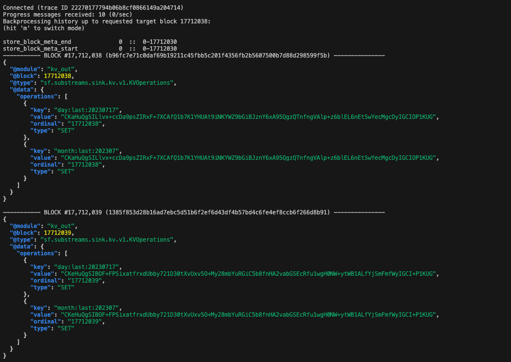
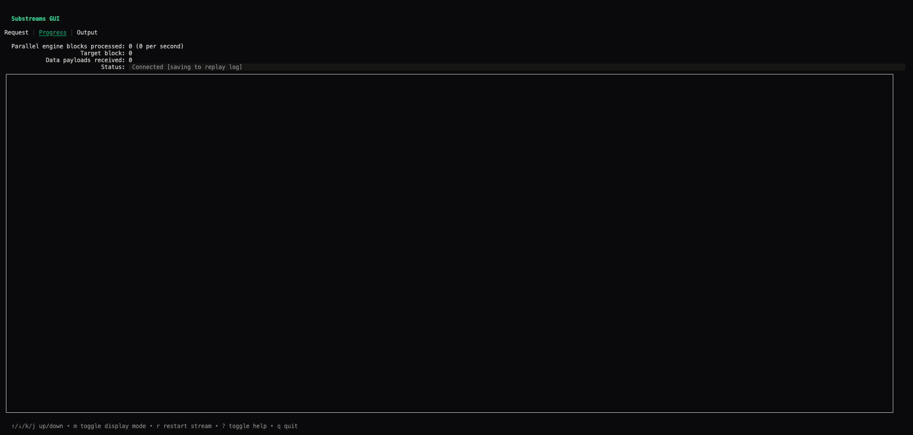
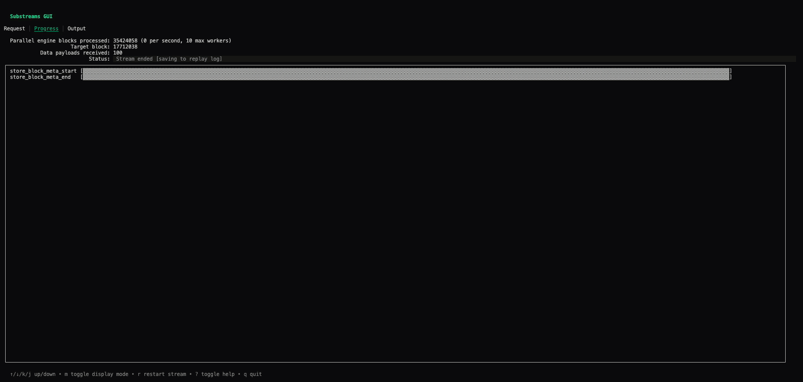
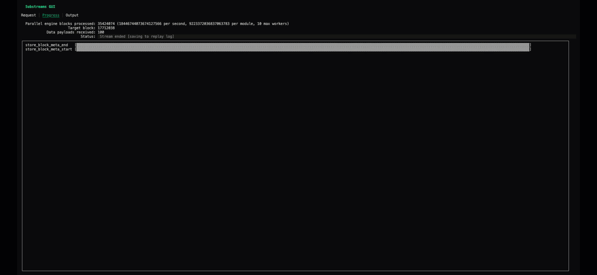
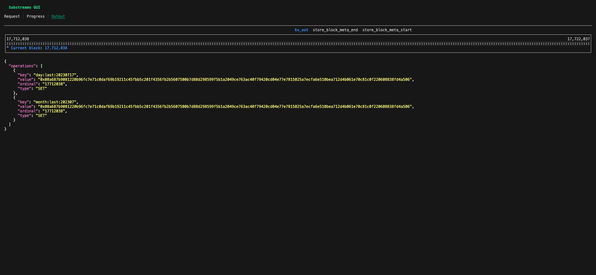
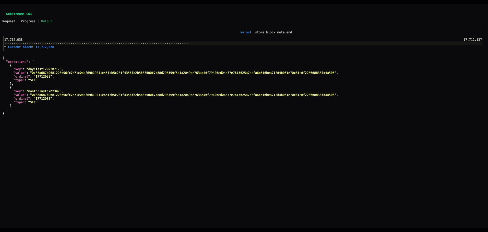
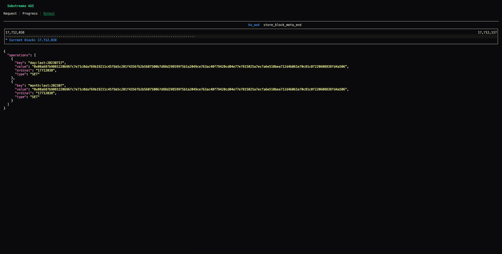
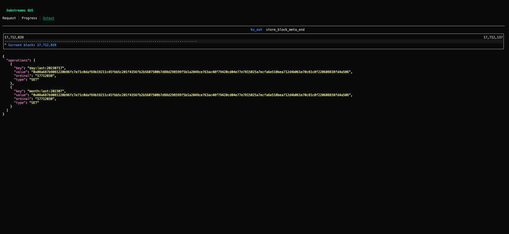

# Using the Substreams GUI

When running Substreams through the CLI, you can use two different commands: `substreams run` and `substreams gui`. The `substreams run` command prints the output of the execution linearly for every block:

<figure></figure>

However, this is not a useful approach when dealing with complex Substreams (i.e. with several modules and many blocks). The `substreams gui` command allows you to easily see the progress of a Substreams, move across blocks or search within the output.

<figure></figure>

The Substreams GUI is a command-line utility, so you use the keys in your keyboard to interact with it.

## Cheatsheet

| Function | Keys  | 
|---|---|
| Switch screen (`Request`, `Progress`, `Output`) | `tab` |
| Restart                                         | `r`  |
| Quit                                            | `q`  |
| Navigate Blocks - Forward                       | `p`  |
| Navigate Blocks - Backwards                     | `o`  |
| Navigate Blocks - Go To                         | `=` + *block number* + `enter` |
| Navigate Modules - Forward                      | `i`  |
| Navigate Modules - Backwards                    | `u`  |
| Search                                          | `/` + *text* + `enter`  |
| Commnads information                            | `?`  |

## Launching the GUI

In order to showcase the different options of the GUI, the [Ethereum Block Meta Substreams](https://github.com/streamingfast/substreams-eth-block-meta/) will be used as an example.
By running the following command, you are executing the `kv_out` module, which retrieves outputs the data in a key-value format.

```bash
substreams gui -e mainnet.eth.streamingfast.io:443 https://github.com/streamingfast/substreams-eth-block-meta/releases/download/v0.5.1/substreams-eth-block-meta-v0.5.1.spkg kv_out --start-block 17712038 --stop-block +100
```

In your command-line terminal, you should see something like:

<figure></figure>

The `Progress` screen provides information about the Substreams execution, such as its status or the payload received. Once all the blocks have been consumed, the status is `Stream ended`.
There are two other main screens in the Substreams GUI: `Request` and `Output`. You can move to a different screen by using the `tab` key:

<figure></figure>

You can restart the stream by pressing the `s` key.

<figure></figure>

To quit the GUI, press the `q` key.

## The Output Screen

If you are in the `Progress` screen, press `tab` in your keyboard to move to the `Output` screen. In this screen, you can see the Protobuf output for every block. The image below shows the output for the block number `17712038` (the starting block).

<figure></figure>

### Navigating Through Blocks

You can see the output for other blocks by using the `o` and `p` keys.
The `o` key takes you to the following block, and the `p` takes you to the previous block.

<figure></figure>


If you want to jump to a specific block, you can press the `=` key and specify the block number. Then, just press `enter`.

<figure></figure>


### Navigating Through Modules

You can see the output of a different module by using the `u` and `i` keys. In the following example, you go from the `kv_out` module (the module specified in the CLI command), to the `store_block_meta_end` module.

<figure></figure>


### Searching in the Output

To search for a speciifc text in the output:

1. Press the `/` key.
2. Introduce the text.
3. Press `enter`.

In the following example, your search for the `SET` text.

<figure></figure>


