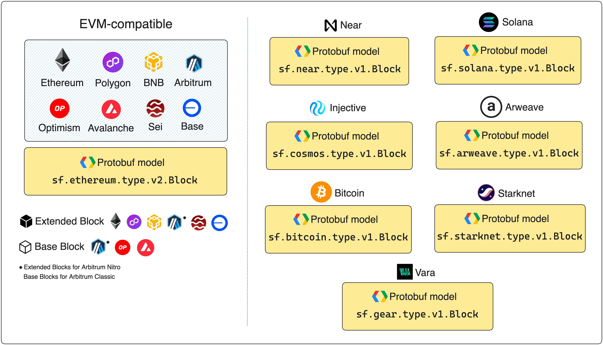

# Glossary

## Substreams
[Substreams](https://substreams.streamingfast.io/) is a powerful indexing technology, which allows you to:
1. Extract data from several blockchains (Ethereum, Polygon, BNB, Solana...).
2. Apply custom transformations to the data.
3. Send the data to a place of your choice (for example, a Postgres database or a file).

## Firehose
[Firehose](https://firehose.streamingfast.io/) is the extraction layer of Substreams (i.e. step number one of the previous glossary entry). Although Firehose is a different project, it is tightly related to Substreams.

## CLI
`CLI`, which stands for command-line interface, is a text-based interface that allows you to input commands to interact with a computer.
The [Substreams CLI](https://substreams.streamingfast.io/getting-started/installing-the-cli) allows you to deploy and manage your Substreams.

## Module
[Modules](https://substreams.streamingfast.io/developers-guide/modules) are small pieces of Rust code running in a WebAssembly (WASM) virtual machine. Modules have one or more inputs and an output.
For example, a module could receive an Ethereum block as input and emit a list of transfers for that block as output.

There are two types of modules: `map` and `store`.

## map Module
`map` modules receive an input and emit an output (i.e. they perform a transformation).

## store Module
`store` modules write to key-value stores and are stateful. They are useful in combination with `map` modules to keep track of past data.

## Directed Acyclic Graph (DAG)
[DAGs](https://en.wikipedia.org/wiki/Directed_acyclic_graph) are data structures used in many computational models. In Substreams, DAGs are used to define module data flows.

A DAG is a one-direction, acyclic graph. They are used in a variety of software, such as Git or IPFS.

## Composability
Modules make Substreams really _composable_. Being composable means that Substreams can be independent, but they can also work together to create powerful streams.

For example, consider that you have two _map modules_: one emitting `Transfer` objects and another one emitting `AccountInformation` objects.
You could create another module that receives the previous two modules as input and merges the information from both.

That is why Substreams is so powerful!

## Protocol Buffers (Protobuf)
[Protocol Buffers](https://protobuf.dev/) is a serializing format used to define module inputs and outputs in Substreams.
For example, a manifest might define a module called `map_tranfers` with an input object, `Transfer` (representing an Ethereum transaction), and an output object `MyTransfer` (representing a reduced version of an Ethereum transaction).

## Manifest
The [Substreams manifest](https://substreams.streamingfast.io/developers-guide/creating-your-manifest) (called `substreams.yaml`) is a YAML file where you define all the configurations needed. For example, the modules of your Substreams (along with their inputs and outputs), or the Protobuf definitions used.

## WebAssembly (WASM)
[WebAssembly (WASM)](https://webassembly.org/) is a binary-code format used to run a Substreams. The Rust code used to define your Substreams transformations is packed into a WASM module, which you can use as an independent executable.

## Block
The `Block` Protobuf object contains all the blockchain information for a specific block number. EVM-compatible chains share the same [Block](https://github.com/streamingfast/firehose-ethereum/blob/develop/proto/sf/ethereum/type/v2/type.proto) object, but non-EVM-compatible chains must use [their corresponding Block Protobuf definition](https://substreams.streamingfast.io/reference-and-specs/chains-and-endpoints).

<figure></figure>

## SPKG (.spkg)
[SPKG files](https://substreams.streamingfast.io/reference-and-specs/packages) contain Substreams definitions. You can create an `.spkg` file from a Substreams manifest using the `substreams pack` command. Then, you can use this file to share or run the Substreams independently.
The `.spkg` file contains everything needed to run a Substreams: Rust code, Protobuf definitions and the manifest.

## GUI
The CLI includes two commands to run a Substreams: `run` and `gui`. The `substreams run` command prints the output of the execution linearly for every block, while the `substreams gui` allows you to easily jump to the output of a specific block.

<figure></figure>

## Subgraph
[Subgraphs](https://thegraph.com/docs/en/developing/creating-a-subgraph/) are another indexing mechanism developed by The Graph.
In Subgraphs, data is indexed and available through a GraphQL endpoint.

One of the main differences between Subgraphs and Substreams is that Subgraphs rely on _polling_, while Substreams relies on _streaming_.

## Triggers
In Subgraphs, you define _triggers_ to index your data. These triggers are events that happen in the blockchain (for example, `AccountCreated`). Subgraphs listen for those events, and index the data accordingly.

## Sink
Substreams allows you to extract blockchain data and apply transformations to it. After that, you should choose **a place to send your transform data, which is called _sink_**.
A sink can be a [SQL database](https://substreams.streamingfast.io/developers-guide/sink-targets/substreams-sink-sql), [a file](https://substreams.streamingfast.io/developers-guide/sink-targets/substreams-sink-files) or a [custom solution of your choice](https://substreams.streamingfast.io/developers-guide/sink-targets/custom-sink-js).

## Deployable Unit
A deployable unit is a Substreams manifest or package (spkg) that contains all the information about how to run it from sink service. In the manifest, it corresponds to the `network` and `sink` fields.
See [Working with deployable units](https://substreams.streamingfast.io/developers-guide/sink-deployable-units)

## Substreams-powered Subgraph
When a Subgraph acts as a sink for your Substreams, you call it a [Substreams-powered Subgraph](https://thegraph.com/docs/en/cookbook/substreams-powered-subgraphs/).

The Subgraph Sink is one of the _official sinks_ supported by Substreams, and can help you index your Subgraph way faster!

## Parallel execution
[Parallel execution](https://substreams.streamingfast.io/developers-guide/parallel-execution) is the process of a Substreams module's code executing multiple segments of blockchain data simultaneously in a forward or backward direction.

## Workers
Workers are the fundamental unit of parallelizing in Substreams. Workers are computer processes that run in parallel to speed up the Substreams computations.
