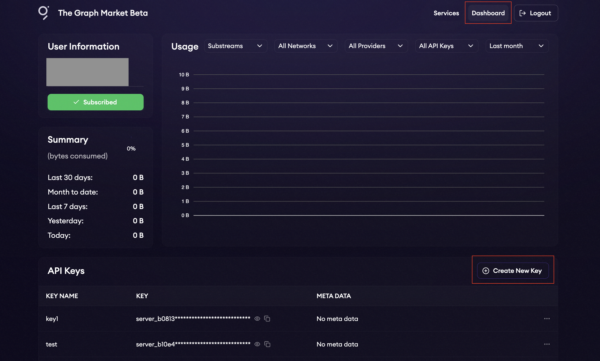

# Substreams Authentication Guide

This guide explains how to authenticate when running a Substreams package (`.spkg`) with a provider, specifically using The Graph Market.

## Overview

Substreams require authentication to ensure secure and controlled access to providers. This guide focuses on obtaining and using a JWT token from The Graph Market to authenticate your Substreams execution.

## Prerequisites

- A Substreams package (`.spkg`) ready to deploy.
- An account with [The Graph Market](https://thegraph.market).

## Step 1: Obtain a JWT Token

To authenticate with The Graph Market, you need to generate a JWT token. Follow these steps:

1. **Log in to The Graph Market**: 
   - Visit [https://thegraph.market](https://thegraph.market).
   - Log in to your existing account or create a new one if you don't have an account.

2. **Access the Dashboard**: 
   - Click on `Dashboard` in the navigation menu or go directly to [https://thegraph.market/dashboard](https://thegraph.market/dashboard).

   

3. **Create a New API Key**:
   - In the dashboard, click on `Create New Key`.
   - Input a recognizable name for future reference.
   - This is not the _authentication token_, but a key to generate tokens.

4. **Generate an API Token**:
   - Click the **...** beside your new key.
   - Click **Generate token**
   - The system will generate a JWT token. **Copy** and **save** this token securely, as it will be required for authentication.

## Step 2: Set the JWT Token as an Environment Variable

To authenticate Substreams on your local machine, you need to set the JWT token as an environment variable.

### Unix-like Systems (macOS, Linux)

1. **Open a terminal** on your machine.

2. **Set the environment variable** using the following command:

   ```bash
   export SUBSTREAMS_API_TOKEN="<YOUR-JWT-TOKEN>"
   ```

   Replace `<YOUR-JWT-TOKEN>` with the JWT token you obtained earlier.

## Step 3: Verify Authentication

To ensure that your authentication is set up correctly, you can run a test Substreams. Here's how:

1. Run the following command in your terminal to execute the ERC20 Balance Changes Substreams on the Ethereum Mainnet:

   ```bash
   substreams gui \
     https://spkg.io/streamingfast/erc20-balance-changes-v1.2.0.spkg \
     map_valid_balance_changes \
     -e mainnet.eth.streamingfast.io:443 \
     --start-block 10397553 \
     --stop-block +10
   ```

2. Verify that the Substreams runs without errors, confirming that your authentication is successful.

## Need Help?

If you encounter any issues or have questions, the StreamingFast team is available on [Discord](https://discord.gg/jZwqxJAvRs) to assist you.
