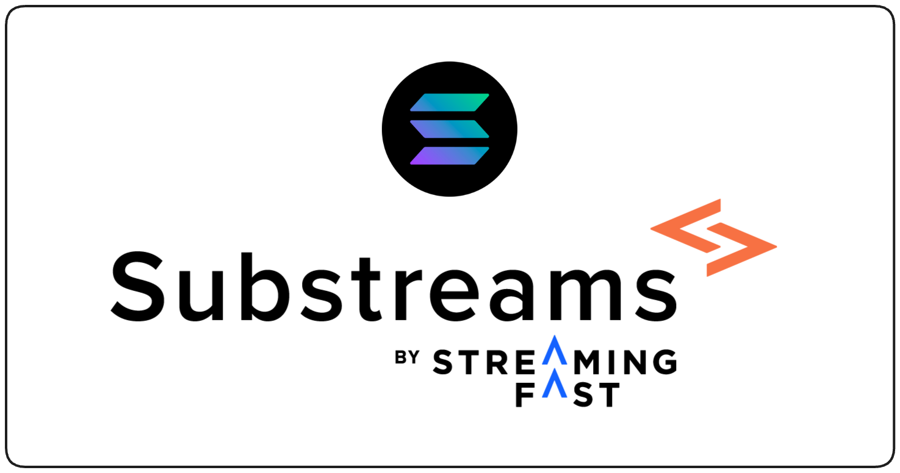

Substreams allows you to easily extract data from the the Solana blockchain. With Substreams, you can retrieve transactions, instructions or accounts, taking advantage of its powerful streaming technology. It's super fast!

<figure></figure>

## Getting Started

First, you must consider whether you want to develop your own Substreams or consume a ready-to-use Substreams. It is possible that someone has already built a Substreams package to extract the data you want; you can explore Substreams packages in the [Substreams Registry](https://substreams.dev).

**If you have found a Substreams package that fits your needs**, then explore the [Consume Substreams](../consume/consume.md) section. At the most basic level you should cover:

- [Install the Substreams CLI](./installing-the-cli.md)
- [Authentication](./authentication.md)
- [Packages](./packages.md)
- Choose how you want to consume the data:
    - [Send the data to a SQL database.](./../consume/sql/sql.md)
    - [Stream the data from your application.](../consume/stream/stream.md)
    <!-- - [Send the data to a subgraph.]((./../consume/subgraph/subgraph.md)) -->

**If you can't find a Substreams package that fits your needs**, then you can go ahead and develop your own Substreams. The [Develop Substreams](../develop/develop.md) section of the documentation covers everything you need to know about building a Substreams from scratch. At the most basic level, you should cover:

- [Install the Substreams CLI](./installing-the-cli.md)
- [Authentication](./authentication.md)
<!-- - [Initialize a project (Quickstart)](./../develop/init-project.md) -->
- [Manifest & Modules](./../common/manifest-modules.md)
- [Protobuf defitions](./../develop/creating-protobuf-schemas.md)
- [Packages](./packages.md)
- [Run a Substreams](./running-substreams.md)
- [Choose how you want to consume the data](./../consume/consume.md)

## Tutorials

If you want to deep dive into the code, you can follow one or several of the Solana Tutorials available in the documentation.
- The [Explore Solana Tutorial](../tutorials/solana/explore-solana/explore-solana.md) will teach you the most basic operations you can perform in a Solana Substreams.
- The [Solana Token Tracker Tutorial](../tutorials/solana/token-tracker/token-tracker.md) will teach how to track an SPL token of your choice.
- The [NFT Trades Tutorial](../tutorials/solana/top-ledger/nft-trades.md) will help you in extracting data from different NFT exchanges.
- The [DEX Trades Tutorial](../tutorials/solana/top-ledger/dex-trades.md) will help you in extracting data from different decentralized exchanges.

## The Solana Data Model

A Substreams module is, essentially, a Rust function that extracts data from the blockchain. In order to specify which data you want to retrieve, Substreams gives you access to the abstraction of a full [Solana block](https://github.com/streamingfast/firehose-solana/blob/develop/proto/sf/solana/type/v1/type.proto#L9).

In the following example, a Solana block (`solana::Block`) is passed as a parameter. Then, a custom object defined by the user, `BlockMeta`, is emitted as output, containing some relevant fields (`slot`, `hash`, `parent_hash`):

```rust
fn map_block_meta(block: solana::Block) -> Result<BlockMeta, substreams::errors::Error> {
    Ok(BlockMeta {
        slot: blk.slot,
        hash: blk.blockhash,
        parent_hash: blk.previous_blockhash,
    })
}
```

The [Block](https://github.com/streamingfast/firehose-solana/blob/develop/proto/sf/solana/type/v1/type.proto#L9) object holds other important data, such as:
- [block.transactions_owned()](https://github.com/streamingfast/substreams-solana/blob/1f66cc3081f61ad1189dc814cb82096ae5ac4b3b/core/src/block_view.rs#L15)
- [block.rewards](https://github.com/streamingfast/firehose-solana/blob/develop/proto/sf/solana/type/v1/type.proto#L64)
- [block.parent_slot](https://github.com/streamingfast/firehose-solana/blob/develop/proto/sf/solana/type/v1/type.proto#L12)

## The Account Address Tables

In Solana, the _account_ concept plays a very important role. However, the original Solana data model imposes a restriction on the number of accounts that a single transaction can have. The [Account Address Tables](https://docs.solana.com/developing/lookup-tables) is a way to overcome this restriction, allowing developers to increase the number of accounts per transaction.

The [resolved_accounts()](https://github.com/streamingfast/substreams-solana/blob/1f66cc3081f61ad1189dc814cb82096ae5ac4b3b/core/src/lib.rs#L9) method of the [ConfirmedTransaction](https://github.com/streamingfast/substreams-solana/blob/1f66cc3081f61ad1189dc814cb82096ae5ac4b3b/core/src/lib.rs#L8) object includes a ready-to-use array of accounts, including accounts from the Lookup Table.