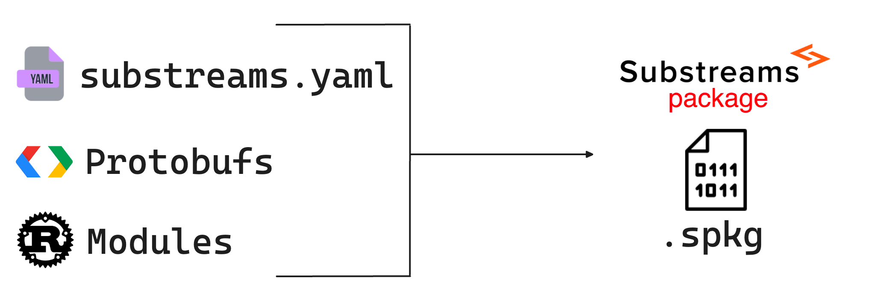
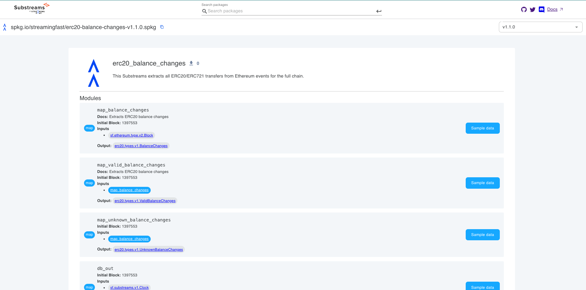

# Packages

There are a lot of developers building Substreams and creating very useful transformations that can be reused by other people. Once a Substreams is developed, you can pack it into a Substreams package and share it with other people!

Essentially, a Substreams package is a ready-to-consume binary file, which contains all the necessary dependencies (manifest, modules, protobufs...). The standard file extension for a Substreams package is `.spkg`.

<figure><figcaption></figcaption></figure>

### The Substreams Registry

In order to facilitate how developers share Substreams packages, the Substreams Registry (https://substreams.dev) was created. In the Registry, developers can discover and push Substreams.

For example, the [ERC20 Balance Changes](https://github.com/streamingfast/substreams-erc20-balance-changes) package is stored at the registry (https://substreams.dev/streamingfast/erc20-balance-changes/v1.1.0).

<figure><figcaption></figcaption></figure>

### Using a Package

You can easily run a Substreams package by inputting the `.spkg` file in the CLI:

```bash
substreams gui \
 https://spkg.io/streamingfast/erc20-balance-changes-v1.1.0.spkg \
 map_balance_changes \
 -e mainnet.eth.streamingfast.io:443 \
 --start-block 1397553
```

### Creating a Package

You can create a Substreams package by executing the `substreams pack` command in the CLI. Given a Substreams project, you can create a new package from a manifest (`substreams.yaml`):

```bash
substreams pack ./substreams.yaml
```

#### Package Dependencies

Developers can use modules and protobuf definitions from other Substreams packages when `imports` is defined in the manifest.


**Important**: To avoid potential naming collisions select unique `.proto` filenames and namespaces specifying fully qualified paths.


Local Protobuf filenames take precedence over the imported package's proto files.
