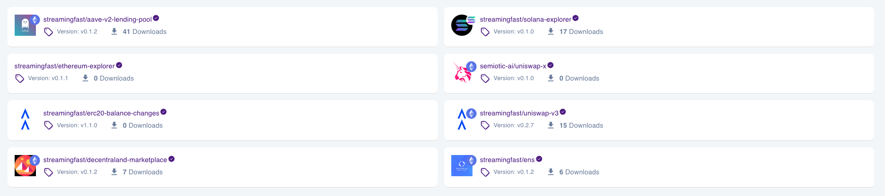
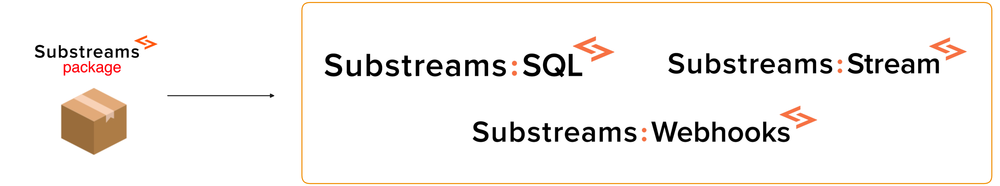

Substreams is a technology that allows you to extract blockchain data in a fast and reliable way!

You can retrieve blockchain data by using packages. A Substreams package is a file that contains which data you want to retrieve from the blockchain. For example, the Uniswap v3 package allows you to extract all the information related to the Uniswap v3 smart contract. Use the [Substreams Registry](https://substreams.dev) to explore new packages!

If you can't find a package that fits your needs, you can always develop your own Substreams to extract custom data from the blockchain!

The _Consume_ sections focus on consuming data from Substreams packages, instead of developing your own Substreams.
If you want to learn how to develop your own Substreams package, navigate to the Develop Substreams sections.

## How to Consume a Package

### Choose a Substreams Package
Among the wide range of packages available, choose whichever retrieves the data that you need!

<figure></figure>

### Choose a Consuming Service
What do you want to do with the data extracted from the blockchain? You have several options: send it to a PosgreSQL database, directly stream the data from your application (JS, Python, Rust...) or configure a webhook.

<figure></figure>

### Access the Data!
Depending on the consuming service selected, the way you access the data will vary.

For example, with PosgreSQL, you create SQL queries to perform aggregations over the data; if you are streaming data with JavaScript, you can directly embed the data into your application!