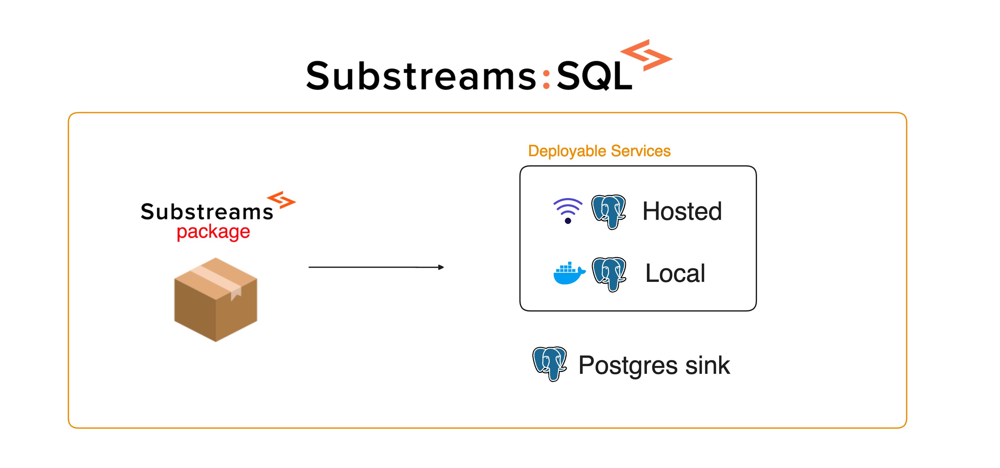

The **Substreams:SQL service** allows you to consume the data extracted from the blockchain through a SQL database.

<figure></figure>

## Different Ways of Setting Up the SQL Consumption

Substreams offers two different ways of consuming data as SQL:
- The SQL sink, which you can install in your own server.
- The SQL Deployable Service, which 

### SQL sink (bare metal)

Previous to the implementation of the Deployable Services, the Postgres Sink was used to send data to a database. This is still available and there are a lot developers using it.

### Substreams:SQL Deployable Service
Use the Substreams CLI to easily send the data of your Substreams to a database. It also has support for **dbt transformations**, so it's great for data analyts!

You can deploy a new service by using the `substreams alpha service` command.

#### Hosted Service
The StreamingFast Hosted Service deploys a remote database in the StreamingFast servers, so you don't have to take of the infrastructure.

#### Local Service
If you want to manage your own infrastructure, you can set up a services environment locally using Docker.

## Module Requirements

In order to the send the data to a SQL database, your Substreams must have a `db_out` module that emits [`DatabaseChanges`](https://docs.rs/substreams-database-change/latest/substreams_database_change/pb/database/struct.DatabaseChanges.html) objects.

The `DatabaseChanges` object is something that the Postgres sink can understand, thus acting as a conversion layet between the data model of your Substreams and the table structure of the database.
