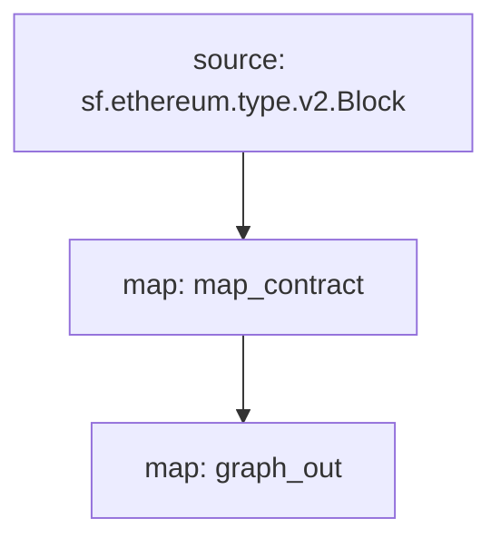

If you want to include the extractions logic in Substreams to benefit from the paralellization engine, you can use the **EntityChanges** model. 

Essentially, this means that you will create a `graph_out` module in Substreams, which will emit an **EntityChanges** structure representing the subgraph entities.

## Requirements

- Install the Substreams CLI.
- Install the Graph CLI.

## Create a Sample Project

```
graph init --from-example substreams-powered-subgraph
```

## Defining a Substreams package

A Substreams package is composed of types (defined as [Protocol Buffers](https://protobuf.dev/)), modules (written in Rust), and a `substreams.yaml` file which references the types, and specifies how modules are triggered. 

The Substreams package in question detects contract deployments on Mainnet Ethereum, tracking the creation block and timestamp for all newly deployed contracts. To do this, there is a dedicated `Contract` type in `/proto/example.proto` ([learn more about defining Protocol Buffers](https://protobuf.dev/programming-guides/proto3/#simple)):

```proto
syntax = "proto3";

package example;

message Contracts {
  repeated Contract contracts = 1;
}

message Contract {
    string address = 1;
    uint64 blockNumber = 2;
    string timestamp = 3;
    uint64 ordinal = 4;
}
```

The core logic of the Substreams package is a `map_contract` module in `lib.rs`, which processes every block, filtering for Create calls which did not revert, returning `Contracts`:

```rust
#[substreams::handlers::map]
fn map_contract(block: eth::v2::Block) -> Result<Contracts, substreams::errors::Error> {
    let contracts = block
        .transactions()
        .flat_map(|tx| {
            tx.calls
                .iter()
                .filter(|call| !call.state_reverted)
                .filter(|call| call.call_type == eth::v2::CallType::Create as i32)
                .map(|call| Contract {
                    address: format!("0x{}", Hex(&call.address)),
                    block_number: block.number,
                    timestamp: block.timestamp_seconds().to_string(),
                    ordinal: tx.begin_ordinal,
                })
        })
        .collect();
    Ok(Contracts { contracts })
}
```

A Substreams package can be used by a subgraph as long as it has a module which outputs compatible entity changes. The example Substreams package has an additional `graph_out` module in `lib.rs` which returns a `substreams_entity_change::pb::entity::EntityChanges` output, which can be processed by Graph Node.

> The `substreams_entity_change` crate also has a dedicated `Tables` function for simply generating entity changes ([documentation](https://docs.rs/substreams-entity-change/1.2.2/substreams_entity_change/tables/index.html)). The Entity Changes generated must be compatible with the `schema.graphql` entities defined in the `subgraph.graphql` of the corresponding subgraph.

```rust
#[substreams::handlers::map]
pub fn graph_out(contracts: Contracts) -> Result<EntityChanges, substreams::errors::Error> {
    // hash map of name to a table
    let mut tables = Tables::new();

    for contract in contracts.contracts.into_iter() {
        tables
            .create_row("Contract", contract.address)
            .set("timestamp", contract.timestamp)
            .set("blockNumber", contract.block_number);
    }

    Ok(tables.to_entity_changes())
}
```

These types and modules are pulled together in `substreams.yaml`:

```yaml
specVersion: v0.1.0
package:
  name: 'substreams_test' # the name to be used in the .spkg
  version: v1.0.1 # the version to use when creating the .spkg

imports: # dependencies
  entity: https://github.com/streamingfast/substreams-entity-change/releases/download/v0.2.1/substreams-entity-change-v0.2.1.spkg

protobuf: # specifies custom types for use by Substreams modules
  files:
    - example.proto
  importPaths:
    - ./proto

binaries:
  default:
    type: wasm/rust-v1
    file: ./target/wasm32-unknown-unknown/release/substreams.wasm

modules: # specify modules with their inputs and outputs.
  - name: map_contract
    kind: map
    inputs:
      - source: sf.ethereum.type.v2.Block
    output:
      type: proto:test.Contracts

  - name: graph_out
    kind: map
    inputs:
      - map: map_contract
    output:
      type: proto:substreams.entity.v1.EntityChanges # this type can be consumed by Graph Node
```

You can check the overall "flow" from a Block, to `map_contract` to `graph_out` by running `substreams graph`:



To prepare this Substreams package for consumption by a subgraph, you must run the following commands:

```bash
yarn substreams:protogen # generates types in /src/pb
yarn substreams:build # builds the substreams
yarn substreams:package # packages the substreams in a .spkg file

# alternatively, yarn substreams:prepare calls all of the above commands
```

> These scripts are defined in the `package.json` file if you want to understand the underlying substreams commands

This generates a `spkg` file based on the package name and version from `substreams.yaml`. The `spkg` file has all the information which Graph Node needs to ingest this Substreams package.

> If you update the Substreams package, depending on the changes you make, you may need to run some or all of the above commands so that the `spkg` is up to date.

## Defining a Substreams-powered subgraph

Substreams-powered subgraphs introduce a new `kind` of data source, "substreams". Such subgraphs can only have one data source.

This data source must specify the indexed network, the Substreams package (`spkg`) as a relative file location, and the module within that Substreams package which produces subgraph-compatible entity changes (in this case `map_entity_changes`, from the Substreams package above). The mapping is specified, but simply identifies the mapping kind ("substreams/graph-entities") and the apiVersion.

> Currently, Subgraph Studio and The Graph Network support Substreams-powered subgraphs which index `mainnet` (Mainnet Ethereum).

```yaml
specVersion: 0.0.4
description: Ethereum Contract Tracking Subgraph (powered by Substreams)
repository: https://github.com/graphprotocol/graph-tooling
schema:
  file: schema.graphql
dataSources:
  - kind: substreams
    name: substream_test
    network: mainnet
    source:
      package:
        moduleName: graph_out
        file: substreams-test-v1.0.1.spkg
    mapping:
      kind: substreams/graph-entities
      apiVersion: 0.0.5
```

The `subgraph.yaml` also references a schema file. The requirements for this file are unchanged, but the entities specified must be compatible with the entity changes produced by the Substreams module referenced in the `subgraph.yaml`.

```graphql
type Contract @entity {
  id: ID!

  "The timestamp when the contract was deployed"
  timestamp: String!

  "The block number of the contract deployment"
  blockNumber: BigInt!
}
```

Given the above, subgraph developers can use Graph CLI to deploy this Substreams-powered subgraph.

> Substreams-powered subgraphs indexing mainnet Ethereum can be deployed to the [Subgraph Studio](https://thegraph.com/studio/).

```bash
yarn install # install graph-cli
yarn subgraph:build # build the subgraph
yarn subgraph:deploy # deploy the subgraph
```

That's it! You have built and deployed a Substreams-powered subgraph.

## Serving Substreams-powered subgraphs

In order to serve Substreams-powered subgraphs, Graph Node must be configured with a Substreams provider for the relevant network, as well as a Firehose or RPC to track the chain head. These providers can be configured via a `config.toml` file:

```toml
[chains.mainnet]
shard = "main"
protocol = "ethereum"
provider = [
  { label = "substreams-provider-mainnet",
    details = { type = "substreams",
    url = "https://mainnet-substreams-url.grpc.substreams.io/",
    token = "exampletokenhere" }},
  { label = "firehose-provider-mainnet",
    details = { type = "firehose",
    url = "https://mainnet-firehose-url.grpc.firehose.io/",
    token = "exampletokenhere" }},
]
```