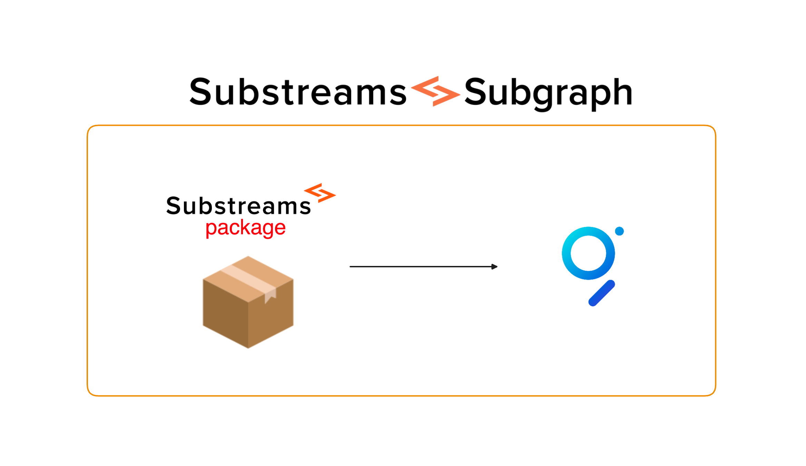

It is possible to the send data the of a Substreams to a subgraph, thus creating a Substreams-powered Subgraph.

You can find information about Substreams-powered Subgraphs in [The Graph documentation](https://thegraph.com/docs/en/cookbook/substreams-powered-subgraphs/).

<figure></figure>