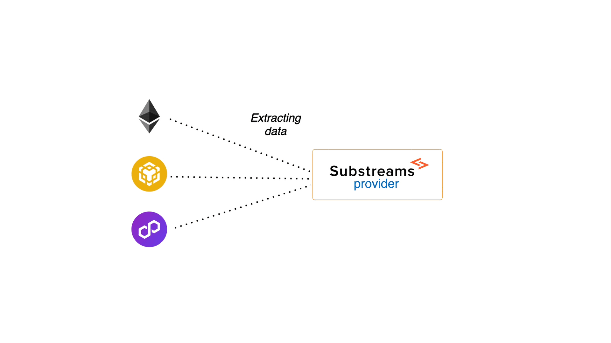
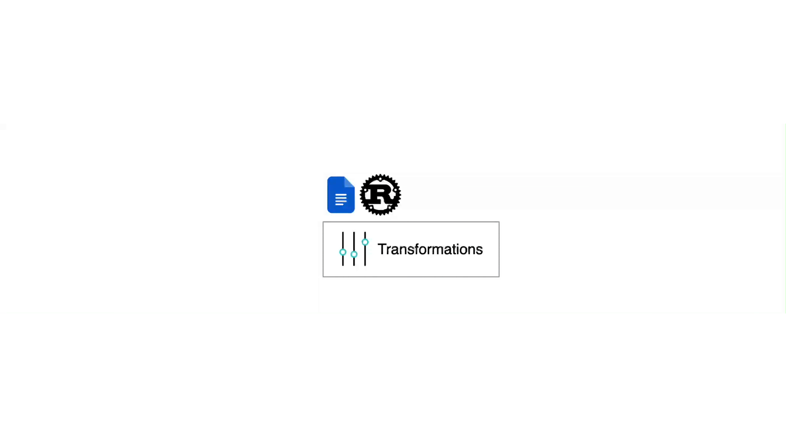
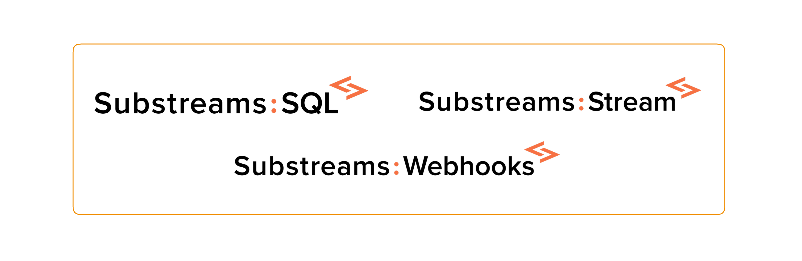

Substreams is a technology that allows you to extract blockchain data in a fast and reliable way!

## How Does It Work?

1. **The Substreams Provider**

<figure></figure>

First of all, there is a Substreams provider. The Substreams provider takes care of storing blockchain data and making it available in a fast and reliable way

2. **Apply Your Transformations**

<figure></figure>

In order for the Substreams provider to know which specific data you want to retrieve, you write a Rust program that defines the transformations that you want to apply to the blockchain data.

3. **The Substreams Package**

<figure></figure>

Then, you pack your Rust program into a Substreams package.

4. **Execution of the Package**

<figure></figure>

Lastly, you send the Substreams package to the Substreams provider for execution. The Substreams provider will start streaming data back to you ultra-fast!

5. **Consume the Data**

Use one of the Substreams services to consume the extracted data (SQL, Webhooks, Stream, Subgraphs...)

<figure></figure>