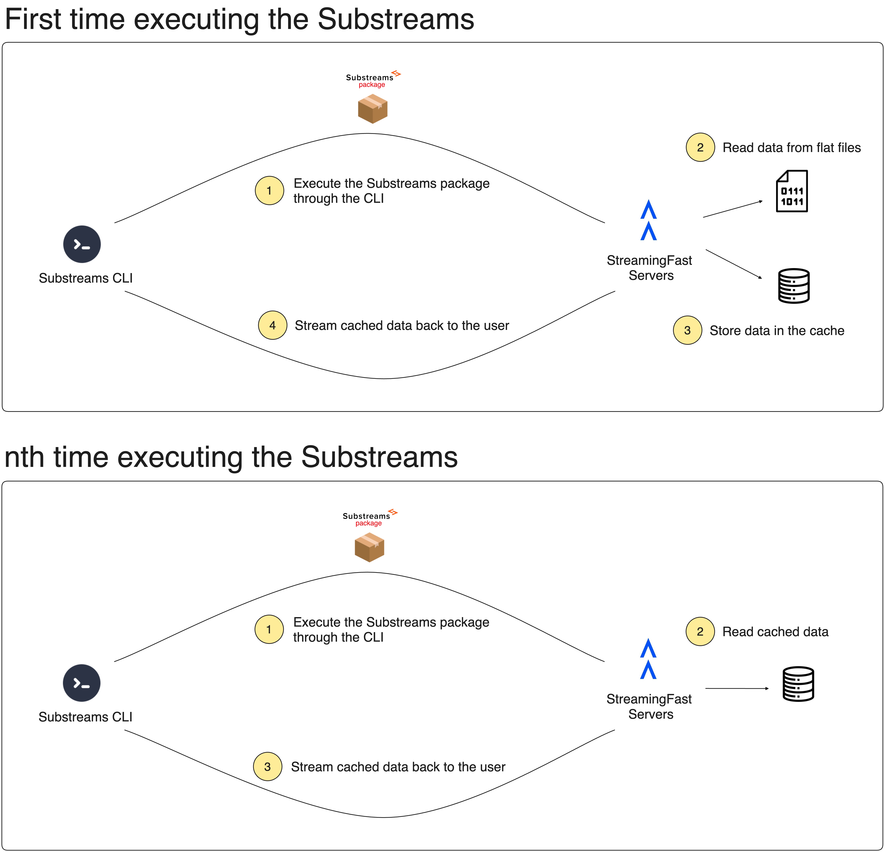
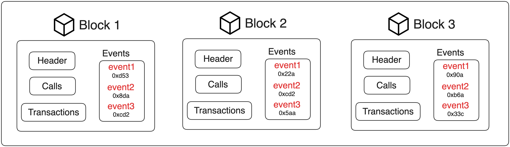
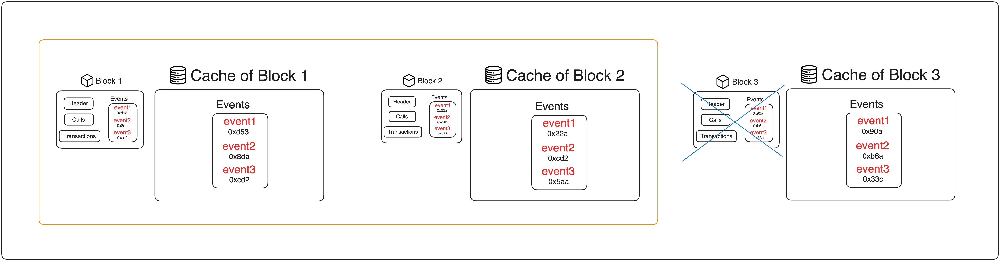
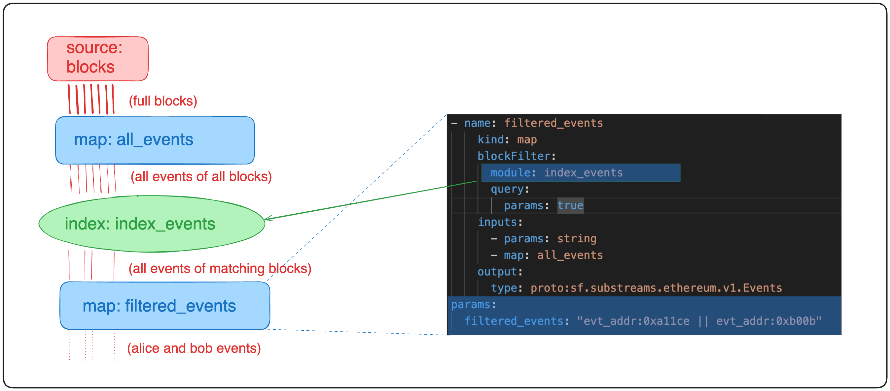

When you execute your Substreams for the first time, you are reading the data stored in the block files of the Substreams provider. 

To improve the performance, the data accessed by the Substreams is cached, so that the second or the third time that you run the Substreams, you can read from the cache, thus saving time and money. This behavior is illustrated in the following diagram.

<figure></figure>

This data caching is done implicitly every time you run a Substreams for the first time, but Substreams also allows you to explicitly create an additional index on top of your data.

## Indexes

Substreams has recently introduced the concept of _index modules_. An index module is a module that has been pre-cached for some specific data. Let's see it with an example!

Consider that you want to retrieve all the Ethereum events matching a specific address. Usually, in every block, you would iterate through all the logs looking for those where `log.address == ADDRESS`.

With indexing, you could have a pre-cached module with the information of all the event addresses in the block. Instead of reading the full Ethereum block, you can search in the events index (event cache) and avoid decoding the data of those blocks that do not contain events you are interested in.

In the following diagram, you can see three blocks with their corresponding data. Consider that you want to retrieve all the events where `log.address == 0xcd2...`. Without an index, you would have to go through the data of every block, but with an index, you can skip the blocks that do not contain the event that you want.

<figure></figure>

On the other hand, in an index module, the events of every block are pre-cached in a special store, so when you look for events where `log.address == 0xcd2...`, you can simply search in the index store of the block. If the event is contained within the block, then you decode the data. If not, you skip it.

In the following diagram, `Block 1` and `Block 2` contain an event where `log.address == 0xcd2...`, but `Block 3` does not.

<figure></figure>

### Create a Custom Index

Anyone can create an index module. All you need to do is create a Substreams with a module that outputs a list of tags that are contained in each block. For example, let's take a look at the `index_events` module from the [Ethereum Foundational Modules GitHub repository](https://github.com/streamingfast/substreams-foundational-modules/blob/develop/ethereum-common/substreams.yaml#L53).

A possible flow to use an index module to index all the events in a block:

<figure></figure>

1. You create a module, `all_events`, which receives a `Block` object as an input and outputs an `Events` object, with all the events of the block.
2. You create the actual index module, `index_events`, which receives the `Events` object of the block as an input and outputs a `Keys` object, containing the `address` and `signature` fields of every event you want to track. For every block, this `Keys` object is cached, and then used to verify if a given event is present in the block before decoding the actual data of the block.
3. You create a module that uses the index module a module that uses the index module (i.e. filters the blocks based on a query before processing them), `filtered_events`, which receives the `index_events` module as an input plus a string with the event addresses that the Substreams must filter.
Given this string of addresses, Substreams checks if the event address is contained on a given block before actually decoding the data of the block.
You can use logical operators (`and` and `or`) to select what events to search.

This previous flow is just an example of a preferred way to use index modules, but it is totally up to you to decide the structure of your Substreams. For example, instead of having a separate module, `all_events`, which extracts all the events of the block, you can receieve the raw `Block` object diretly on the `index_events` module.

The definition of the `index_events` module looks like any other Substreams module, but it is a special _kind_, `kind: blockIndex` and outputs a special data model, `sf.substreams.index.v1.Keys`. The `Keys` object contains a list of labels that will be used to identify the content of that block.

```yaml
- name: index_events
    kind: blockIndex
    inputs:
      - map: all_events
    output:
      type: proto:sf.substreams.index.v1.Keys
```

The `index_events` module is defined by the [following function](https://github.com/streamingfast/substreams-foundational-modules/blob/develop/ethereum-common/src/events.rs#L39):

```rust
#[substreams::handlers::map]
fn index_events(events: Events) -> Result<Keys, Error> { // 1.
    let mut keys = Keys::default();

    events.events.into_iter().for_each(|e| { // 2.
        if let Some(log) = e.log {
            evt_keys(&log).into_iter().for_each(|k| { // 3.
                keys.keys.push(k);
            });
        }
    });

    Ok(keys)
}

pub fn evt_keys(log: &substreams_ethereum::pb::eth::v2::Log) -> Vec<String> {
    let mut keys = Vec::new();

    if log.topics.len() > 0 {
        let k_log_sign = format!("evt_sig:0x{}", Hex::encode(log.topics.get(0).unwrap()));
        keys.push(k_log_sign); // 4.
    }

    let k_log_address = format!("evt_addr:0x{}", Hex::encode(&log.address));
    keys.push(k_log_address); // 5.

    keys
}
```
1. Receives all the events of the block as input (note that this `Events` object is coming from the `all_events` module, which extracts all the events from the `Block` object).
Outputs a `Keys` object with all the event addresses of the block.
2. Iterate over all the events in the block.
3. For every event, call the `evt_keys` function.
4. Add the `address` of the event to the keys of the block.
5. Add the `signature` of the event to the keys of the block.

The keys of the block, defined by the `Keys` object, are a list of strings defining the parts of the event that you want to use for searching. For example:

```
Block 32443
--------------------------
keys = {'evt_addr:0xa34', 'evt_addr:0xba7', 'evt_addr:0x99a'}
```

If you're looking for an event with address `0xba7`, when Substreams gets to this block, it will know beforehand that the block contains that event. If you looking for an event with address `0xaa1`, then Substreams knows beforehand it's not contained in the block and can safely skip it.