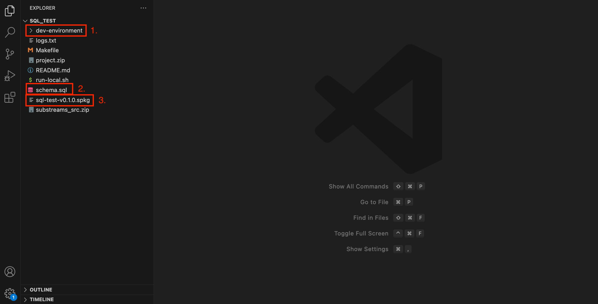

The `substreams init` command allows you to easily auto-generate several types of Substreams projects. **In this specific tutorial, you will learn how to bootstrap an EVM SQL Substreams to filter all the EVM information (events and calls) with almost no-code needed**

## Before You Begin

- [Install the Substreams CLI](../../common/installing-the-cli.md)
- [Get an authentication token](../../common/authentication.md)

## Create the Project

The `substreams init` command allows you choose among several code-generation tools, depending on your needs. In this example, you will create an EVM Substreams module that streams data to a PostgreSQL database.

1. In a command-line terminal, run `substreams init`.

2. Choose `ethereum-sql`.
Now, you will input the parameters needed to create your EVM SQL Substreams.

3. `Project name`: give a name to the project. This will be used to create the folder in your computer.

4. `Select the chain`: select the EVM chain (Arbitrum, Ethereum Mainnet, Polygon...).

5. `Contract address`: input the smart contract address that you want to index.
The ABI will be fetched from the corresponding blockchain scanner (e.g. Etherscan or Arbiscan). This might take a few seconds to complete.

6. `Verify the ABI`: the CLI will try to download the ABI the given smart contract address.
**If it is able to fetch it**, the ABI will be shown in the screen, so you just have to confirm it is correct.
**If it is NOT able to fetch it**, probably because the smart contract is not verified, you can input the ABI yourself.

7. `Initial block number`: input the block where you want to start indexing.

8. `Contract short name`: give an alias to the smart contract. This is useful in case you will track several smart contracts. The generated code will be prefix with the alias name.

9. `What do you want to track from this contract?`: you can choose to track events, calls or both.

10. `Is it a factory contract?`: choose whether the smart contract is a factory contract. If it is, you will be required to provide the event that signals the creation of new contracts and the address of one of the created contracts (so that the ABI can be retrieved).

11. `Add another contract`: choose if you want to index another contract. You can track as many contracts as you need.

13. `Directory`: choose the directory where the project will be created.

14. `Package build`: whether you want the Substreams package to the built.
The Substreams package is the binary that extracts all the data from the blockchain.
**Always select `Yes, build it`. Otherwise, you'd have to _unzip_ the project and build it yourself.**

## Inspect the Project

Open the generated project in an IDE of your choice (e.g. VSCode).

<figure></figure>

1. The `dev-environment` folder contains the Docker Compose file to spin up a local PostgreSQL database.

2. The `schema.sql` file defines the SQL schema used in the database. The corresponding tables will be created based on the ABI of the smart contract.

3. The `.spkg` file is a binary file that contains the Substreams itself. This file contains all the code necessary to extract the events and/or calls.

## Run the Substreams and Store the Data in a Database

In order to feed the data into PostgreSQL, you will need the [substreams-sql-sink](https://substreams.streamingfast.io/documentation/consume/sql/sql-sink) binary. The `substreams-sql-sink` binary will execute the `.spkg` file (i.e. run the Substreams) and send the data to Postgres. Essentially, it acts as a bridge between the Substreams execution and the PostgreSQL database.

1. Get the `sink-sql-binary`:

```bash
make get-sink-sql-binary
```

The binary will be stored in the `bin` folder of the project.

1. Launch a local PostgreSQL databe using Docker.

```bash
make launch-postgresql-db
```


**Note**: Make sure you have Docker installed and running.
The Docker set-up will use ports `5432` and `8081`. If you run into issues, make sure this ports are not used in your computer.


1. Set-up the the `substreams-sql-sink` to point to the right Substreams package (i.e. the spkg file of the project).

```bash
make setup-sink 
```

1. Start sinking the data by running the `substreams-sql-sink`.

```bash
make run-sink
```

The SQL database will start getting data from the Substreams execution.

You can now navigate to `https://localhost:8081` in your web browser to access the SQL data through PgWeb.