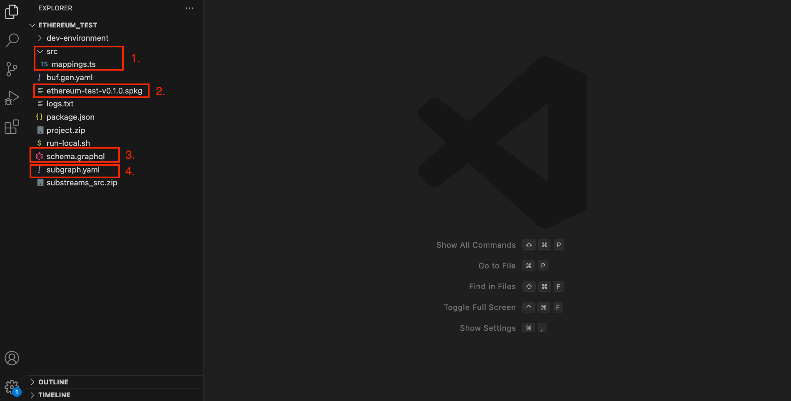

The `substreams init` command allows you to easily auto-generate several types of Substreams projects. **In this specific tutorial, you will learn how to bootstrap an EVM Substreams-powered Subgraph to filter all the EVM information (events and calls) with almost no-code needed**

## Before You Begin

- [Install the Substreams CLI](../../common/installing-the-cli.md)
- [Get an authentication token](../../common/authentication.md)
- [Install the Graph CLI](https://thegraph.com/docs/en/quick-start/#2-install-the-graph-cli)

## Create the Project

The `substreams init` command allows you choose among several code-generation tools, depending on your needs. In this example, you will create an EVM Substreams module that streams data to a subgraph.

1. In a command-line terminal, run `substreams init`.

2. Choose `ethereum-subgraph`.
Now, you will input the parameters needed to create your EVM Substreams-powered Subgraph.

3. `Project name`: give a name to the project. This will be used to create the folder in your computer.

4. `Select the chain`: select the EVM chain (Arbitrum, Ethereum Mainnet, Polygon...)

5. `Contract address`: input the smart contract address that you want to index.
The ABI will be fetched from the corresponding blockchain scanner (e.g. Etherscan or Arbiscan). This might take a few seconds to complete.

6. `Verify the ABI`: the CLI will try to download the ABI the given smart contract address.
**If it is able to fetch it**, the ABI will be shown in the screen, so you just have to confirm it is correct.
**If it is NOT able to fetch it**, probably because the smart contract is not verified, you can input the ABI yourself.

7. `Initial block number`: input the block where you want to start indexing.

8. `Contract short name`: give an alias to the smart contract. This is useful in case you will track several smart contracts. The generated code will be prefix with the alias name.

9. `What do you want to track from this contract?`: you can choose to track events, calls or both.

10. `Is it a factory contract?`: choose whether the smart contract is a factory contract. If it is, you will be required to provide the event that signals the creation of new contracts and the address of one of the created contracts (so that the ABI can be retrieved).

11. `Add another contract`: choose if you want to index another contract. You track as many contracts as you need.

12. `Subgraph feed mode`: there are two in which subgraphs can receive data from Substreams: _entities_ and _triggers_
    - **Entities**: all the logic lives in the Substreams, so you can't modify update the subgraph code in AssemblyScript.
    - **Triggers**: the logic lives in the subgraph, so you **CAN** modify the subgraph code in AssemblyScript and create your own aggregations. In this case, the Substreams only acts as a bridge between the chain and the subgraph.


**Tip**: Choose _triggers_ if you want to place the code logic in the subgraph. You will be able to access the events and calls directly within the subgraph and create your own entities.


13. `Directory`: choose the directory where the project will be created.

14. `Package build`: whether you want the Substreams package to the built.
The Substreams package is the binary that extracts all the data from the blockchain.
**Always select `Yes, build it`. Otherwise, you'd have to _unzip_ the project and build it yourself.**

## Inspect the Project

Now, let's inspect the project and understand all the files created. Note that in this example, the following options have been chosen:
- Track events and calls.
- No factory contract.
- Use triggers to feed data into the subgraph.

Depending on the options you choose in the codegen tool, the files created might differ, but the overall structure should remain the same.

In an IDE of your choice (e.g. VSCode), open the project.

<figure></figure>

1. The `src/mappings.ts` file contains the source of the subgraph. Here, you define the `handleEvents` function, which receives all the filtered events from the Substreams. You can manipulate and aggregate the events to create the subgraph entities that you need.

2. The `.spkg` file is the binary file generated by the Substreams. Essentially, this file contains the all the source code to filter the events that you selected when running the `substreams init` command.

The Graph Node (i.e. the software that runs your subgraph) uses the `spkg` file to extract the blockchain data and provide it as AssemblyScript code to the `handleEvents` function.

3. The `schema.graphql` file contains the subgraph entities. You can use this file to define the output model of your subgraph.
The [entities defined in the GraphQL schema](https://thegraph.com/docs/en/developing/creating-a-subgraph/#the-graphql-schema) are generated into AssemblyScript code by running the `graph codegen`.

4. The `subgraph.yaml` file is the configuration file of the subgraph. It defines the source code of the subgraph (in this case, Substreams) and the handler that will receive the data extracted from the blockchain (in this case, the `handleEvents` function).

## Build the Project

Before deploying your subgraph, you must install and generate all the necessary code:
1. Run `npm install` to install the dependencies of the project.
2. Run `npm run generate` to generate the output of the Substreams (i.e. the events and calls) in AssemblyScript. This allows you to access the output of the Substreams inside the AssemblyScript code.
In this case, the `EventsCalls` object, representing the events and calls extracted from the blockchain.
3. Run `npm run codegen` to generate the subgraph entities that you have defined in the `schema.graphql` file.

## Test the Subgraph

After installing all the necessary depdendencies of the project, you are now able to deploy the subgraph a local Graph Node.

**Before publishing to decentralized network, you can test your subgraph locally**, thus not incurring in any costs associated with the deployment. You can run a Graph Node instance (the software that indexers use) in a Docker environment, and replicate the deployment locally.

In the project that you created previously, the `dev-environment` folders contains all the necessary files to spin up a Docker-based Graph Node environment (note that you will need Docker installed and available in your computer).

1. Spin up the environment by running the `dev-environment/start.sh` script.
This script will create a Graph Node instance, a Postgres node and an IPFS node (all these dependencies are necessary for the local Graph Node to succesfully work).

2. Once the Graph Node has started, in another command-line session, create a new subgraph using the NPM scripts provided in the project:


**Note**: The NPM scripts, defined in the `scripts` section of the `package.json` file, are just a wrapped of the Graph CLI commands.


```bash
npm run create-local
```

The previous command connects to the local Graph Node and creates a subgraph. You can always remove the subgraph using the `npm run remove-local` command.

3. Deploy the subgraph.

```bash
npm run deploy-local
```

The previous command deploys the subgraph to the local Graph Node. You can now go back to the logs of the local Graph Node and check out the subgraph indexing.

In a production environment, you will publish your subgraph to the [The Graph decentralized network](https://thegraph.com/docs/en/publishing/publishing-a-subgraph/) (note for EVM chains you can also use The Graph Studio).