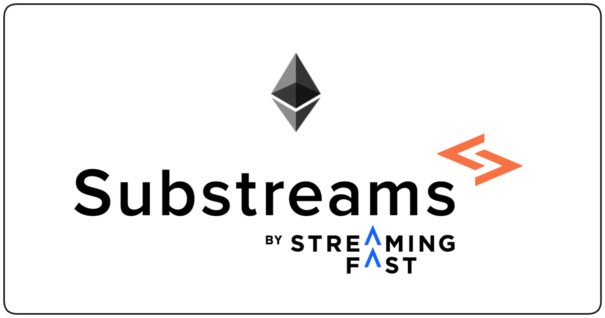

Substreams allows you to easily extract data from EVM blockchains. With Substreams, you can retrieve transactions, instructions or accounts, taking advantage of its powerful streaming technology. It's super fast!

<figure></figure>

## Getting Started

There are two main concepts in Substreams: packages and modules. Essentially, **a _module_ is a Rust function that contains definitions to extract data from the blockchain**. Modules are grouped in **_packages_, which are binary files (`.spkg`) that contain one or several modules**. For example, you might have a package called `ethereum-common`, which has two modules: `get_transactions` and `get_events`.

Developing a Substreams module requires some knowledge of Rust, but the **code-generation tools provided by the Substreams CLI make it so easy to bootstrap a Substreams project**.

To consume Ethereum data with The Graph you have two options:

**- Substreams-powered Subgraphs:** you import a Substreams module into the subgraph. Essentially, Substreams acts just as the extraction layer, but the business logic lives in the subgraph. The Substreams only provides _raw_ data (you use AssemblyScript to code your subgraph).

**- Substreams directly:** you develop your own Substreams module (you use Rust to code your Substreams). Then, you can choose how to consume the data (SQL, Prometheus, streaming...).

Choosing one over the other is up to you. Consider the needs of your application and the skills needed to develop.


**Tip**: If you do not know what subgraphs are, please take a look at [The Graph documentation](https://thegraph.com/docs/en/quick-start/).


To get started, start auto-generating your Substreams using the `substreams init` command:

- [Create Your First Substreams-powered Subgraph](../evm/evm-first-sps.md)
- [Create Your First SQL Substreams](../evm/emv-first-sql.md)
