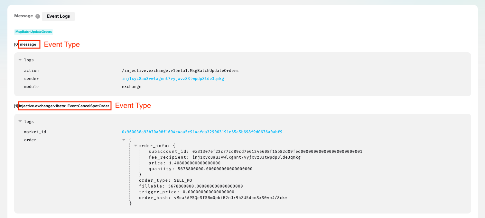
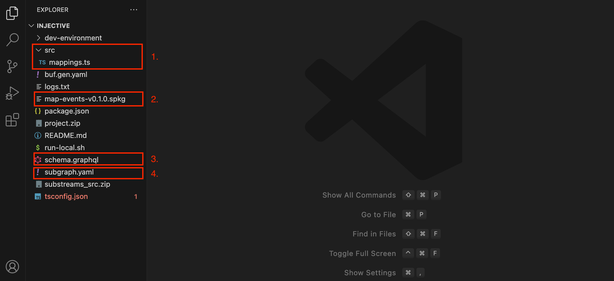

The `substreams init` command allows you to easily auto-generate several types of Substreams projects for several projects. **In this specific tutorial, you will learn how to bootstrap an Injective Substreams-powered Subgraph to filter all the Injective events that you want with almost no-code needed!**

## Before You Begin

- [Install the Substreams CLI](../../../common/installing-the-cli.md)
- [Get an authentication token](../../../common/authentication.md)
- [Install the Graph CLI](https://thegraph.com/docs/en/quick-start/#2-install-the-graph-cli)

## Create the Project

1. In a command-line terminal, run `substreams init`.
You can choose among several project types.

2. Choose `injective-subgraph`.
Now, you will input the parameters needed to create your Injective Substreams-powered Subgraph.

3. `Project name`: give a name to your project.
This will be the name of the folder in your filesystem.

4. `Chain`: you can choose to index data on `Injective Mainnet` or `Injective Testnet`.

5. `Start block`: first block where your Subgraph starts indexing data.

6. `Event types`: input the event type that your Subgraph will index. You can input several input types.
The [Injective Explorer](https://explorer.injective.network/) gives you information about the different event types contained in a transaction.

<figure></figure>

If you input `wasm` and `injective.exchange.v1beta1.EventCancelDerivativeOrder` (note that you have to do it in several steps. When you input your first event, the CLI will ask you whether you can to add another event), the Subgraph will index all the events where `type = wasm` and `type = injective.exchange.v1beta1.EventCancelDerivativeOrder`.

7. `Package build`: whether you want the Substreams package to the built.
The Substreams package is the binary that extracts all the data from the Injective blockchain.
**Always select `Yes, build it`. Otherwise, you'd have to _unzip_ the project and build it yourself.**

8. `Directory`: lastly, choose the directory where you want to create the project.

Done! A new Substreams-powered Subgraph project will be created in the specified directory.

## Inspect the Project

Now, let's inspect the project and understand all the files created. In an IDE of your choice (e.g. VSCode), open the project.

<figure></figure>

1. The `src/mappings.ts` file contains the source of the subgraph. Here, you define the `handleEvents` function, which receives all the filtered events from the Substreams. You can manipulate and aggregate the events to create the subgraph entities that you need.

2. The `map-events-v0.1.0.spkg` is the binary file (`spkg`) generated by the Substreams. Essentially, this file contains the all the source code to filter the events that you selected when running the `substreams init` command.

The Graph Node (i.e. the software that runs your subgraph) uses the `spkg` file to extract the Injective data and provide it as AssemblyScript code to the `handleEvents` function.

3. The `schema.graphql` file contains the subgraph entities. You can use this file to define the output model of your subgraph.
The [entities defined in the GraphQL schema](https://thegraph.com/docs/en/developing/creating-a-subgraph/#the-graphql-schema) are generated into AssemblyScript code by running the `graph codegen`.

4. The `subgraph.yaml` file is the configuration file of the subgraph. It defines the source code of the subgraph (in this case, Substreams) and the handler that will receive the data extracted from Injective (in this case, the `handleEvents` function).

## Test the Subgraph

A subgraph project is really an NPM-based project, so first you must install all the dependencies by running `npm install`.

In a production environment, you will publish your subgraph to the [The Graph decentralized network](https://thegraph.com/docs/en/publishing/publishing-a-subgraph/) (note that The Graph Studio, the hosted testing environment, is not supported for Injective).

**Before publishing to decentralized network, you can test your subgraph locally**, thus not incurring in any costs associated with the deployment. You can run a Graph Node instance (the software that indexers use) in a Docker environment, and replicate the deployment locally.

In the project that you created previously, the `dev-environment` folders contains all the necessary files to spin up a Docker-based Graph Node environment (note that you will need Docker installed and available in your computer).

1. Spin up the environment by running the `dev-environment/start.sh` script.
This script will create a Graph Node instance, a Postgres node and an IPFS node (all these dependencies are necessary for the local Graph Node to succesfully work).

2. Once the Graph Node has started, in another command-line session, create a new subgraph using the NPM scripts provided in the project:


**Note**: The NPM scripts, defined in the `scripts` section of the `package.json` file, are just a wrapped of the Graph CLI commands.


```bash
npm run create-local
```

The previous command connects to the local Graph Node and creates a subgraph. You can always remove the subgraph using the `npm run remove-local` command.

3. Deploy the subgraph.

```bash
npm run deploy-local
```

The previous command deploys the subgraph to the local Graph Node. You can now go back to the logs of the local Graph Node and check out the subgraph indexing.