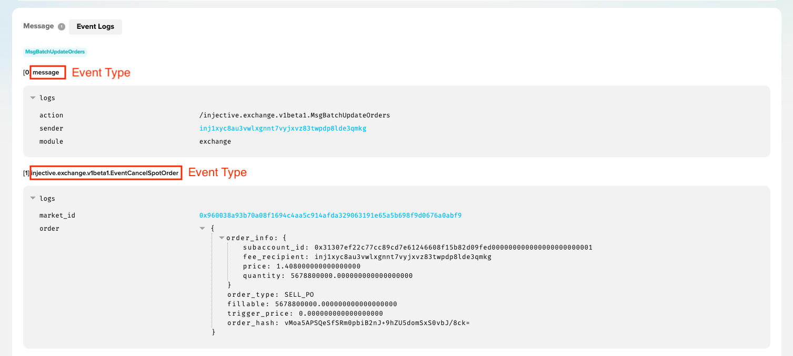
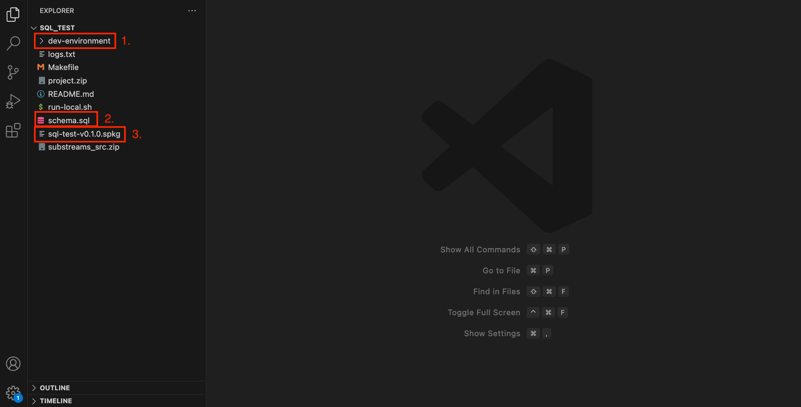

The `substreams init` command allows you to easily auto-generate several types of Substreams projects. **In this specific tutorial, you will learn how to bootstrap an Injective SQL Substreams to filter all the Injective information (events and calls) with almost no-code needed**

## Before You Begin

- [Install the Substreams CLI](../../common/installing-the-cli.md)
- [Get an authentication token](../../common/authentication.md)

## Create the Project

The `substreams init` command allows you choose among several code-generation tools, depending on your needs. In this example, you will create an Injective Substreams module that streams data to a PostgreSQL database.

1. In a command-line terminal, run `substreams init`.

1. Choose `injective-sql`.
Now, you will input the parameters needed to create your Injective SQL Substreams.

1. `Project name`: give a name to the project. This will be used to create the folder in your computer.

1. `Select the chain`: you can choose to index data on `Injective Mainnet` or `Injective Testnet`.

1. `Start block`: first block where your Subgraph starts indexing data.

1. `Filtering options`: the Injective data that you will received will be filtered based on the events (e.g. using the event type of the event attributes). There are several options:
    - `Specific events`: you get a list of events filtered by the event type and/or the event attributes. Note that you will **only** get the events specified.
    - `All events in transactions where at least one event matches your query`: in this case, you get **all** the events of the transaction as long as one event matches your criteria within the transaction.

The [Injective Explorer](https://explorer.injective.network/) gives you information about the different event types and attributes contained in a transaction.

<figure></figure>

Then, you will be asked to input the _type_ and/or _attributes_ that you want to use for the filtering.

1. `SQL type`: you can choose the driver: PosgreSQL or Clickhouse.

1. `Directory`: choose the directory where you want to create the project.

1. `Package build`: whether you want the Substreams package to the built.
The Substreams package is the binary that extracts all the data from the blockchain.
**Always select `Yes, build it`. Otherwise, you'd have to _unzip_ the project and build it yourself.**

## Inspect the Project

Open the generated project in an IDE of your choice (e.g. VSCode).

<figure></figure>

1. The `dev-environment` folder contains the Docker Compose file to spin up a local PostgreSQL database.

2. The `schema.sql` file defines the SQL schema used in the database. The corresponding tables will be created based on the ABI of the smart contract.

3. The `.spkg` file is a binary file that contains the Substreams itself. This file contains all the code necessary to extract the events and/or calls.

## Run the Substreams and Store the Data in a Database

In order to feed the data into PostgreSQL, you will need the [sql-substreams-sink](https://substreams.streamingfast.io/documentation/consume/sql/sql-sink) binary. The `sql-subsreams-sink` binary will execute the `.spkg` file (i.e. run the Substreams) and send the data to Postgres. Essentially, it acts as a bridge between the Substreams execution and the PostgreSQL database.

1. Get the `sink-sql-binary`:

```bash
make get-sink-sql-binary
```

The binary will be stored in the `bin` folder of the project.

1. Launch a local PostgreSQL databe using Docker.

```bash
make launch-postgresql-db
```


**Note**: Make sure you have Docker installed and running.
The Docker set-up will use ports `5432` and `8081`. If you run into issues, make sure this ports are not used in your computer.


1. Set-up the the `substreams-sql-sink` to point to the right Substreams package (i.e. the spkg file of the project).

```bash
make setup-sink 
```

1. Start sinking the data by running the `substreams-sql-sink`.

```bash
make run-sink
```

The SQL database will start getting data from the Substreams execution.

You can now navigate to `https://localhost:8081` in your web browser to access the SQL data through PgWeb.