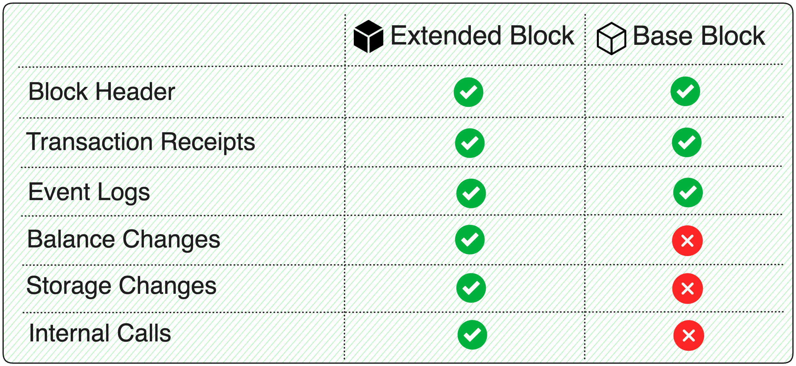

# Chains and endpoints

## Chains and endpoints overview

The different blockchains have separate endpoints that Substreams uses. You will use the endpoint that matches the blockchain you've selected for your development initiative.

### Supported blockchains and Protobuf models

There are different Substreams providers that you can use. StreamingFast and Pinax are the largest providers currently.

Protobuf definitions and public endpoints are provided for the supported protocols and chains.


**Tip**: All of the endpoints listed in the documentation require [authentication](../common/authentication.md) before use.



**Important**_:_ Endpoints serve protobuf models specific to the underlying blockchain protocol and must match the `source:` field for the module.

**Streaming a `sf.near.type.v1.Block` from an Ethereum endpoint does not work!**


<figure><figcaption>
Protobuf for the different supported chains
</figcaption></figure>

| Protocol | Proto model                                                                                                                                   | Latest package                                                                                                        |
| -------- | --------------------------------------------------------------------------------------------------------------------------------------------- | --------------------------------------------------------------------------------------------------------------------- |
| Ethereum | [`sf.ethereum.type.v2.Block`](https://github.com/streamingfast/firehose-ethereum/blob/develop/proto/sf/ethereum/type/v2/type.proto)           | [ethereum-v0.10.4.spkg](https://github.com/streamingfast/sf-ethereum/releases/download/v0.10.2/ethereum-v0.10.4.spkg) |
| NEAR     | [`sf.near.type.v1.Block`](https://github.com/streamingfast/firehose-near/blob/develop/proto/sf/near/type/v1/type.proto)                       |                                                                                                                       |
| Solana   | [`sf.solana.type.v1.Block`](https://github.com/streamingfast/firehose-solana/blob/develop/proto/sf/solana/type/v1/type.proto)                 | [solana-v0.1.0.spkg](https://github.com/streamingfast/sf-solana/releases/download/v0.1.0/solana-v0.1.0.spkg)          |
| Cosmos   | [`sf.cosmos.type.v2.Block`](https://github.com/streamingfast/firehose-cosmos/blob/develop/cosmos/proto/sf/cosmos/type/v2/block.proto#L10)                          |                                                                                                                       |                                                                                                                       |                                                                                                       
| Bitcoin  | [`sf.bitcoin.type.v1.Block`](https://github.com/streamingfast/firehose-bitcoin/blob/develop/proto/sf/bitcoin/type/v1/type.proto)              |                                                                                                                       |
| Antelope  | [`sf.antelope.type.v1.Block`](https://buf.build/pinax/firehose-antelope/docs/main:sf.antelope.type.v1#sf.antelope.type.v1.Block)              |                                                                                                                       |
| Starknet  | [`sf.starknet.type.v1.Block`](https://github.com/streamingfast/firehose-starknet/blob/main/proto/sf/starknet/type/v1/block.proto#L8)              |                                                                                                                       |
| Gara  | [`sf.gear.type.v1.Block`](https://github.com/streamingfast/firehose-gear/blob/main/proto/sf/gear/type/v1/block.proto#L7)              |                                                                                                                       |

### EVM Extended vs Base Block Model

For EVM chains, the are two different types of `Block` models: _Extended_ and _Base_:

* An **Extended Block** is produced by a full node instrumentation integration, thus containing a rich data model (balance changes, internal calls, storage changes...).
* A **Base Block** is produced by a _RPC Poller_ integration, which essentially means that only the data exposed by an RPC endpoint can be included in the data model.

The following table summarizes the different data contained in each type of `Block`.

<figure><figcaption>
Base vs. Extended Block Data Available
</figcaption></figure>

The data missing in the Base Block makes the corresponding Protobuf field empty. For example, if you try to read _internal call_ on a Base Block, the list will be empty.

## Official Endpoints

* **Ethereum Mainnet**: `mainnet.eth.streamingfast.io:443`
* **Ethereum Görli**: `goerli.eth.streamingfast.io:443`
* **Ethereum Sepolia**: `sepolia.eth.streamingfast.io:443`
* **Ethereum Holesky**: `holesky.eth.streamingfast.io:443`
* **Polygon** **Mainnet**: `polygon.streamingfast.io:443`
* **Mumbai Testnet**: `mumbai.streamingfast.io:443`
* **Arbitrum One**: `arb-one.streamingfast.io:443`
* **BNB**: `bnb.streamingfast.io:443`
* **Optimism**: `opt-mainnet.streamingfast.io:443`
* **Avalanche C-Chain Mainnet**: `avalanche-mainnet.streamingfast.io:443`
* **NEAR Mainnet**: `mainnet.near.streamingfast.io:443`
* **NEAR Testnet**: `testnet.near.streamingfast.io:443`
* **Solana mainnet-beta**: `mainnet.sol.streamingfast.io:443`
* **Bitcoin Mainnet**: `mainnet.btc.streamingfast.io:443`
* **Injective Mainnet**: `mainnet.injective.streamingfast.io:443`
* **Injective Testnet**: `testnet.injective.streamingfast.io:443`
* **Sei Mainnet (EVM)**: `evm-mainnet.sei.streamingfast.io:443`
* **Starknet Mainnet**: `mainnet.starknet.streamingfast.io`
* **Base Mainnet**: `base-mainnet.streamingfast.io:443`
* **Vara Mainnet**: `mainnet.vara.streamingfast.io:443`
* **Vara Testnet**: `testnet.vara.streamingfast.io:443`

## Community Endpoints

### Pinax Endpoints

* **Arbitrum One (Mainnet)**: `arbone.substreams.pinax.network:443`
* **Arbitrum Sepolia (Testnet)**: `arbsepolia.substreams.pinax.network:443`
* **Arweave (Mainnet)**: `arweave.substreams.pinax.network:443`
* **Base (Mainnet)**: `base.substreams.pinax.network:443`
* **BNB (Mainnet)**: `bsc.substreams.pinax.network:443`
* **BNB Chapel (Testnet)**: `bsc.substreams.pinax.network:443`
* **Bitcoin (Mainnet)**: `bitcoin.substreams.pinax.network:443`
* **EOS (Mainnet)**: `eos.substreams.pinax.network:443`
* **EOS (Mainnet) EVM**: `eosevm.substreams.pinax.network:443`
* **EOS Jungle4 (Testnet)**: `jungle4.substreams.pinax.network:443`
* **EOS Kylin (Testnet)**: `kylin.substreams.pinax.network:443`
* **Ethereum (Mainnet)**: `eth.substreams.pinax.network:443`
* **Ethereum (Mainnet) Consensus Layer**: `eth-cl.substreams.pinax.network:443`
* **Ethereum Holesky (Testnet)**: `holesky.substreams.pinax.network:443`
* **Ethereum Holesky (Testnet) Consensus Layer**: `holesky-cl.substreams.pinax.network:443`
* **Ethereum Sepolia (Testnet)**: `sepolia.substreams.pinax.network:443`
* **Ethereum Sepolia (Testnet) Consensus Layer**: `sepolia-cl.substreams.pinax.network:443`
* **Gnosis (Mainnet) Consensus Layer**: `gnosis-cl.substreams.pinax.network:443`
* **Gnosis Chiado (Testnet) Consensus Layer**: `chiado-cl.substreams.pinax.network:443`
* **Mode Network (Mainnet)**: `mode.substreams.pinax.network:443`
* **NEAR (Mainnet)**: `near.substreams.pinax.network:443`
* **NEAR (Testnet)**: `neartest.substreams.pinax.network:443`
* **Polygon (Mainnet)**: `polygon.substreams.pinax.network:443`
* **Polygon Amoy (Testnet)**: `amoy.substreams.pinax.network:443`
* **Telos (Mainnet)**: `telos.substreams.pinax.network:443`
* **Telos (Testnet)**: `telostest.substreams.pinax.network:443`
* **Cosmos Theta (Testnet)**: `theta.substreams.pinax.network:443`
* **WAX (Mainnet)**: `wax.substreams.pinax.network:443`
* **WAX (Testnet)**: `waxtest.substreams.pinax.network:443`

You can support other blockchains for Substreams through Firehose instrumentation. Learn more in the [official Firehose documentation](https://firehose.streamingfast.io/).
