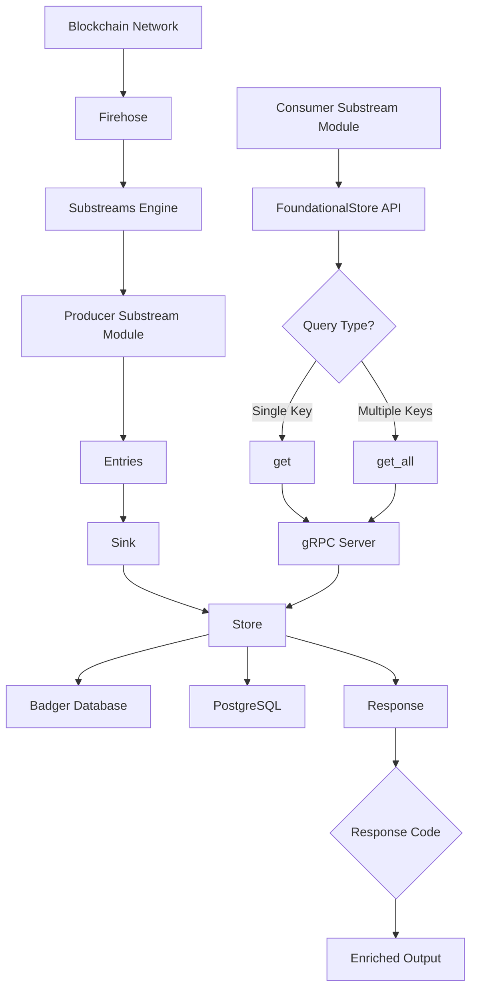

# Foundational Stores

A high-performance, multi-backend key-value storage system designed for Substreams ingestion and serving within the StreamingFast ecosystem. The foundational store provides a unified interface to persist and query time-series blockchain data with fork-awareness and efficient batch processing.

## What are Foundational Stores?

Foundational stores are persistent storage systems that serve as the foundation for complex blockchain data applications. They provide a unified interface for ingesting, storing, and serving time-series blockchain data with fork-awareness capabilities.

- **Block-level versioning**: Every piece of data is tagged with the block number where it originated
- **Fork-aware operations**: Automatic handling of blockchain reorganizations with rollback capabilities
- **Real-time ingestion**: Continuous processing of streaming Substreams output
- **High-performance serving**: Optimized gRPC API for fast data retrieval

## Architecture

Foundational stores consist of three main components working together:

### Sink Component

The **Sink** handles streaming data ingestion from Substreams:

- **Continuous Processing**: Consumes Substreams output in real-time
- **Batch Management**: Groups data into efficient batches for storage
- **Cursor Management**: Maintains resumption state for reliable streaming
- **Fork Detection**: Processes `BlockUndoSignal` messages for reorganizations

### Store Component

The **Store** provides a unified interface across multiple storage backends:

- **ForkAware Layer**: In-memory cache with block-level versioning
- **Backend Abstraction**: Support for Badger (embedded) and PostgreSQL
- **Flush Operations**: Persists finalized data below Last Irreversible Block (LIB)
- **Eviction Handling**: Removes reorganized data during fork events

### Server Component

The **Server** exposes a high-performance gRPC API:

- **Get/GetAll Operations**: Retrieve single or multiple keys efficiently
- **Block Validation**: Ensures requested blocks have been processed
- **Response Codes**: Clear status indicators (FOUND, NOT_FOUND, NOT_FOUND_BLOCK_NOT_REACHED)

## Data Flow Architecture



## User Consumption Patterns

### Foundational Store Intrinsics

Foundational stores are consumed through the [substreams-rs FoundationalStore](https://github.com/streamingfast/substreams-rs/blob/develop/substreams/src/store.rs#L1642) type in your Substreams modules:

```rust
#[substreams::handlers::map]
fn my_module(
    block: Block,
    foundational_store: FoundationalStore,
) -> Result<Output, Error> {
    // Query foundational store for block-scoped data
    let response = foundational_store.get_all(&keys);
    // ...
}
```

### Response Codes

Foundational stores return detailed status information for each query:

- **FOUND**: Key exists and value was retrieved successfully
- **NOT_FOUND**: Key does not exist at the requested block
- **NOT_FOUND_FINALIZE**: Key was deleted after finality (LIB) - historical reference
- **NOT_FOUND_BLOCK_NOT_REACHED**: Requested block has not been processed yet

> See the complete [ResponseCode definition](https://github.com/streamingfast/substreams-foundational-store/blob/develop/proto/sf/substreams/foundational-store/v1/service.proto#L73) for additional details.

## See Also
- [Intro to Foundational Stores](../tutorials/intro-to-foundational-stores.md) - Step-by-step tutorial on consuming foundational stores
