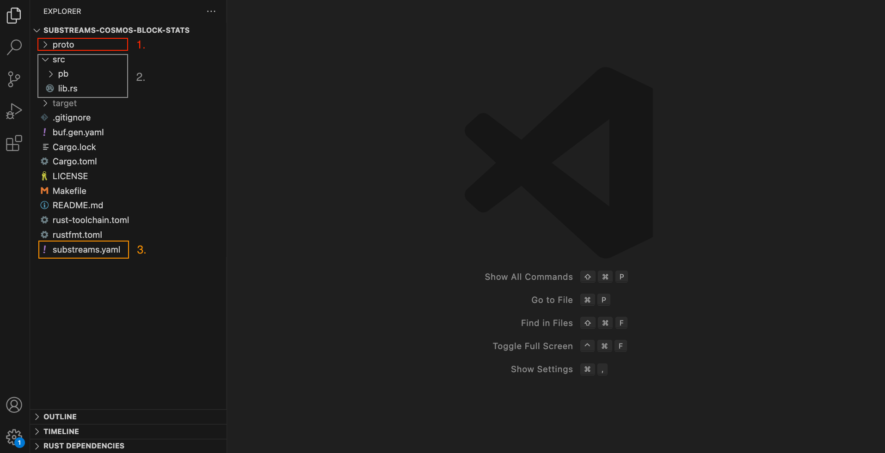

The [BlockStats Susbtreams](https://github.com/streamingfast/substreams-cosmos-block-stats) is a very basic Substreams, extracting data from the Injective blockchain.


**Tip**: This tutorial teaches you how to build a Substreams from scratch.

Remember that you can auto-generate your Substreams module by usig the [code-generation tools](../../../getting-started/injective/injective-first-sql.md).


## Before You Begin

- [Install the Substreams CLI](../../../common/installing-the-cli.md)
- [Get an authentication token](../../../common/authentication.md)
- [Learn about the basics of the Substreams](../../../common/manifest-modules.md)

Clone the [BlockStats Substreams GitHub repository](https://github.com/streamingfast/substreams-cosmos-block-stats) and open it in an IDE of your choice (for example, VSCode).

## Inspect the Project

Every Substreams project contains three main pieces:

- **The Protobuf definitions:** the outputs of your Substreams, which you define through Protobuf schemas.
- **The source code:** the Rust functions that extract the actual data from the blockchain.
- **The Substreams manifest:** the `substreams.yaml` file contains the configuration of your Substreams.

<figure></figure>

1. The `proto` folder contains the Protobuf definitions for the output of your Substreams.
In this example, only a `BlockStats` Protobuf is defined as the output of the Substreams.
2. The `src` folder contains the source code of the Substreams transformations. Specifically, the `lib.rs` contains the Rust functions.
3. The `substreams.yml` is the Substreams manifest, which defines relevant information, such as the inputs/outputs of every module or the Protobuf files.

Take a look at the `substreams.yaml` file:

```yaml
network: cosmos # 1.

imports:
  cosmos: https://github.com/streamingfast/substreams-cosmos/releases/download/v0.1.1/cosmos-v0.1.0.spkg # 2.

protobuf:
  files:
    - cosmos/v1/stats/stats.proto # 3.
  importPaths:
    - ./proto

binaries:
  default:
    type: wasm/rust-v1
    file: target/wasm32-unknown-unknown/release/cosmos_block_stats.wasm

modules:
  - name: block_to_stats # 4.
    kind: map
    initialBlock: 64987400
    inputs:
      - source: sf.cosmos.type.v2.Block # 5.
    output:
      type: proto:cosmos.v1.BlockStats # 6.
```
1. The `network` field specifies which network is the Substreams going to be executed on.
2. Import the [Cosmos Block Protobuf](https://github.com/streamingfast/firehose-cosmos/blob/develop/cosmos/pb/sf/cosmos/type/v1/block.pb.go#L75), which gives you access to the blockchain data.
3. Import the user-defined Protobuf schemas (i.e. the outputs of your Substreams).
4. Define a module. `block_to_stats`, which will be mapped to the `block_to_stats` Rust function in the source code.
5. Define the inputs of the module. In this case, the `Block` Cosmos Protobuf.
6. Define the outputs of the module. In this case, the `BlockStats` Protobuf, which you imported in `#3`.

## Run the Substreams

1. Build the Rust code:

```bash
make build
```

1. Run the Substreams using the `substreams run` command of the CLI: 

```bash
substreams run substreams.yaml block_to_stats \
 -e mainnet.injective.streamingfast.io:443 \
 --start-block=64987400 --stop-block=+1000
```
- `substreams.yaml` is the Substreams manifest with the configurations.
- `block_to_stats` is the name of the module that you want to run (in this Substreams, there only one module).
- `-e mainnet.injective.streamingfast.io:443` is the StreamingFast (Substreams provider) endpoint that will read execute the Substreams and stream back the data.
- `--start-block=64987400 --stop-block=+1000` defines the start and stop block (start at block `64987400` and finish at block `64987500`, 100 blocks later).

1. The `substreams run` displays the data extract at every block linearly, so it might be difficult to properly read the data if your execution happens through thousands of blocks. **The `substreams gui` allows you to jump between blocks and search content.**

```bash
substreams gui substreams.yaml block_to_stats \
 -e mainnet.injective.streamingfast.io:443 \
 --start-block=64987400 --stop-block=+1000
```

Review the [GUI Reference](../../../references/gui.md) to get more information on how to use this utility.

## Inspect the Code

The `lib.rs` file contains the only module defined in this Substreams, `block_to_stats`.

```rust
mod pb;
use crate::pb::sf::cosmos::r#type::v2::Block; // 1.
use crate::pb::cosmos::v1::BlockStats; // 2.
use substreams::errors::Error;

#[substreams::handlers::map]
pub fn block_to_stats(block: Block) -> Result<BlockStats, Error> { // 3.
    let mut stats = BlockStats::default(); // 4.
    let header =  block.header.as_ref().unwrap();
    let last_block_id = header.last_block_id.as_ref().unwrap();

    stats.block_height = block.height as u64; // 5,
    stats.block_hash = hex::encode(block.hash);
    stats.block_time = block.time;
    stats.block_proposer = hex::encode(&header.proposer_address);
    stats.parent_hash = hex::encode(&last_block_id.hash);
    stats.parent_height = block.height - 1i64;

    stats.num_txs = block.txs.len() as u64; // 6.

    Ok(stats) // 7.
}
```
1. Import the Cosmos `Block` Protobuf object, which is passed as a parameter.
2. Import the `BlockStats` Protobuf object, which is the return type of the function.
This Rust object is automatically generated from the Protobuf defined in the `proto` folder.
3. Declaration of the Rust function.
**Input:** Injective block.
**Output:** `BlockStats` object, which is defined by the user and is consumable from the outside world.
4. Creation of the `BlockStats` object.
5. Add data from the `Block` Injective object to user-defined `BlockStats` object. In this case, the `height` of the block.
6. Add more data. In this case, the number of transactions contained in the block.
