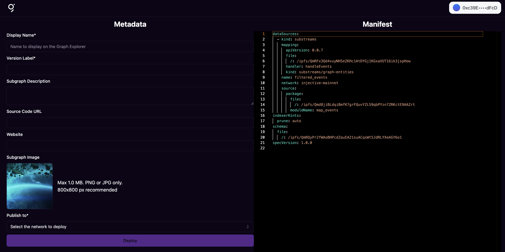

## Publish to the Decentralized Network

The Graph protocol allows you to **publish your subgraph to a decentralized network, where indexers will provide and store the data that you need**. This is the final step to bring your subgraph to a production environment.

Before publishing to the decentralized network, make sure you have tested your subgraph locally by completing the [subgraph local development](./local-development.md) tutorial.

## Use the CLI to Publish to the Network

**Publishing to the decentralized network means interacting with The Graph smart contract in the Arbitrum blockchain**, so you will need a wallet some ETH on Arbitrum before being able to publish your subgraph.

The Graph CLI provides the `graph publish` command, which allows you to easily sign the transaction on the The Graph smart contract by using a in-the-browser wallet (e.g. Metamask).

1. In the directory of your subgraph project, execute `graph publish`.
The command will build your subgraph and publish it to IPFS, as usual.
2. Then, you will be asked to open a browser window. Press `y` to open it.
3. A new window will be opened with a URL similar to this:

```
https://cli.thegraph.com/publish?id=<SUBGRAPH_ID>
```

<figure><figcaption><p>Ethereum Explorer Project Structure</p></figcaption></figure>

4. Complete all the mandatory fields, providing relevant information about your subgraph (name, version...).
5. In the `Publish to` field, choose `The Graph Network`.
6. Press the `Deploy` button. The wallet of your browser will ask you to sign the transaction.

After signing the transaction, your subgraph will be deployed to the decentralized network. Now, indexers can start indexing the data that you need and you can start making queries through The Graph gateway!

To find out more information about your deployed subgraph, you can use [The Graph Explorer](https://thegraph.com/explorer).