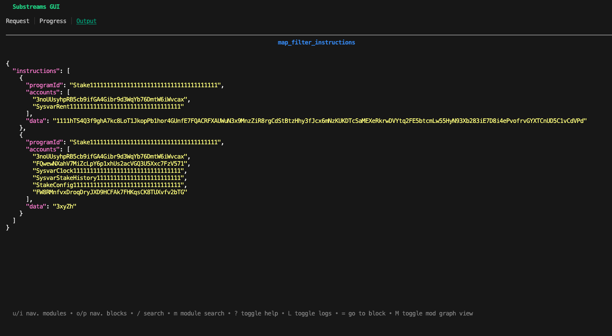

The `map_filter_instructions` module of the Solana Substreams Explorer extracts instruction of a given Program ID. For example, consider that you want to extract all the `Stake11111111111111111111111111111111111111` instructions.

## Run the Substreams

### Run From Source Code

In the `substreams-explorer` project, move to the `solana-explorer` folder, which contains the source of the Solana Substreams. Then, build the Rust code:

```bash
make build
```

Now, you can run the Substreams by using the `substreams gui` command. To avoid iterating over the whole blockchain, the following command extracts instructions from the Stake Program only at block `243830383`:

```bash
substreams gui ./substreams.yaml \
    map_filter_instructions -e mainnet.sol.streamingfast.io:443 \
    --start-block 243830383 --stop-block +1
```

In the `Output` screen of the GUI, you can see two `Stake11111111111111111111111111111111111111` instructions were retrieved at block `243830383`:

<figure></figure>

The `map_filter_instructions` allows you to filter any Program ID, and this is configurable as a parameter in the Substreams Manifest (`substreams.yaml`):

```yaml
params:
  map_filter_instructions: "program_id=Stake11111111111111111111111111111111111111"
```

You can replace `Stake11111111111111111111111111111111111111` by any instruction of your choice.

### Run the Package From the Substreams Registry

The Solana Explorer package is also available on the [Substreams Registry](https://substreams.dev). You can run it by using the following command, achieving the same result:

```bash
substreams gui https://spkg.io/streamingfast/solana-explorer-v0.2.0.spkg \
    map_filter_instructions -e mainnet.sol.streamingfast.io:443 \
    --start-block 243830383 --stop-block +1
```

## Inspect the Code

The `map_filter_instructions.rs` file contains the source of the module. The output of the Substreams module is the `Instructions` object, which is defined in the `/proto/transactions.proto` file of the project. This is a custom object defined by the user, and you can modify at your will.

```protobuf
message Instructions {
  repeated Instruction instructions = 1;
}

message Instruction {
  string program_id = 1;
  repeated string accounts = 2;
  string data = 3;
}
```

Let's inspect the module function:

```rust
#[substreams::handlers::map]
fn map_filter_instructions(params: String, blk: Block) -> Result<Instructions, substreams::errors::Error> {
    let filters = parse_filters_from_params(params)?; // 1.

    let instructions : Vec<Instruction> = blk.transactions().flat_map(|tx| { // 2.
        let msg = tx.transaction.as_ref().unwrap().message.as_ref().unwrap(); // 3.
        let acct_keys = tx.resolved_accounts(); // 4.

        msg.instructions.iter() // 5.
            .filter(|inst| apply_filter(inst, &filters, &acct_keys)) // 6.
            .map(|inst| { // 7.
            Instruction {
                program_id: bs58::encode(acct_keys[inst.program_id_index as usize].to_vec()).into_string(),
                accounts: inst.accounts.iter().map(|acct| bs58::encode(acct_keys[*acct as usize].to_vec()).into_string()).collect(),
                data: bs58::encode(&inst.data).into_string(),
            }
        }).collect::<Vec<_>>()
    }).collect();

    Ok(Instructions { instructions })
}
```
1. The `parse_filters_from_params` function parses the parameters passed to the module.
In this example, the parameter passed is defined in the `substreams.yaml` file as `program_id=Stake11111111111111111111111111111111111111`.
2. Iterate over the transactions of the blocks.
3. Extract the [Message](https://github.com/streamingfast/firehose-solana/blob/develop/proto/sf/solana/type/v1/type.proto#L32) object, which contains relevant information, such as the instructions of the trasaction.
4. Get accounts of the transaction (the `resolved_accounts()` method contains also accounts stored in the [Address Lookup Tables](https://docs.solana.com/developing/lookup-tables)).
5. Iterave over the instructions.
6. Use the `apply_filter` function to only keep instruction where `program_id=Stake11111111111111111111111111111111111111`.
7. Create an `Instruction` object, which will be the output of the Substreams.
This object is declared as a Protobuf in the `proto` folder of the project.
