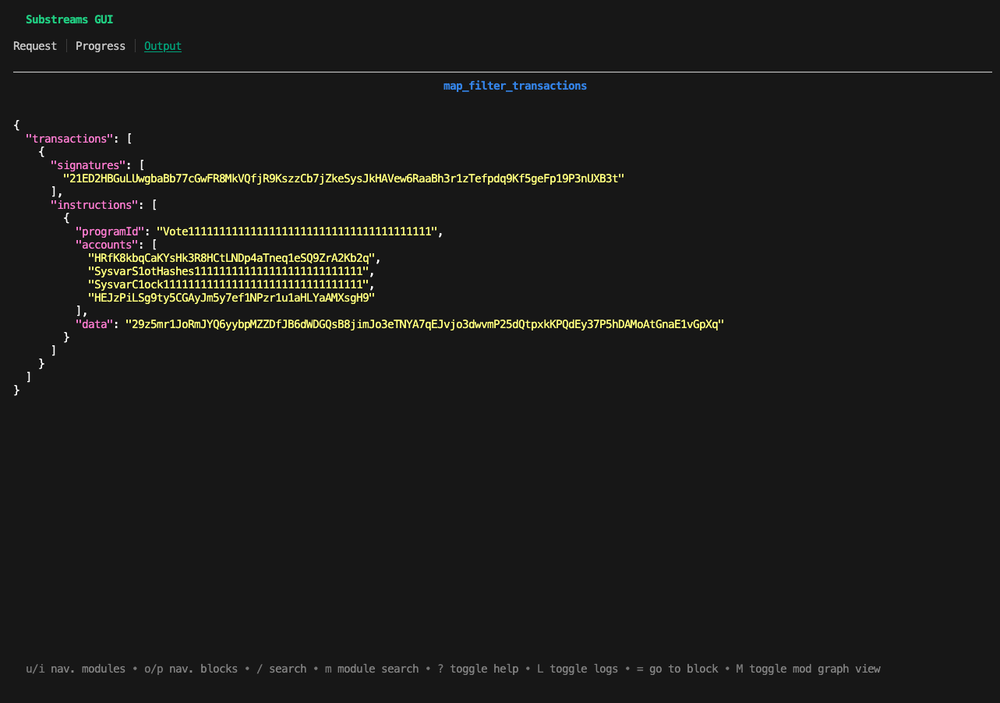

The `map_filter_transactions` module of the Solana Substreams Explorer filters transactions given a signature hash. For example, let's consider that you want to retrieve transactions containing the `21ED2HBGuLUwgbaBb77cGwFR8MkVQfjR9KszzCb7jZkeSysJkHAVew6RaaBh3r1zTefpdq9Kf5geFp19P3nUXB3t`.

## Run the Substreams

### Run From Source Code

In the `substreams-explorer` project, move to the `solana-explorer` folder, which contains the source of the Solana Substreams. Then, build the Rust code:

```bash
make build
```

Now, you can run the Substreams by using the `substreams gui` command. To avoid iterating over the whole blockchain, the following command extracts transactions including `21ED2HBGuLUwgbaBb77cGwFR8MkVQfjR9KszzCb7jZkeSysJkHAVew6RaaBh3r1zTefpdq9Kf5geFp19P3nUXB3t` signatures.

```bash
substreams gui ./substreams.yaml \
    map_filter_instructions -e mainnet.sol.streamingfast.io:443 \
    --start-block 153000028 --stop-block +1
```

In the `Output` screen of the Substreams GUI you can see there is a transaction with the corresponding signature at block number `153000028`.

<figure></figure>

You can change the signature hash in `params` section of the the Substreams Manifest (`substreams.yaml`):

```yaml
params:
  map_filter_transactions: "signature=21ED2HBGuLUwgbaBb77cGwFR8MkVQfjR9KszzCb7jZkeSysJkHAVew6RaaBh3r1zTefpdq9Kf5geFp19P3nUXB3t"
```

### Run the Package From the Substreams Registry

The Solana Explorer is also available as a Substreams package in the [Substreams Regitry](https://substreams.dev). You can simply run it:

```bash
substreams gui https://spkg.io/streamingfast/solana-explorer-v0.2.0.spkg \
    map_filter_transactions -e mainnet.sol.streamingfast.io:443 \
    --start-block 153000028 --stop-block +1
```

## Inspect the Code

The `map_flter_transaction.rs` file contains the source of the module. The output emitted by the module is defined as a Protobuf in the `/proto/transactions.proto` file of the project.

```protobuf

message Instructions {
  repeated Instruction instructions = 1;
}

message Instruction {
  string program_id = 1;
  repeated string accounts = 2;
  string data = 3;
}

message Transactions {
  repeated Transaction transactions = 1;
}

message Transaction {
  repeated string signatures = 1;

  repeated Instruction instructions = 2;
}
```

The output of the Substreams is the `Transactions` Protobuf object:

```rust
#[substreams::handlers::map]
fn map_filter_transactions(params: String, blk: Block) -> Result<Transactions, Vec<substreams::errors::Error>> {
    let filters = parse_filters_from_params(params)?; // 1.

    let mut transactions: Vec<Transaction> = Vec::new();

    blk.transactions // 2.
        .iter()
        .filter(|tx| apply_filter(tx, &filters)) // 3.
        .for_each(|tx| {
            let msg = tx.transaction.as_ref().unwrap().message.as_ref().unwrap();
            let acct_keys = tx.resolved_accounts(); // 4.

            let insts: Vec<Instruction> = msg
                .instructions // 5.
                .iter()
                .map(|inst| Instruction { // 6.
                    program_id: bs58::encode(acct_keys[inst.program_id_index as usize].to_vec()).into_string(),
                    accounts: inst
                        .accounts
                        .iter()
                        .map(|acct| bs58::encode(acct_keys[*acct as usize].to_vec()).into_string())
                        .collect(),
                    data: bs58::encode(&inst.data).into_string(),
                })
                .collect();

            let t = Transaction { // 7.
                signatures: tx
                    .transaction
                    .as_ref()
                    .unwrap()
                    .signatures
                    .iter()
                    .map(|sig| bs58::encode(sig).into_string())
                    .collect(),
                instructions: insts,
            };
            transactions.push(t);
        });

    Ok(Transactions { transactions })
}
```
1. Parse the filters provided as a parameter to the module function.
The signature to filter is defined as a parameter in the Substreams Manifest, and is then injected as a string in the Rust function.
2. Iterate over the transactions of the block.
3. Filter the transactions by invoking the `apply_filters` function. This function only keeps transactions containing the signature passed as a parameter.
4. Get the accounts of the transaction. The `resolved_accounts()` method includes accounts stored in the [Address Lookup Tables](https://docs.solana.com/developing/lookup-tables).
5. Iterate over the instructions of the transaction.
6. Map every instruction to the `Instruction` output Protobuf data model of the Substreams, keeping only three fields: `program_id`, `accounts` and `data`.
7. Map the transaction to the `Transaction` output Protobuf data model of the Substreams.