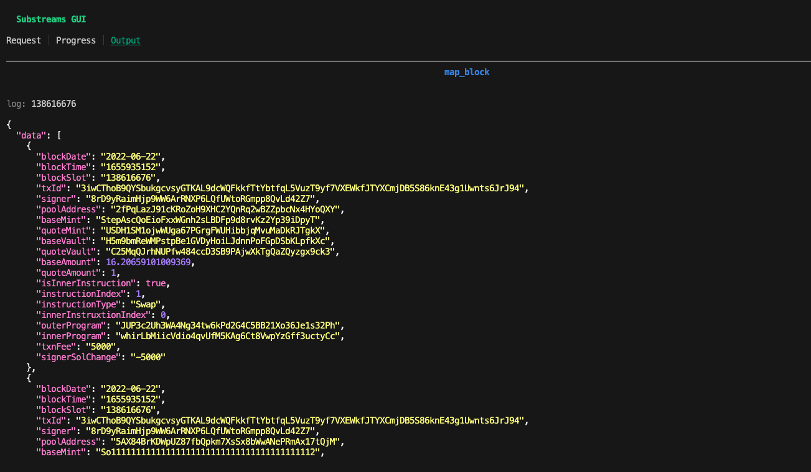

The DEX Trades Substreams, developed by TopLedger, extracts trades from different Solana DEXs (decentralized exchanges).

## About TopLedger

[TopLedger](https://topledger.xyz/) is SQL-based data discovery and analytics platform focused on Solana. By using Substreams, TopLedger has been able to extract data from the main Solana dapps, thus providing rich analytics products.

TopLedger is an active contributor to the Substreams community and has developed several useful ready-to-use Substreams.

## Before You Begin

The DEX Trades Substreams requires medium to advanced Substreams knowledge. If this is the first time you are using Substreams, make sure you:

- Read the [Develop Substreams](../../../develop/develop.md) section, which will teach you the basics of the developing Substreams modules.
- Complete the [Explore Solana](../explore-solana/explore-solana.md) tutorial, which will assist you in understanding the main pieces of the Solana Substreams.

Then, clone the [TopLedger Solana Programs](https://github.com/Topledger/solana-programs) project and navigate to the `dex-trades` folder, which contains the code of the Substreams.

## Inspect the Substreams

The Substreams contains only one module, `map_block`:

```yaml
modules:
  - name: map_block
    kind: map
    inputs:
      - source: sf.solana.type.v1.Block
    output:
      type: proto:sf.solana.dex.trades.v1.Output
```

The module receives a raw Solana block as a parameter (`sf.solana.type.v1.Block`) and emits a custom object containing the trades data (`sf.solana.dex.trades.v1.Output`). The output is a Protobut object defined in the `proto/output.proto` file:

```protobuf
message Output {
  repeated TradeData data = 1;
}

message TradeData {
  required string block_date = 1;
  required int64 block_time = 2;
  required uint64 block_slot = 3;
  required string tx_id = 4;
  required string signer = 5;
  required string pool_address = 6;
  required string base_mint = 7;
  required string quote_mint = 8;
  required string base_vault = 9;
  required string quote_vault = 10;
  required double base_amount = 11;
  required double quote_amount = 12;
  required bool is_inner_instruction = 13;
  required uint32 instruction_index = 14;
  required string instruction_type = 15;
  required uint32 inner_instruxtion_index = 16;
  required string outer_program = 17;
  required string inner_program = 18;
  required uint64 txn_fee = 19;
  required int64 signer_sol_change = 20;
}
```

The Substreams extracts trades from different DEXs. Because every DEX handles the data diffrerently, it is necessary to create a custom decoding function for every DEX. Every supported DEX has its correponding function in the `dapps` directory of the project.

## Run the Substreams

You can run the Substreams against the Solana StreamingFast endpoint by using the Substreams CLI:

```bash
substreams gui -e mainnet.sol.streamingfast.io:443 \
    substreams.yaml map_block -s 138616676 -t +1
```

<figure><figcaption><p>Substreams Execution in the GUI</p></figcaption></figure>

## Inspect the Code

```rust
fn process_block(block: Block) -> Result<Output, substreams::errors::Error> {
    let slot = block.slot;
    let parent_slot = block.parent_slot;
    let timestamp = block.block_time.as_ref();
    let mut data: Vec<TradeData> = vec![]; // 1.
    if timestamp.is_some() {
        let timestamp = timestamp.unwrap().timestamp;
        for trx in block.transactions_owned() { // 2.
            let accounts = trx.resolved_accounts_as_strings(); // 3.
            if let Some(transaction) = trx.transaction {
                let meta = trx.meta.unwrap();
                let pre_balances = meta.pre_balances;
                let post_balances = meta.post_balances;
                let pre_token_balances = meta.pre_token_balances;
                let post_token_balances = meta.post_token_balances;

                let msg = transaction.message.unwrap();

                for (idx, inst) in msg.instructions.into_iter().enumerate() { // 4.
                    let inner_instructions: Vec<InnerInstructions> =
                        filter_inner_instructions(&meta.inner_instructions, idx as u32); // 5.

                    let program = &accounts[inst.program_id_index as usize]; // 6.
                    let trade_data = get_trade_instruction( // 7.
                        program,
                        inst.data,
                        &inst.accounts,
                        &accounts,
                        &pre_token_balances,
                        &post_token_balances,
                        &"".to_string(),
                        false,
                        &inner_instructions,
                    );

                    // ...code omitted...
                }
            }
        }
    }
}
```
1. Initialize an _array_ to keep the trades data extracted.
2. Iterate over the transactions.
3. Get accounts of the transaction (the `resolved_accounts()` method contains also accounts stored in the [Address Lookup Tables](https://docs.solana.com/developing/lookup-tables)).
4. Iterate over the instructions within the transaction.
5. Keep only inner instructions beloging to the current top-level instruction.
Becuse the inner instructions are at the transaction level, you must filter filter which inner instruction belong to the current instruction by using the `index` property.
6. Get the program account.
7. Process trade instruction by calling the `get_trade_instruction(...)` function.

Every DEX handles the data differently, so it is necessary to create a decoding function for every exchange supported. The `get_trade_instruction(...)` function receives the data of every top-level instruction and figures out whether the instruction belongs to any of the supported DEXs. If the instruction is part of a known DEX, the corresponding DEX decoding function is called and a `TradeInstruction` object is returned.

```rust
fn get_trade_instruction(
    dapp_address: &String,
    instruction_data: Vec<u8>,
    account_indices: &Vec<u8>,
    accounts: &Vec<String>,
    pre_token_balances: &Vec<TokenBalance>,
    post_token_balances: &Vec<TokenBalance>,
    outer_program: &String,
    is_inner: bool,
    inner_instructions: &Vec<InnerInstructions>,
) -> Option<trade_instruction::TradeInstruction> {
    let input_accounts = prepare_input_accounts(account_indices, accounts);

    let mut result = None;
    match dapp_address.as_str() { // 1.
        "CLMM9tUoggJu2wagPkkqs9eFG4BWhVBZWkP1qv3Sp7tR" => { // 2.
            result =
                dapps::dapp_CLMM9tUoggJu2wagPkkqs9eFG4BWhVBZWkP1qv3Sp7tR::parse_trade_instruction( // 3.
                    instruction_data,
                    input_accounts,
                );
        }
        "Dooar9JkhdZ7J3LHN3A7YCuoGRUggXhQaG4kijfLGU2j" => { // 4.
            result =
                dapps::dapp_Dooar9JkhdZ7J3LHN3A7YCuoGRUggXhQaG4kijfLGU2j::parse_trade_instruction(
                    instruction_data,
                    input_accounts,
                );
        }
        "Eo7WjKq67rjJQSZxS6z3YkapzY3eMj6Xy8X5EQVn5UaB" => { // 5.
            result =
                dapps::dapp_Eo7WjKq67rjJQSZxS6z3YkapzY3eMj6Xy8X5EQVn5UaB::parse_trade_instruction(
                    instruction_data,
                    input_accounts,
                );
        }
        "PhoeNiXZ8ByJGLkxNfZRnkUfjvmuYqLR89jjFHGqdXY" => {
            result =
                dapps::dapp_PhoeNiXZ8ByJGLkxNfZRnkUfjvmuYqLR89jjFHGqdXY::parse_trade_instruction(
                    instruction_data,
                    input_accounts,
                );
        }
        "SSwapUtytfBdBn1b9NUGG6foMVPtcWgpRU32HToDUZr" => {
            result =
                dapps::dapp_SSwapUtytfBdBn1b9NUGG6foMVPtcWgpRU32HToDUZr::parse_trade_instruction(
                    instruction_data,
                    input_accounts,
                );
        }

        // ...code omitted...
    }
}
```
1. Match the program account passed as a parameter.
2. Excuted if the program account is `CLMM9tUoggJu2wagPkkqs9eFG4BWhVBZWkP1qv3Sp7tR` (Crema Finance).
3. Call the decoding function of Crema Finance (`parse_trade_instruction(...)`).
4. Executed if the program account is `Dooar9JkhdZ7J3LHN3A7YCuoGRUggXhQaG4kijfLGU2j` (Dooar Exchange).
5. Executed if the program account is `Eo7WjKq67rjJQSZxS6z3YkapzY3eMj6Xy8X5EQVn5UaB` (Meteora).

You can find the decoding functions in the `dapps` folder of the project.

Back in the main function (`process_block`), if the instruction processed matches any of the supported DEXs, then the `trade_data` variable will be populated. A new `TradeData` object is created with the corresponding trading information and is added to the array as part of the output of the Substreams.

```rust
fn process_block(block: Block) -> Result<Output, substreams::errors::Error> {
    // ...code omitted...
        let trade_data = get_trade_instruction(
            program,
            inst.data,
            &inst.accounts,
            &accounts,
            &pre_token_balances,
            &post_token_balances,
            &"".to_string(),
            false,
            &inner_instructions,
        );
        if trade_data.is_some() {
            let td = trade_data.unwrap();

            data.push(TradeData {
                block_date: convert_to_date(timestamp),
                tx_id: bs58::encode(&transaction.signatures[0]).into_string(),
                block_slot: slot,
                block_time: timestamp,
                signer: accounts.get(0).unwrap().to_string(),
                pool_address: td.amm,
                base_mint: get_mint(&td.vault_a, &post_token_balances, &accounts),
                quote_mint: get_mint(&td.vault_b, &pre_token_balances, &accounts),
                base_amount: get_amt(
                    &td.vault_a,
                    &pre_token_balances,
                    &post_token_balances,
                    &accounts,
                ),
                quote_amount: get_amt(
                    &td.vault_b,
                    &pre_token_balances,
                    &post_token_balances,
                    &accounts,
                ),
                base_vault: td.vault_a,
                quote_vault: td.vault_b,
                is_inner_instruction: false,
                instruction_index: idx as u32,
                instruction_type: td.name,
                inner_instruxtion_index: 0,
                outer_program: td.dapp_address,
                inner_program: "".to_string(),
                txn_fee: meta.fee,
                signer_sol_change: get_signer_balance_change(
                    &pre_balances,
                    &post_balances,
                ),
            });
        }
    // ...code omitted...
}
```

Until now, the code logic has taken care of the top-level instructions. However, it is also necessary to verify if any of the inner instructions contain relevant DEX information.

The logic for the inner instruction is analogus to the logic of top-level instructions:
- Iterate over the inner instructions.
- Pass the data to the `get_trade_instruction(...)` function.
- If the `get_trade_instruction(...)` function returns a `TradeInstruction` object, then a new `TradeData` object is created and added to the array.

```rust
fn process_block(block: Block) -> Result<Output, substreams::errors::Error> {
    // ...code omitted...
        meta.inner_instructions
            .iter()
            .filter(|inner_instruction| inner_instruction.index == idx as u32)
            .for_each(|inner_instruction| {
                inner_instruction.instructions.iter().enumerate().for_each(
                    |(inner_idx, inner_inst)| {
                        let inner_program =
                            &accounts[inner_inst.program_id_index as usize];
                        let trade_data = get_trade_instruction(
                            inner_program,
                            inner_inst.data.clone(),
                            &inner_inst.accounts,
                            &accounts,
                            &pre_token_balances,
                            &post_token_balances,
                            &program.to_string(),
                            true,
                            &inner_instructions,
                        );

                        if trade_data.is_some() {
                            let td = trade_data.unwrap();

                            data.push(TradeData {
                                block_date: convert_to_date(timestamp),
                                tx_id: bs58::encode(&transaction.signatures[0])
                                    .into_string(),
                                block_slot: slot,
                                block_time: timestamp,
                                signer: accounts.get(0).unwrap().to_string(),
                                pool_address: td.amm,
                                base_mint: get_mint(
                                    &td.vault_a,
                                    &pre_token_balances,
                                    &accounts,
                                ),
                                quote_mint: get_mint(
                                    &td.vault_b,
                                    &pre_token_balances,
                                    &accounts,
                                ),
                                base_amount: get_amt(
                                    &td.vault_a,
                                    &pre_token_balances,
                                    &post_token_balances,
                                    &accounts,
                                ),
                                quote_amount: get_amt(
                                    &td.vault_b,
                                    &pre_token_balances,
                                    &post_token_balances,
                                    &accounts,
                                ),
                                base_vault: td.vault_a,
                                quote_vault: td.vault_b,
                                is_inner_instruction: true,
                                instruction_index: idx as u32,
                                instruction_type: td.name,
                                inner_instruxtion_index: inner_idx as u32,
                                outer_program: program.to_string(),
                                inner_program: td.dapp_address,
                                txn_fee: meta.fee,
                                signer_sol_change: get_signer_balance_change(
                                    &pre_balances,
                                    &post_balances,
                                ),
                            });
                        }
                    },
                )
            });
}
```

