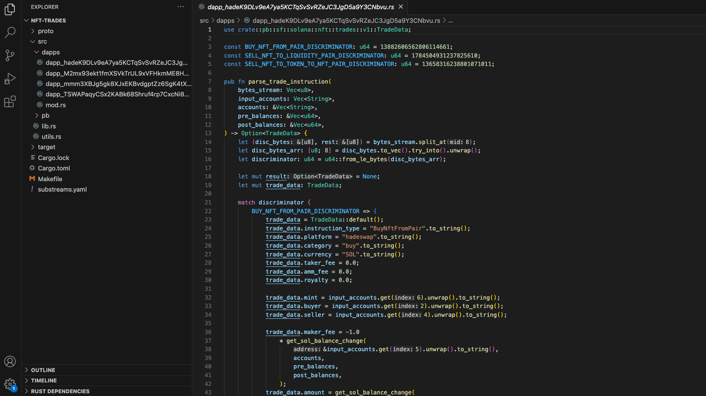
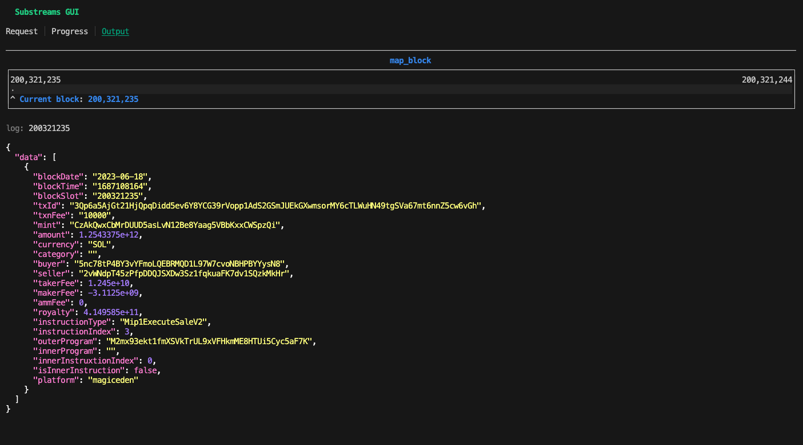

The NFT Trades project, developed by TopLedger, extracts NFT trades from different Solana exchanges, such as Tensor, MagicEden, or HadeSwap.

## About TopLedger

[TopLedger](https://topledger.xyz/) is SQL-based data discovery and analytics platform focused on Solana. By using Substreams, TopLedger has been able to extract data from the main Solana dapps, thus providing rich analytics products.

TopLedger is an active contributor to the Substreams community and has developed several useful ready-to-use Substreams.

## Before You Begin

The NFT Trades Substreams requires medium to advanced Substreams knowledge. If this is the first time you are using Substreams, make sure you:

- Read the [Develop Substreams](../../../develop/develop.md) section, which will teach you the basics of the developing Substreams modules.
- Complete the [Explore Solana](../explore-solana/explore-solana.md) tutorial, which will assist you in understanding the main pieces of the Solana Substreams.

Clone the [TopLedger Solana Programs](https://github.com/Topledger/solana-programs) project and navigate to the `nft-trades` folder, which contains the code of the Substreams.

## Inspect the Project

The Substreams contains only one module, `map_block`:

```rust
modules:
  - name: map_block
    kind: map
    inputs:
      - source: sf.solana.type.v1.Block
    output:
      type: proto:sf.solana.nft.trades.v1.Output
```

The `Output` object provided as the Substreams output is defined in the `proto/outout.proto` file:

```protobuf
message Output {
  repeated TradeData data = 1;
}

message TradeData {
  required string block_date = 1;
  required int64 block_time = 2;
  required uint64 block_slot = 3;
  required string tx_id = 4;
  required uint64 txn_fee = 5;
  required string mint = 6;
  required double amount = 7;
  required string category = 8;
  required string buyer = 9;
  required string seller = 10;
  required double taker_fee = 11;
  required double maker_fee = 12;
  required double amm_fee = 13;
  required double royalty = 14;
  required string instruction_type = 15;
  required uint32 instruction_index = 16;
  required string outer_program = 17;
  required string inner_program = 18;
  required uint32 inner_instruxtion_index = 19;
  required bool is_inner_instruction = 20;
  required string platform = 21;
  required string currency_mint = 22;
}
```

The `TradeData` object contains information about every trade executed, such as `amount`, `buyer` or `seller`.

Every exchange handles data differently, so there is no unique way to decode the data. Therefore, it is necessary to create a custom _decode_ function for every exchange supported by the Substreams. If you navigate to the `nft-trades/dapps` folder, you will find a file for every exchange.

<figure><figcaption><p>NFT Trades Dapps Files</p></figcaption></figure>

Every `dapp` file has a `parse_trade_instruction` function, which is responsible for decoding the data.

## Run the Substreams

You can use the Substreams CLI to run the project:

```bash
substreams gui -e mainnet.sol.streamingfast.io:443 \
    substreams.yaml map_block -s 200321235 -t +1
```

<figure><figcaption><p>Substreams Execution in the GUI</p></figcaption></figure>

## Inspect the Code

The `src/lib.rs` file contains the declaration of the Substreams module, `map_block`. This function is executed for every block of the blockchain.

```rust
fn map_block(block: Block) -> Result<Output, substreams::errors::Error> {
    let slot = block.slot;
    let parent_slot = block.parent_slot;
    let timestamp = block.block_time.as_ref().unwrap().timestamp;

    let mut data: Vec<TradeData> = vec![]; // 1.

    for trx in block.transactions_owned() { // 2. 
        let accounts = trx.resolved_accounts_as_strings(); // 3.
        if let Some(transaction) = trx.transaction { // 4.
            let meta = trx.meta.unwrap();
            let pre_balances = meta.pre_balances;
            let post_balances = meta.post_balances;
            let pre_token_balances = meta.pre_token_balances;
            let post_token_balances = meta.post_token_balances;

            let msg = transaction.message.unwrap();

            for (idx, inst) in msg.instructions.into_iter().enumerate() { // 5.
                let program = &accounts[inst.program_id_index as usize]; // 6.

                let trade_data = get_trade_data( // 7.
                    program,
                    inst.data,
                    &inst.accounts,
                    &accounts,
                    &pre_balances,
                    &post_balances,
                    &meta.log_messages,
                    &post_token_balances,
                );
            
                // ...code omitted...
            }
        }
    }
}
```
1. Create an _array_ of `TradeData` objects, where the trading data will be stored.
2. Iterate over the transactions of the block.
3. Get accounts of the transaction (the `resolved_accounts()` method contains also accounts stored in the [Address Lookup Tables](https://docs.solana.com/developing/lookup-tables)).
4. _Unwrap transaction_
5. Iterate over the instructions of the transaction.
6. Get the program account. The `instruction.program_id_index` indicates the position of the program account in the accounts array.
7. Pass the data to the `get_trade_data` function. This function verifies if the instruction executed is from one of the NFT exchanges that you want to track. The return type is `Option<TradeData>`. The `Option` will only be populated if the instruction belongs to one of the NFT exchanges.

Because every exchange handles the NFT data differently, there must be a custom decoding function for every exchange. The `dapps` folder of the project contains a file for every exchange, declaring the `parse_trade_instruction` function.

```rust
fn get_trade_data(
    dapp_address: &String,
    instruction_data: Vec<u8>,
    account_indices: &Vec<u8>,
    accounts: &Vec<String>,
    pre_balances: &Vec<u64>,
    post_balances: &Vec<u64>,
    log_messages: &Vec<String>,
    post_token_balances: &Vec<TokenBalance>,
) -> Option<TradeData> {
    let input_accounts = prepare_input_accounts(account_indices, accounts); // 1.

    let mut result = None;
    match dapp_address.as_str() { // 2.
        "TSWAPaqyCSx2KABk68Shruf4rp7CxcNi8hAsbdwmHbN" => { // 3. Tensor
            result =
                dapps::dapp_TSWAPaqyCSx2KABk68Shruf4rp7CxcNi8hAsbdwmHbN::parse_trade_instruction( // 4.
                    instruction_data,
                    input_accounts,
                    log_messages,
                );
        }
        "M2mx93ekt1fmXSVkTrUL9xVFHkmME8HTUi5Cyc5aF7K" => { // 4. MagicEden
            result =
                dapps::dapp_M2mx93ekt1fmXSVkTrUL9xVFHkmME8HTUi5Cyc5aF7K::parse_trade_instruction(
                    instruction_data,
                    input_accounts,
                    accounts,
                    log_messages,
                    post_token_balances,
                );
        }
        "hadeK9DLv9eA7ya5KCTqSvSvRZeJC3JgD5a9Y3CNbvu" => { // 5. HadeSwap
            result =
                dapps::dapp_hadeK9DLv9eA7ya5KCTqSvSvRZeJC3JgD5a9Y3CNbvu::parse_trade_instruction(
                    instruction_data,
                    input_accounts,
                    accounts,
                    pre_balances,
                    post_balances,
                )
        }
        "mmm3XBJg5gk8XJxEKBvdgptZz6SgK4tXvn36sodowMc" => { // 6. MMM
            result =
                dapps::dapp_mmm3XBJg5gk8XJxEKBvdgptZz6SgK4tXvn36sodowMc::parse_trade_instruction(
                    instruction_data,
                    input_accounts,
                    accounts,
                    pre_balances,
                    post_balances,
                    log_messages,
                );
        }
        "CJsLwbP1iu5DuUikHEJnLfANgKy6stB2uFgvBBHoyxwz" => {  // 7. Solanart
            result =
                dapps::dapp_CJsLwbP1iu5DuUikHEJnLfANgKy6stB2uFgvBBHoyxwz::parse_trade_instruction(
                    instruction_data,
                    input_accounts,
                    accounts,
                    pre_balances,
                    post_balances,
                    log_messages,
                );
        }
        "SNPRohhBurQwrpwAptw1QYtpFdfEKitr4WSJ125cN1g" => { // 8. Sniper Market
            result =
                dapps::dapp_SNPRohhBurQwrpwAptw1QYtpFdfEKitr4WSJ125cN1g::parse_trade_instruction(
                    instruction_data,
                    input_accounts,
                    accounts,
                    pre_balances,
                    post_balances,
                    log_messages,
                );
        }
        _ => {} // 9.
    }

    return result;
}
```
1. Based on the `account_indices` parameter passed, create an in-order array of accounts.
2. The `dapp_address` parameter passed is the program account. For every NFT program, you handle the decoding differently.
3. For example, the `TSWAPaqyCSx2KABk68Shruf4rp7CxcNi8hAsbdwmHbN` account represents the Tensor exchange.
9. If the program account does not match any of the NFT exchanges, then an empty `Option<TradeData>` object is returned.