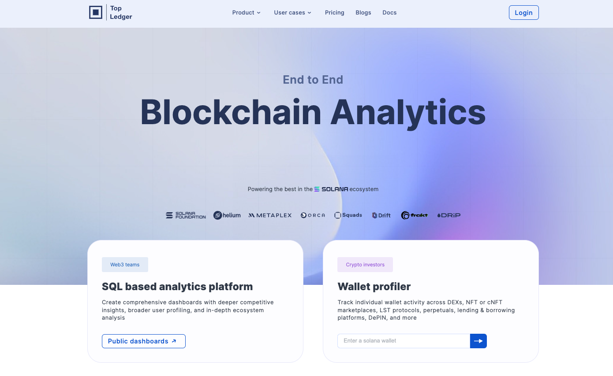

[TopLedger](https://topledger.xyz/) is SQL-based data discovery and analytics platform focused on Solana. By using Substreams, TopLedger has been able to extract data from the main Solana dapps, thus providing rich analytics products.

<figure><figcaption>
TopLedger Website
</figcaption></figure>

You can find the Substreams they have built on the [Solana Programs GitHub Repository](https://github.com/Topledger/solana-programs). Among the most relevant Substreams you can find:
- [DEX Trades](https://github.com/Topledger/solana-programs/tree/main/dex-trades)
- [NFT Trades](https://github.com/Topledger/solana-programs/tree/main/nft-trades)
- [cNFT Trades](https://github.com/Topledger/solana-programs/tree/main/cnft-trades)
- [Liquidity Providers](https://github.com/Topledger/solana-programs/tree/main/liquidity-providers)

In the following pages, you will go through some of these projects to test and learn about the code.