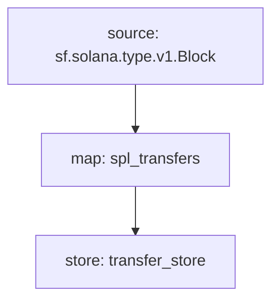

# Substreams CLI reference

The Substreams command line interface (CLI) is the Substreams user interface and primary tool for sending requests and receiving data.

The Substreams CLI exposes many commands to developers enabling a range of features. The Substreams commands available for you to use are explained in further detail in the proceeding Substreams CLI documentation.


**Note**: When a package is specified you can use:&#x20;

* Local `substreams.yaml` files
* Local `.spkg's`
* Remote `.spkg` URLs


### **`run`**

The `run` command connects to a Substreams endpoint and begins processing data.

```
substreams run -e mainnet.eth.streamingfast.io:443 \
   -t +1 \
   ./substreams.yaml \
   module_name
```

#### Run Command breakdown

* `-e mainnet.eth.streamingfast.io:443` is the endpoint of the provider running your Substreams
* `-t +1` (or `--stop-block`) only requests a single block (the stop block is the manifest's `initialBlock` + 1)
* `substreams.yaml` is the path where you have defined your [Substreams Manifest](https://github.com/streamingfast/substreams-docs/blob/master/docs/guides/docs/reference/manifests.html). You can use a `.spkg` or `substreams.yaml` file.
* `module_name` is the module we want to run, referring to the `name` [defined in the manifest](manifests.md#modules-.name).

Passing a different `-s` (or `--start-block`) runs prior modules at a higher speed. Output is provided at the requested start block, keeping snapshots along the way if you want to process it again.

Example output of `gravatar_updates` starting at block 6200807.

```
$ substreams run -e mainnet.eth.streamingfast.io:443 \
    https://github.com/Jannis/gravity-substream/releases/download/v0.0.1/gravity-v0.1.0.spkg \
    gravatar_updates -o json
{
  "updates": [
    {
      "id": "39",
      "owner": "0xaadcc13071fdf9c73cfbb8d97639ea68aa6fd1d2",
      "displayName": "alex | OpenSea",
      "imageUrl": "https://ucarecdn.com/13a67247-cb89-417a-92d2-50a7d7aa481c/-/crop/382x382/0,0/-/preview/"
    }
  ]
}
...
```

Notice how the `-o` (or `--output`), alters the output format. The available options are:

* `ui`, a nicely formatted, UI-driven interface, displaying progress information and execution logs.
* `json`, an indented stream of data, **not** displaying progress information or logs, only data output for blocks proceeding the start block.
* `jsonl`, same as `json` showing every individual output on a single line.

### `pack`

The `pack` command builds a shippable, importable package from a `substreams.yaml` manifest file.

```bash
$ substreams pack ./substreams.yaml
...
Successfully wrote "your-package-v0.1.0.spkg".
```

### `info`

The `info` command prints out the contents of a package for inspection. It works on both local and remote `yaml` or `spkg` files.

```bash
$ substreams info ./substreams.yaml
Package name: solana_spl_transfers
Version: v0.5.2
Doc: Solana SPL Token Transfers stream

  Stream SPL token transfers to the nearest human being.

Modules:
----
Name: spl_transfers
Initial block: 130000000
Kind: map
Output Type: proto:solana.spl.v1.TokenTransfers
Hash: 2b59e4e840f814f4154a688c2935da9c3b61dc61

Name: transfer_store
Initial block: 130000000
Kind: store
Value Type: proto:solana.spl.v1.TokenTransfers
Update Policy: UPDATE_POLICY_SET
Hash: 11fd70768029bebce3741b051c15191d099d2436
```

### `graph`

The `graph` command prints out a visual graph of the package in the _mermaid-js_ format.


**Note**: see [https://mermaid.live/](https://mermaid.live/) for a live mermaid-js editor.


````bash
$ substreams graph ./substreams.yaml                         [±master ●●]
Mermaid graph:


````

The code creates a graphic similar to:


Mermaid generated graph diagram


### `inspect`

The `inspect` command reaches deep into the file structure of a package (`yaml` or `spkg`). The `inspect` command is used mostly for debugging, _or for the curious ;)_

```
$ substreams inspect ./substreams.yaml | less
proto_files {
...
modules {
  modules {
    name: "my_module_name"
...
```

### Help

The commands and a brief explanation are provided in the Substreams CLI. Run the `substreams` command in a terminal passing the `-h` flag to view the help reference at any time.

```bash
substreams -h
```


```bash
Usage:
  substreams [command]

Available Commands:
  completion  Generate the autocompletion script for the specified shell
  decode
  graph       Generate mermaid-js graph document
  help        Help about any command
  info        Display package modules and docs
  inspect     Display low-level package structure
  pack        Build an .spkg out of a .yaml manifest
  protogen    Generate Rust bindings from a package
  run         Stream modules from a given package on a remote endpoint
  tools       Developer tools related to substreams

Flags:
  -h, --help      help for substreams
  -v, --version   version for substreams

Use "substreams [command] --help" for more information about a command.
```

