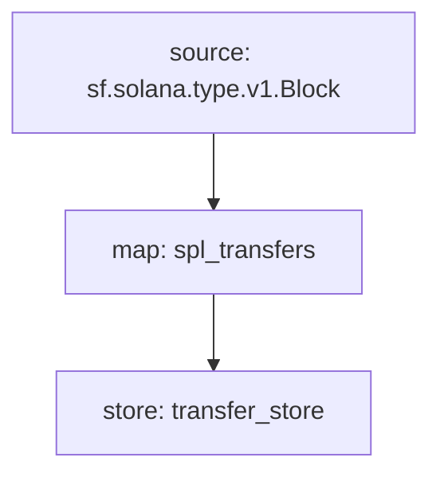

# Substreams CLI reference

## `substreams` CLI reference overview

The `substreams` command line interface (CLI) is the primary user interface and the main tool for sending requests and receiving data.

The `substreams` CLI exposes many commands to developers enabling a range of features.


**Note**: When a package is specified, it is optional. If you do use it, you can use:

* Local `substreams.yaml` configuration files
* Local `.spkg` package files
* Remote `.spkg` package URLs
* Local directory containing a `substreams.yaml` file

If you choose to not use it, make sure that you are in a directory that contains a substreams.yaml file. Otherwise, you will get a usage error back.


### **`run`**

The `run` command connects to a Substreams endpoint and begins processing data.


```bash
substreams run -e mainnet.eth.streamingfast.io:443 \
   -t +1 \
   ./substreams.yaml \
   module_name
```


The details of the run command are:

* `-e mainnet.eth.streamingfast.io:443` is the endpoint of the provider running your Substreams.
* `-t +1` or `--stop-block` only requests a single block; the stop block is the manifest's `initialBlock` + 1.
* `substreams.yaml` is the path where you have defined your [Substreams manifest](https://github.com/streamingfast/substreams-docs/blob/master/docs/guides/docs/reference/manifests.html). You can use a `.spkg` or `substreams.yaml` configuration file.
* `module_name` is the module we want to `run`, referring to the module name [defined in the Substreams manifest](manifests.md#modules-.name).


**Tip**: Passing a different `-s` or `--start-block` runs prior modules at a higher speed. Output is provided at the requested start block, keeping snapshots along the way if you want to process it again.


#### Run example with output


```bash
$ substreams run -e mainnet.eth.streamingfast.io:443 \
    https://github.com/Jannis/gravity-substream/releases/download/v0.0.1/gravity-v0.1.0.spkg \
    gravatar_updates -o json
```


The output of the `gravatar_updates` module starting at block `6200807` will print a message resembling:


```bash
{
  "updates": [
    {
      "id": "39",
      "owner": "0xaadcc13071fdf9c73cfbb8d97639ea68aa6fd1d2",
      "displayName": "alex | OpenSea",
      "imageUrl": "https://ucarecdn.com/13a67247-cb89-417a-92d2-50a7d7aa481c/-/crop/382x382/0,0/-/preview/"
    }
  ]
}
...
```



**Note**: The `-o` or `--output` flag alters the output format.


The available output display options are:

* `ui`, a nicely formatted, UI-driven interface, displaying progress information and execution logs.
* `json`, an indented stream of data, **not** displaying progress information or logs, only data output for blocks proceeding the start block.
* `jsonl`, same as `json` showing every individual output on a single line.

### `gui`

The `gui` command pops up a terminal-based graphical user interface.

Its parameters are very similar to those of `run`, but provides a UI to navigate the results instead of a stream of data.

#### Replay mode

When you run a `gui` session, a file called `replay.log` gets written with the contents of the streamed data that persists after closing the GUI.

You can reload the data without hitting the server again using `--replay`. The data is immediately reloaded in the GUI, ready for more inspection.

### `pack`

The `pack` command builds a shippable, importable package from a `substreams.yaml` manifest file.


```bash
$ substreams pack ./substreams.yaml
```


The output of the `pack` command will print a message resembling:


```bash
...
Successfully wrote "your-package-v0.1.0.spkg".
```


### `info`

The `info` command prints out the contents of a package for inspection. It works on both local and remote `yaml` or `spkg` configuration files.


```bash
$ substreams info ./substreams.yaml
```


The output of the `info` command will print a message resembling:


```bash
Package name: solana_spl_transfers
Version: v0.5.2
Doc: Solana SPL Token Transfers stream

  Stream SPL token transfers to the nearest human being.

Modules:
----
Name: spl_transfers
Initial block: 130000000
Kind: map
Output Type: proto:solana.spl.v1.TokenTransfers
Hash: 2b59e4e840f814f4154a688c2935da9c3b61dc61

Name: transfer_store
Initial block: 130000000
Kind: store
Value Type: proto:solana.spl.v1.TokenTransfers
Update Policy: UPDATE_POLICY_SET
Hash: 11fd70768029bebce3741b051c15191d099d2436
```


### `graph`

The `graph` command prints out a visual graph of the package in the [mermaid-js format](https://mermaid.js.org/intro/n00b-syntaxReference.html).


**Tip**: [Mermaid Live Editor](https://mermaid.live/) is the visual editor used by Substreams.



````bash
$ substreams graph ./substreams.yaml
                    [±master ●●]
Mermaid graph:


````


The `graph` command will result in a graphic resembling:


Mermaid generated graph diagram


### `inspect`

The `inspect` command reaches deep into the file structure of a `yaml` configuration file or `spkg` package and is used mostly for debugging, or if you're curious\_.\_


```bash
$ substreams inspect ./substreams.yaml | less
```


The output of the `inspect` command will print a message resembling:


```bash
proto_files
...
modules {
  modules {
    name: "my_module_name"
...
```


### Help

To view a list of available commands and brief explanations in the `substreams` CLI, run the `substreams` command in a terminal passing the `-h` flag. You can use this help reference at any time.


```bash
substreams -h
```


The output of the `help` command will print a message resembling:


```bash
Usage:
  substreams [command]

Available Commands:
  completion  Generate the autocompletion script for the specified shell
  decode
  graph       Generate mermaid-js graph document
  help        Help about any command
  info        Display package modules and docs
  inspect     Display low-level package structure
  pack        Build an .spkg out of a .yaml manifest
  protogen    Generate Rust bindings from a package
  run         Stream modules from a given package on a remote endpoint
  tools       Developer tools related to substreams

Flags:
  -h, --help      help for substreams
  -v, --version   version for substreams

Use "substreams [command] --help" for more information about a command.
```

