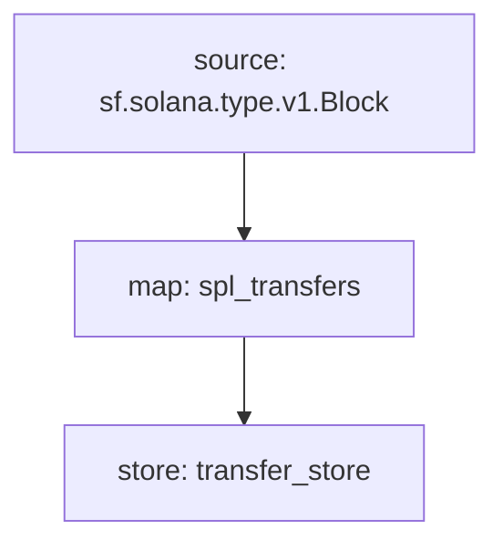

# Using the CLI

Here are the commands you can invoke with the `substreams` command-line tool.


In the commands below, any time a package is specified, you can use either a local `substreams.yaml` file, a local `.spkg` or a remote `.spkg` url.


### **`run`**

The `run` command allows you connect to a Substreams endpoint and start processing data.

```
substreams run -e api-dev.streamingfast.io:443 \
   --stop-block +1 \
   ./substreams.yaml \
   module_name
```

Let's break down everything happening above.

* `-e api-dev.streamingfast.io:443` is the endpoint of the provider running our Substreams
* `--stop-block +1` only requests a single block (stop block will be manifest's `initialBlock` + 1)
* `substreams.yaml` is the path where we have defined our [Substreams Manifest](https://github.com/streamingfast/substreams-docs/blob/master/docs/guides/docs/reference/manifests.html). This can be an `.spkg` or a `substreams.yaml` file.
* `module_name` this is the module we want to run, refering to the `name` [defined in the manifest](manifests.md#modules-.name).

Passing a different `-s` (or `--start-block`) will run any prior modules at high speed, in order to provide you with output at the requested start block as fast as possible, while keeping snapshots along the way, in case you want to process it again.

Here is the example of an output of the `graviatar_updates` starting at block 6200807:

```
$ substreams run -e api-dev.streamingfast.io:443 \
                 gravity-v0.1.0.spkg gravatar_updates -o json
{
  "updates": [
    {
      "id": "39",
      "owner": "0xaadcc13071fdf9c73cfbb8d97639ea68aa6fd1d2",
      "displayName": "alex | OpenSea",
      "imageUrl": "https://ucarecdn.com/13a67247-cb89-417a-92d2-50a7d7aa481c/-/crop/382x382/0,0/-/preview/"
    }
  ]
}
...
```

Notice the `-o` (or `--output`), that can alter the output format. The options are:

* `ui`, a nicely formatted, UI-driven interface, with progress information, and execution logs.
* `json`, an indented stream of data, with no progress information nor logs, but just data output for blocks following the start block.
* `jsonl`, same as `json` but with each output on a single line
* `module-json`, same as `json` but wrapped in a json structure specifying the module name
* `module-jsonl`, sam eas `module-json`, but on a single line.

### `pack`

The `pack` command builds a shippable, importable package from a `substreams.yaml` manifest file.

Use:

```bash
$ substreams pack ./substreams.yaml
...
Successfully wrote "your-package-v0.1.0.spkg".
```

### `info`

This command prints out the contents of a package for inspection. It works on both local and remote `yaml` or `spkg` files.

Example:

```bash
$ substreams info ./substreams.yaml
Package name: solana_spl_transfers
Version: v0.5.2
Doc: Solana SPL Token Transfers stream

  This streams out SPL token transfers to the nearest human being.
  
Modules:
----
Name: spl_transfers
Kind: map
Output Type: proto:solana.spl.v1.TokenTransfers
Hash: 9d72f37f043229c88eb8494c72f830b9990acb8e

Name: transfer_store
Kind: store
Value Type: proto:solana.spl.v1.TokenTransfers
Update Policy: UPDATE_POLICY_SET
Hash: b08127b2f900cb4562f7d9597c98d9d09a8088d4

```

### `graph`

This command prints out a graph of the package in the _mermaid-js_ format.


See [https://mermaid.live/](https://mermaid.live/) for a live mermaid-js editor


Example:

````bash
$ substreams graph ./substreams.yaml                                 [±master ●●]
Mermaid graph:


````

This produces a graph like:


Open the link and change ".ink/svg/" to ".live/edit#" in the URL, to go back to edit mode.


### `inspect`

This command goes deep into the file structure of a package (`yaml` or `spkg`). Used mostly for debugging or for the curious:

```
$ substreams inspect ./substreams.yaml | less
proto_files {
...
modules {
  modules {
    name: "my_module_name"
...
```
