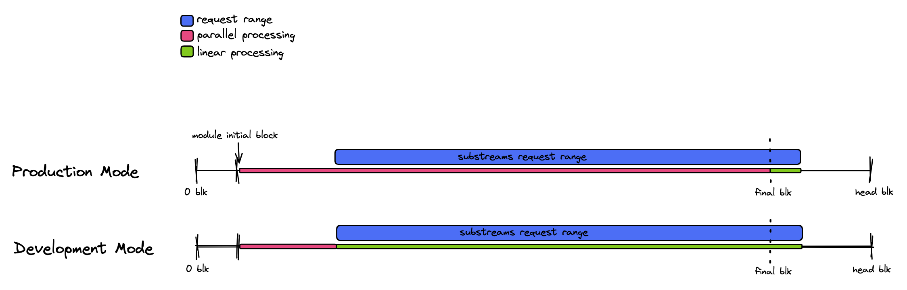

# Change log

All notable changes to this project will be documented in this file.

The format is based on [Keep a Changelog](https://keepachangelog.com/en/1.0.0/), and this project adheres to [Semantic Versioning](https://semver.org/spec/v2.0.0.html).

## Unreleased

### Fixed

* "undo" messages incorrectly contained too many module outputs (all modules, with some duplicates)
* Fixed status bar message cutoff bug

## [1.0.0](https://github.com/streamingfast/substreams/releases/tag/v1.0.0)

### Highlights

* Added command `substreams gui`, providing a terminal-based GUI to inspect the streamed data. Also adds `--replay` support, to save a stream to `replay.log` and load it back in the UI later. You can use it as you would `substreams run`. Feedback welcome.
* Modified command `substreams protogen`, defaulting to generating the `mod.rs` file alongside the rust bindings. Also added `--generate-mod-rs` flag to toggle `mod.rs` generation.
* Added support for module parameterization. Defined in the manifest as:

```
module:
  name: my_module
  inputs:
    params: string
  ...
  
params:
  my_module: "0x123123"
  "imported:module": override value from imported module
```

and on the command-line as:

* `substreams run -p module=value -p "module2=other value" ...`

Servers need to be updated for packages to be able to be consumed this way.

This change keeps backwards compatibility. Old Substreams Packages will still work the same, with no changes to module hashes.

### Added

* Added support for `{version}` template in `--output-file` flag value on `substreams pack`.
* Added fuel limit to wasm execution as a server-side option, preventing wasm process from running forever.
* Added 'Network' and 'Sink{Type, Module, Config}' fields in the manifest and protobuf definition for future bundling of substreams sink definitions within a substreams package.

## [0.2.0](https://github.com/streamingfast/substreams/releases/tag/v0.2.0)

### Highlights

* Improved execution speed and module loading speed by bumping to WASM Time to version 4.0.

* Improved developer experience on the CLI by making the `<manifest>` argument optional.

  The CLI when `<manifest>` argument is not provided will now look in the current directory for a `substreams.yaml` file and is going to use it if present. So if you are in your Substreams project and your file is named `substreams.yaml`, you can simply do `substreams pack`, `substreams protogen`, etc.

  Moreover, we added to possibility to pass a directory containing a `substreams.yaml` directly so `substreams pack path/to/project` would work as long as `path/to/project` contains a file named `substreams.yaml`.

* Fixed a bug that was preventing production mode to complete properly when using a bounded block range.

* Improved overall stability of the Substreams engine.

#### Operators Notes

* **Breaking** Config values `substreams-stores-save-interval` and `substreams-output-cache-save-interval` have been merged together into `substreams-cache-save-interval` in the `firehose-<chain>` repositories. Refer to chain specific `firehose-<chain>` repository for further details.

### Added

* The `<manifest>` can point to a directory that contains a `substreams.yaml` file instead of having to point to the file directly.

* The `<manifest>` parameter is now optional in all commands requiring it.

### Fixed

* Fixed valuetype mismatch for stores 

* Fixed production mode not completing when block range was specified

* Fixed tier1 crashing due to missing context canceled check.

* Fixed some code paths where locking could have happened due to incorrect checking of context cancellation.

* Request validation for blockchain's input type is now made only against the requested module it's transitive dependencies.

### Updated

* Updated WASM Time library to 4.0.0 leading to improved execution speed.

### Changed

* Remove distinction between `output-save-interval` and `store-save-interval`.

* `substreams init` has been moved under `substreams alpha init` as this is a feature included by mistake in latest release that should not have been displayed in the main list of commands.

* `substreams codegen` has been moved under `substreams alpha codegen` as this is a feature included by mistake in latest release that should not have been displayed in the main list of commands.

## [0.1.0](https://github.com/streamingfast/substreams/releases/tag/v0.1.0)

This upcoming release is going to bring significant changes on how Substreams are developed, consumed and speed of execution. Note that there is **no** breaking changes related to your Substreams' Rust code, only breaking changes will be about how Substreams are run and available features/flags.

Here the highlights of elements that will change in next release:

- [Production vs Development Mode](#production-vs-development-mode)
- [Single Output Module](#single-module-output)
- [Output Module must be of type `map`](#output-module-must-be-of-type-map)
- [`InitialSnapshots` is now a `development` mode feature only](#initialsnapshots-is-now-a-development-mode-feature-only)
- [Enhanced Parallel Execution](#enhanced-parallel-execution)

In this rest of this post, we are going to go through each of them in greater details and the implications they have for you. Full changelog is available after.

> **Warning** Operators, refer to [Operators Notes](#operators-notes) section for specific instructions of deploying this new version.

### Production vs development mode

We introduce an execution mode when running Substreams, either `production` mode or `development` mode. The execution mode impacts how the Substreams get executed, specifically:

 - The time to first byte
 - The module logs and outputs sent back to the client
 - How parallel execution is applied through the requested range

The difference between the modes are:

- In `development` mode, the client will receive all the logs of the executed `modules`. In `production` mode, logs are not available at all.
- In `development` mode, module's are always re-executed from request's start block meaning now that logs will always be visible to the user. In `production` mode, if a module's output is found in cache, module execution is skipped completely and data is returned directly.
- In `development` mode, only backward parallel execution can be effective. In `production` mode, both backward parallel execution and forward parallel execution can be effective. See [Enhanced parallel execution](#enhanced-parallel-execution) section for further details about parallel execution.
- In `development` mode, every module's output is returned back in the response but only root module is displayed by default in `substreams` CLI (configurable via a flag). In `production` mode, only root module's output is returned.
- In `development` mode, you may request specific `store` snapshot that are in the execution tree via the `substreams` CLI `--debug-modules-initial-snapshots` flag. In `production` mode, this feature is not available.

The execution mode is specified at that gRPC request level and is the default mode is `development`. The `substreams` CLI tool being a development tool foremost, we do not expect people to activate production mode (`-p`) when using it outside for maybe testing purposes.

If today's you have `sink` code making the gRPC request yourself and are using that for production consumption, ensure that field `production_mode` in your Substreams request is set to `true`. StreamingFast provided `sink` like [substreams-sink-postgres](https://github.com/streamingfast/substreams-sink-postgres), [substreams-sink-files](https://github.com/streamingfast/substreams-sink-files) and others have already been updated to use `production_mode` by default.

Final note, we recommend to run the production mode against a compiled `.spkg` file that should ideally be released and versioned. This is to ensure stable modules' hashes and leverage cached output properly.

### Single module output

We now only support 1 output module when running a Substreams, while prior this release, it was possible to have multiple ones.

- Only a single module can now be requested, previous version allowed to request N modules.
- Only `map` module can now be requested, previous version allowed `map` and `store` to be requested.
- `InitialSnapshots` is now forbidden in `production` mode and still allowed in `development` mode.
- In `development` mode, the server sends back output for all executed modules (by default the CLI displays only requested module's output).

> **Note** We added `output_module` to the Substreams request and kept `output_modules` to remain backwards compatible for a while. If an `output_module` is specified we will honor that module. If not we will check `output_modules` to ensure there is only 1 output module. In a future release, we are going to remove `output_modules` altogether.

With the introduction of `development` vs `production` mode, we added a change in behavior to reduce frictions this changes has on debugging. Indeed, in `development` mode, all executed modules's output will be sent be to the user. This includes the requested output module as well as all its dependencies. The `substreams` CLI has been adjusted to show only the output of the requested output module by default. The new `substreams` CLI flag `-debug-modules-output` can be used to control which modules' output is actually displayed by the CLI.

> **Migration Path** If you are currently requesting more than one module, refactor your Substreams code so that a single `map` module aggregates all the required information from your different dependencies in one output.

### Output module must be of type `map`

It is now forbidden to request a `store` module as the output module of the Substreams request, the requested output module must now be of kind `map`. Different factors have motivated this change:

- Recently we have seen incorrect usage of `store` module. A `store` module was not intended to be used as a persistent long term storage, `store` modules were conceived as a place to aggregate data for later steps in computation. Using it as a persistent storage make the store unmanageable.
- We had always expected users to consume a `map` module which would return data formatted according to a final `sink` spec which will then permanently store the extracted data. We never envisioned `store` to act as long term storage.
- Forward parallel execution does not support a `store` as its last step.

> **Migration Path** If you are currently using a `store` module as your output store. You will need to create a `map` module that will have as input the `deltas` of said `store` module, and return the deltas.

#### Examples

Let's assume a Substreams with these dependencies: `[block] --> [map_pools] --> [store_pools] --> [map_transfers]`

* Running `substreams run substreams.yaml map_transfers` will only print the outputs and logs from the `map_transfers` module.
* Running `substreams run substreams.yaml map_transfers --debug-modules-output=map_pools,map_transfers,store_pools` will print the outputs of those 3 modules.

### `InitialSnapshots` is now a `development` mode feature only

Now that a `store` cannot be requested as the output module, the `InitialSnapshots` did not make sense anymore to be available. Moreover, we have seen people using it to retrieve the initial state and then continue syncing. While it's a fair use case, we always wanted people to perform the synchronization using the streaming primitive and not by using `store` as long term storage.

However, the `InitialSnapshots` is a useful tool for debugging what a store contains at a given block. So we decided to keep it in `development` mode only where you can request the snapshot of a `store` module when doing your request. In the Substreams' request/response, `initial_store_snapshot_for_modules` has been renamed to `debug_initial_store_snapshot_for_modules`, `snapshot_data` to `debug_snapshot_data` and `snapshot_complete` to `debug_snapshot_complete`.

> **Migration Path** If you were relying on `InitialSnapshots` feature in production. You will need to create a `map` module that will have as input the `deltas` of said `store` module, and then synchronize the full state on the consuming side.

#### Examples

Let's assume a Substreams with these dependencies: `[block] --> [map_pools] --> [store_pools] --> [map_transfers]`

* Running `substreams run substreams.yaml map_transfers -s 1000 -t +5 --debug-modules-initial-snapshot=store_pools` will print all the entries in store_pools at block 999, then continue with outputs and logs from `map_transfers` in blocks 1000 to 1004.

### Enhanced parallel execution

There are 2 ways parallel execution can happen either backward or forward.

Backward parallel execution consists of executing in parallel block ranges from the module's start block up to the start block of the request. If the start block of the request matches module's start block, there is no backward parallel execution to perform. Also, this is happening only for dependencies of type `store` which means that if you depends only on other `map` modules, no backward parallel execution happens.

Forward parallel execution consists of executing in parallel block ranges from the start block of the request up to last known final block (a.k.a the irreversible block) or the stop block of the request, depending on which is smaller. Forward parallel execution significantly improves the performance of the Substreams as we execute your module in advanced through the chain history in parallel. What we stream you back is the cached output of your module's execution which means essentially that we stream back to you data written in flat files. This gives a major performance boost because in almost all cases, the data will be already for you to consume.

Forward parallel execution happens only in `production` mode is always disabled when in `development` mode. Moreover, since we read back data from cache, it means that logs of your modules will never be accessible as we do not store them.

Backward parallel execution still occurs in `development` and `production` mode. The diagram below gives details about when parallel execution happen.



You can see that in `production` mode, parallel execution happens before the Substreams request range as well as within the requested range. While in `development` mode, we can see that parallel execution happens only before the Substreams request range, so between module's start block and start block of requested range (backward parallel execution only).

### Operators Notes

The state output format for `map` and `store` modules has changed internally to be more compact in Protobuf format. When deploying this new version, previous existing state files should be deleted or deployment updated to point to a new store location. The state output store is defined by the flag `--substreams-state-store-url` flag parameter on chain specific binary (i.e. `fireeth`).

### Library

- Added `production_mode` to Substreams Request
- Added `output_module` to Substreams Request

### CLI

- Fixed `Ctrl-C` not working directly when in TUI mode.
- Added `Trace ID` printing once available.
- Added command `substreams tools analytics store-stats` to get statistic for a given store.
- Added `--debug-modules-output` (comma-separated module names) (unavailable in `production` mode).
* **Breaking** Renamed flag `--initial-snapshots` to `--debug-modules-initial-snapshots` (comma-separated module names) (unavailable in `production` mode).

## [0.0.21](https://github.com/streamingfast/substreams/releases/tag/v0.0.21)

* Moved Rust modules to `github.com/streamingfast/substreams-rs`

### Library

* Gained significant execution time improvement when saving and loading stores, during the squashing process by leveraging [vtprotobuf](https://github.com/planetscale/vtprotobuf)

* Added XDS support for tier 2s

* Added intrinsic support for type `bigdecimal`, will deprecate `bigfloat`

* Significant improvements in code-coverage and full integration tests.

### CLI

* Added `substreams tools proxy <package>` subcommand to allow calling substreams with a pre-defined package easily from a web browser using bufbuild/connect-web

* Lowered GRPC client keep alive frequency, to prevent "Too Many Pings" disconnection issue.

* Added a fast failure when attempting to connect to an unreachable substreams endpoint.

* CLI is now able to read `.spkg` from `gs://`, `s3://` and `az://` URLs, the URL format must be supported by our [dstore](https://github.com/streamingfast/dstore) library).

* Command `substreams pack` is now restricted to local manifest file.

* Added command `substreams tools module` to introspect a store state in storage.

* Made changes to allow for `substreams` CLI to run on Windows OS (thanks @robinbernon).

* Added flag `--output-file <template>` to `substreams pack` command to control where the `.skpg` is written, `{manifestDir}` and `{spkgDefaultName}` can be used in the `template` value where  `{manifestDir}` resolves to manifest's directory and `{spkgDefaultName}` is the pre-computed default name in the form `<name>-<version>` where `<name>` is the manifest's "package.name" value (`_` values in the name are replaced by `-`) and `<version>` is `package.version` value.

* Fixed relative path not resolved correctly against manifest's location in `protobuf.files` list.

* Fixed relative path not resolved correctly against manifest's location in `binaries` list.

* `substreams protogen <package> --output-path <path>` flag is now relative to `<package>` if `<package>` is a local manifest file ending with `.yaml`.

* Endpoint's port is now validated otherwise when unspecified, it creates an infinite 'Connecting...' message that will never resolves.

## [0.0.20](https://github.com/streamingfast/substreams/releases/tag/v0.0.20)

### CLI

* Fixed error when importing `http/https` `.spkg` files in `imports` section.

## [0.0.19](https://github.com/streamingfast/substreams/releases/tag/v0.0.19)

**New updatePolicy `append`**, allows one to build a store that concatenates values and supports parallelism.  This affects the server, the manifest format (additive only), the substreams crate and the generated code therein.

### Rust API

- Store APIs methods now accept `key` of type `AsRef<str>` which means for example that both `String` an `&str` are accepted as inputs in:

  - `StoreSet::set`
  - `StoreSet::set_many`
  - `StoreSet::set_if_not_exists`
  - `StoreSet::set_if_not_exists_many`
  - `StoreAddInt64::add`
  - `StoreAddInt64::add_many`
  - `StoreAddFloat64::add`
  - `StoreAddFloat64::add_many`
  - `StoreAddBigFloat::add`
  - `StoreAddBigFloat::add_many`
  - `StoreAddBigInt::add`
  - `StoreAddBigInt::add_many`
  - `StoreMaxInt64::max`
  - `StoreMaxFloat64::max`
  - `StoreMaxBigInt::max`
  - `StoreMaxBigFloat::max`
  - `StoreMinInt64::min`
  - `StoreMinFloat64::min`
  - `StoreMinBigInt::min`
  - `StoreMinBigFloat::min`
  - `StoreAppend::append`
  - `StoreAppend::append_bytes`
  - `StoreGet::get_at`
  - `StoreGet::get_last`
  - `StoreGet::get_first`

- Low-level state methods now accept `key` of type `AsRef<str>` which means for example that both `String` an `&str` are accepted as inputs in:

  - `state::get_at`
  - `state::get_last`
  - `state::get_first`
  - `state::set`
  - `state::set_if_not_exists`
  - `state::append`
  - `state::delete_prefix`
  - `state::add_bigint`
  - `state::add_int64`
  - `state::add_float64`
  - `state::add_bigfloat`
  - `state::set_min_int64`
  - `state::set_min_bigint`
  - `state::set_min_float64`
  - `state::set_min_bigfloat`
  - `state::set_max_int64`
  - `state::set_max_bigint`
  - `state::set_max_float64`
  - `state::set_max_bigfloat`

- Bumped `prost` (and related dependencies) to `^0.11.0`

### CLI

* Environment variables are now accepted in manifest's `imports` list.

* Environment variables are now accepted in manifest's `protobuf.importPaths` list.

* Fixed relative path not resolved correctly against manifest's location in `imports` list.

* Changed the output modes: `module-*` modes are gone and become the
  format for `jsonl` and `json`. This means all printed outputs are
  wrapped to provide the module name, and other metadata.

* Added `--initial-snapshots` (or `-i`) to the `run` command, which
  will dump the stores specified as output modules.

* Added color for `ui` output mode under a tty.

* Added some request validation on both client and server (validate
  that output modules are present in the modules graph)

### Service

* Added support to serve the initial snapshot

## [v0.0.13](https://github.com/streamingfast/substreams/releases/tag/v0.0.13)

### CLI

* Changed `substreams manifest info` -> `substreams info`
* Changed `substreams manifest graph` -> `substreams graph`
* Updated usage

### Service

* Multiple fixes to boundaries


## [v0.0.12](https://github.com/streamingfast/substreams/releases/tag/v0.0.12)

### `substreams` server

* Various bug fixes around store and parallel execution.

### `substreams` CLI

* Fix null pointer exception at the end of CLI run in some cases.

* Do log last error when the CLI exit with an error has the error is already printed to the user and it creates a weird behavior.

## [v0.0.11](https://github.com/streamingfast/substreams/releases/tag/v0.0.11)

### `substreams` Docker

* Ensure arguments can be passed to Docker built image.

## [v0.0.10-beta](https://github.com/streamingfast/substreams/releases/tag/v0.0.10-beta)

### `substreams` server

* Various bug fixes around store and parallel execution.
* Fixed logs being repeated on module with inputs that was receiving nothing.

## [v0.0.9-beta](https://github.com/streamingfast/substreams/releases/tag/v0.0.9-beta)

### `substreams` crate

* Added `substreams::hex` wrapper around hex\_literal::hex macro

### `substreams` CLI

* Added `substreams run -o ui|json|jsonl|module-json|module-jsonl`.

### Server

* Fixed a whole bunch of issues, in parallel processing. More stable caching. See chain-specific releases.

## [v0.0.8-beta](https://github.com/streamingfast/substreams/releases/tag/v0.0.8-beta)

* Fixed `substreams` crate usage from tagged version published on crates.io.

## [v0.0.7-beta](https://github.com/streamingfast/substreams/releases/tag/v0.0.7-beta)

* Changed `startBlock` to `initialBlock` in substreams.yaml [manifests](docs/reference-and-specs/manifests.md#modules-.initialblock).
* `code:` is now defined in the `binaries` section of the manifest, instead of in each module. A module can select which binary with the `binary:` field on the Module definition.
* Added `substreams inspect ./substreams.yaml` or `inspect some.spkg` to see what's inside. Requires `protoc` to be installed (which you should have anyway).
* Added command `substreams protogen` that writes a temporary `buf.gen.yaml` and generates Rust structs based on the contents of the provided manifest or package.
*   Added `substreams::handlers` macros to reduce boilerplate when create substream modules.

    `substreams::handlers::map` is used for the handlers corresponding to modules of type `map`. Modules of type `map` should return a `Result` where the error is of type `Error`

    ```rust
    /// Map module example
    #[substreams::handlers::map]
    pub fn map_module_func(blk: eth::Block) -> Result<erc721::Transfers, Error> {
         ...
    }
    ```

    `substreams::handlers::store` is used for the handlers corresponding to modules of type `store`. Modules of type `store` should have no return value.

    ```rust
    /// Map module example
    #[substreams::handlers::store]
    pub fn store_module(transfers: erc721::Transfers, s: store::StoreAddInt64, pairs: store::StoreGet, tokens: store::StoreGet) {
          ...
    }
    ```

## [v0.0.6-beta](https://github.com/streamingfast/substreams/releases/tag/v0.0.6-beta)

* Implemented [packages (see docs)](docs/reference-and-specs/packages.md).
* Added `substreams::Hex` wrapper type to more easily deal with printing and encoding bytes to hexadecimal string.
* Added `substreams::log::info!(...)` and `substreams::log::debug!(...)` supporting formatting arguments (acts like `println!()` macro).
* Added new field `logs_truncated` that can be used to determined if logs were truncated.
* Augmented logs truncation limit to 128 KiB per module per block.
* Updated `substreams run` to properly report module progress error.
* When a module WASM execution error out, progress with failure logs is now returned before closing the substreams connection.
* The API token is not passed anymore if the connection is using plain text option `--plaintext`.
* The `-c` (or `--compact-output`) can be used to print JSON as a single compact line.
* The `--stop-block` flag on `substream run` can be defined as `+1000` to stream from start block + 1000.

## [v0.0.5-beta3](https://github.com/streamingfast/substreams/releases/tag/v0.0.5-beta3)

* Added Dockerfile support.

## [v0.0.5-beta2](https://github.com/streamingfast/substreams/releases/tag/v0.0.5-beta2)

### Client

* Improved defaults for `--proto-path` and `--proto`, using globs.
* WASM file paths in substreams.yaml manifests now resolve relative to the location of the yaml file.
* Added `substreams manifest package` to create .pb packages to simplify querying using other languages. See the python example.
* Added `substreams manifest graph` to show the Mermaid graph alone.
* Improved mermaid graph layout.
* Removed native Go code support for now.

### Server

* Always writes store snapshots, each 10,000 blocks.
* A few tools to manage partial snapshots under `substreams tools`

## [v0.0.5-beta](https://github.com/streamingfast/substreams/releases/tag/v0.0.5-beta)

First chain-agnostic release. THIS IS BETA SOFTWARE. USE AT YOUR OWN RISK. WE PROVIDE NO BACKWARDS COMPATIBILITY GUARANTEES FOR THIS RELEASE.

See https://github.com/streamingfast/substreams for usage docs..

* Removed `local` command. See README.md for instructions on how to run locally now. Build `sfeth` from source for now.
* Changed the `remote` command to `run`.
* Changed `run` command's `--substreams-api-key-envvar` flag to \`\`--substreams-api-token-envvar`, and its default value is changed from` SUBSTREAMS\_API\_KEY`to`SUBSTREAMS\_API\_TOKEN\`. See README.md to learn how to obtain such tokens.
