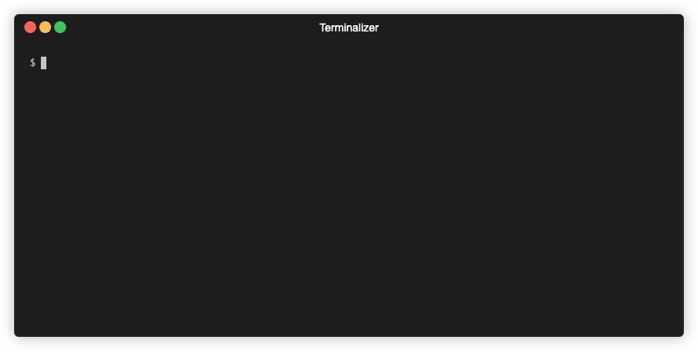
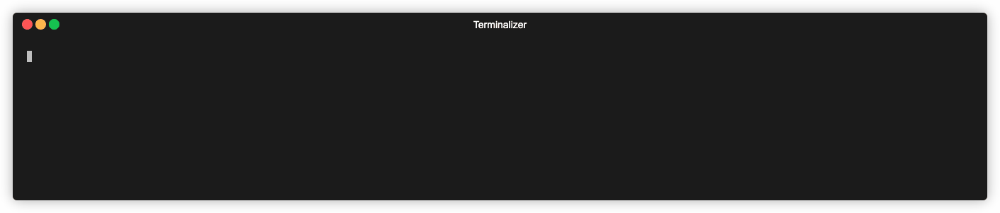
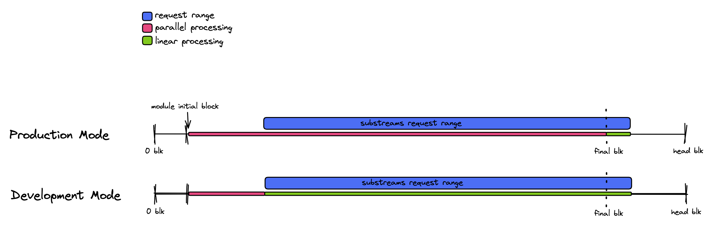

# Change log


Substreams builds upon Firehose.\
Keep track of [Firehose releases and Data model updates](https://firehose.streamingfast.io/release-notes/change-logs) in the Firehose documentation.


All notable changes to this project will be documented in this file.

The format is based on [Keep a Changelog](https://keepachangelog.com/en/1.0.0/), and this project adheres to [Semantic Versioning](https://semver.org/spec/v2.0.0.html).

## Unreleased

### Added

- CLI: Ethereum Hoodi testnet (`hoodi`) StreamingFast endpoints (`hoodi.eth.streamingfast.io:443`).
- RPC: `ModulesProgress.stages` entries now expose per-stage squash visibility, so a client can tell "segment produced" apart from "segment actually usable".

  `Stage` gained two additive fields: `ready_up_to_exclusive` (field 3), the chain block number, exclusive, up to which the stage is immediately usable, and `squash_wait_segment_count` (field 4), the number of segments whose store partial exists but has not been squashed into the store yet.

  `completed_ranges` counts a store segment as soon as its partial has been produced, before tier1 has merged it, whereas `ready_up_to_exclusive` stops at the last squashed segment. A stage could therefore render as 100% covered while a substantial part of the work was still outstanding, and since squashing runs on tier1 rather than on a worker it schedules no job and advances no `processed_blocks` — the request looked frozen at 100% with a rate of zero. A non-zero `squash_wait_segment_count` now names that state explicitly.

  For a stage that executes no store module the two notions coincide, as mapper and index output is read straight from the partial files, and `squash_wait_segment_count` stays 0. A stage that has not started reports the block its modules begin at, floored at the chain's first streamable block, so 0 is a valid value meaning "nothing usable yet" and not a sentinel for "unknown".
- RPC: `SessionInit` gained `segment_block_count` (field 11), the width in blocks of one parallel processing segment, constant for the whole session.

  The segment width was previously not exchanged at all, so a client had no way to turn a segment count such as `Stage.squash_wait_segment_count` into a number of blocks. It could only be inferred from `Job.stop_block - Job.start_block`, which is unavailable exactly when it is needed, since no job runs while tier1 squashes.

  It is an upper bound rather than an exact multiplier: the first and last segment of a run are narrower when a module's initial block or the request's stop block falls inside a segment.
- Server: tier1 request logs now explain how many parallel workers a request actually got, and why. A client asking for 300 workers and getting 15 previously left no trace of the negotiation anywhere in the logs.

  The `incoming Substreams Blocks request` entry gained a `parallelism` object (`requested_workers` as asked by the client, `granted_workers` as allowed by the authentication layer, the effective `workers`, `workers_source` telling which of the two applied, plus `plan_tier` and `stage_layer_executors`), along with `parallel_segment_count` and `stage_count` — a request with fewer segments than workers can never use them all.

  The `substreams request stats` entry gained a `workers` object (`requested`, `granted`, `effective`, `peak`, `pool_exhausted_count`, `pool_rampup_deferred_count`), reported on tier1 only. A high `pool_exhausted_count` with a `peak` well below `effective` means the shared worker pool ran dry, a case that was previously only visible at debug level.

  The periodic `substreams request progress` entry gained its own `workers` object (`requested`, `granted`, `effective`, `running`, `idle`, and `pool_exhausted_5m` when jobs failed to get a worker over the window), so the same question can be answered while the request is still running rather than only once it ends. When jobs repeatedly find no free worker while the request still has idle capacity, a hint now says so and names the three ceilings that can cause it — the tier2 fleet being full, the organization's worker quota, or the server's per-session worker cap — since the pool reports a single error for all three.

- CLI: `substreams tools devenv` boots a complete local stack — a dummy blockchain in a container plus a tier1 and a tier2 built from the current source tree — prints the endpoint and stays up until interrupted. Requires Docker. `--burst` sets how many blocks exist at genesis and `--bundle-size` the segment size, which together decide how much parallel work a request has to do; the state store lives under `--data-dir`, so deleting it is what gives a cold backprocess again. The command waits for the merger to catch up with the burst before starting tier1, since tier1 bootstraps its block hub from merged blocks and cannot become ready until they exist. The end-to-end tests now share this same setup code, so what a developer watches locally is the path CI exercises.

  Running the tiers in-process pulls in the wasmtime runtime, whose bindings are cgo-only, so the command is built only when cgo is enabled — that is, in a local `go build` or `go install`, but not in the released Docker image, which is deliberately static. That image could not run it anyway, having no Docker daemon of its own.

- Sink: `substreams sink postgres` and `substreams sink clickhouse` in Relational Mappings Mode spool rows on local disk in PostgreSQL's binary COPY wire format and loads them from a background goroutine, one segment at a time. The stream no longer waits on the database, and blocks already downloaded survive a restart instead of being streamed — and paid for — twice. Each write mode spools in the format it can send unchanged: binary COPY files, rendered SQL tuples per table, an interleaved log replayed in walk order for `row-insert`, and typed values on ClickHouse, whose inserts are columnar. ClickHouse keeps the guarantees it already had — it has no transactions and its cursor lives in a file, so applying a segment is the same inserts followed by the same cursor write, in the same order. `--spool-dir` (default `./localdata/spool`) is where they land and `--spool-max-size` (default 8GiB) bounds it; the stream is held once it fills. `--spool-max-idle` (default 10s) commits the open segment when the stream goes quiet, so a stall cannot leave the cursor where it was and have those blocks streamed, and paid for, again on restart. How large each commit gets is not a setting: `--db-write-target-duration` (default 3s) says how long one should take and the sink sizes the next segment from what the last one measured, bounded by `--db-write-max-size` (default 512MiB).

  Against `erc20-balance-changes` over 50,000 Ethereum mainnet blocks (17M rows) into a containerised PostgreSQL 17, this took the run from 190.9s to 70.9s and the stream from 262 to 673 messages per second, with an identical resulting table.

- Sink: `substreams sink postgres` in Relational Mappings Mode creates an index on `_block_number_` on every table when it starts, concurrently. Every table carries that column and every reorg deletes from every table by it, and a foreign key indexes only its referenced side — so each undo was a sequential scan per table, and a cascade would have been worse still, PostgreSQL looking the child rows up once per deleted parent row. Measured over 10GiB of `erc20-balance-changes`-shaped rows, it costs 2.6s on a 44s load and 218MiB against 10GiB, and takes one table's undo from 1.296s to 15ms — 86x, for one of the tables a reorg has to clear. `--disable-block-number-index` leaves it out for a run that can never reorg. It is deliberately not part of the constraint pass and not governed by `--apply-constraints`: those describe the schema and are the operator's to schedule, where this one the sink depends on to undo a reorg — and a concurrent build cannot run in a transaction, which that pass does. `constraints apply` on an output with no schema annotations now warns rather than refusing.

- Tools: `substreams tools extract-proto [<manifest> [<module>]]` writes a module's output protobuf definition back out. With `--sql` it comes annotated for the SQL sink's Relational Mappings Mode — every message and field carrying its option commented out — and the annotations file is written beside it so the result parses as-is, which is what `--proto-file-override` then needs. Starting from a package whose author never annotated it was otherwise a matter of finding the right proto and the right extension names by hand.

- Sink: `substreams sink postgres` in Relational Mappings Mode says on every start whether the schema carries the constraints the flags describe, naming the ones it does not. A run interrupted before the backfill ended, or whose constraint pass was killed part-way, leaves a database with no primary keys and no foreign keys — which answers queries, slowly and rejecting nothing, and looks exactly like a database that is fine. The check is one indexed catalog query. It only reports: under `--apply-constraints=auto` the missing ones are created when the stream reaches chain HEAD, and a run that stops before that leaves them — like `manual` — to `constraints apply`, which the warning names.

- Sink: the Relational Mappings Mode sink's periodic stats now report how far the download is ahead of the database: `downloaded_through`, `applied_through`, `blocks_ahead`, `blocks_buffered` and `peak_blocks_ahead`. Substreams throughput is paid for, so a run should be limited by the stream and not by the database; the gap between the two marks is where the opposite shows. Once the buffer stops looking like a working set the line is logged at warning level instead of info, as `database is falling behind the stream, the buffer is over half of what it was given`.

  What counts as behind depends on where the rows are. With a spool it is a share of the disk budget `--spool-max-size` set, because a block count says nothing once rows are on disk: the sparse start of a large backfill spans millions of blocks holding a few hundred kilobytes of an eight gigabyte budget, and used to warn continuously through it. Without a spool the blocks are held in memory and their count is what is reported on.

- Sink: `substreams sink postgres` in Relational Mappings Mode gained `--write-mode`, which says how a spooled segment reaches the database: `copy` (binary COPY), `batch-insert` (one multi-row INSERT per table), `row-insert` (one prepared INSERT per row), or `auto`. Which path ran used to be derived from whether a directory flag was set and whether the schema's foreign keys happened to form a cycle, and a schema that could not be ordered was silently downgraded to row-at-a-time inserts — an order of magnitude slower, announced only in a log line. An explicit mode the driver or the schema cannot support is now an error that names the fix.

- Sink: the Relational Mappings Mode flags are grouped by what they spend, and `substreams sink postgres --help` prints them under headings rather than tagging each line with the mode it belongs to. `--decode-workers` and `--decode-batch-size` size the CPU stage, `--db-write-*` size one commit to the database, `--spool-*` bound how far ahead of the database the stream may run. `--block-batch-size` is deprecated in favour of `--decode-batch-size`: it named the database transaction it stopped sizing when the spool took that job. `--no-constraints` is deprecated in favour of `--disable-foreign-keys --disable-primary-keys=all --disable-unique-constraints=all`.

- Sink: a Relational Mappings Mode flag typed for a Database Changes Mode Substreams is now an error, and so is the reverse. Both vocabularies are registered on the same command because the mode is read from the module at run time, so half of them are inert for any given run; they used to be inert silently. A Database Changes Mode Substreams owns its SQL schema — it comes from the `schema.sql` in the manifest — so `sink postgres constraints` refuses it outright.

### Changed

- Sink: `substreams sink postgres` and `substreams sink clickhouse` no longer accept `--live-block-time-delta`. The SQL sink installs the cursor-based liveness checker itself, so the flag was parsed and then ignored. It is also what the spool relies on: liveness has to turn on the first undo-able block, not on a wall-clock guess. It remains available to other sinks built on the `sink` package.
- Sink: the gRPC User-Agent of a SQL sink run now names the engine as well as the mode: `sink_from_proto_pg`, `sink_from_proto_ch`, `sink_database_changes_pg`, `sink_database_changes_ch`. Both engines run the same commands, so `sink_from_proto` alone said nothing about where the rows were going.
- Sink: `substreams sink postgres` in Relational Mappings Mode leaves the spool behind once the stream reaches the chain head. The spool holds rows on disk until a segment fills, which is what a backfill wants and the opposite of what a live sink wants: at the head a block should be queryable when it arrives, not when the segment it happens to land in is full. On the first live block — a cursor at `STEP_NEW` rather than `STEP_NEW_IRREVERSIBLE` — whatever is spooled is applied, the spool is closed and inserts go straight to the database from there on. It is one-way: a stream that reached the head does not go back to buffering.

  This also required wiring a liveness checker for the Relational Mappings Mode sink, which nothing did before, so `isLive` was always nil there. Blocks are now also flushed per block once live, rather than per batch, which is the existing behaviour that the missing checker had made unreachable.

  The connection pools are bounded while at it — 8 connections for the sink's own pool and 2 for binary COPY, where the pgx default was four per core for an applier that COPYs one segment at a time — and `Close` now releases them instead of holding the slots until the process exits.

- Sink: Relational Mappings Mode now loads without database constraints and creates them afterwards. The timing is `--apply-constraints`: `auto` by default, which has the sink create them once the stream reaches chain HEAD — and only there, a stop block ending the run without saying the backfill is done; `manual`, which leaves it to the new `substreams sink postgres constraints apply <manifest>`; or `always`, which creates them before the load. `constraints drop` is the inverse, and the escape hatch after `always` or before resuming a backfill. Both take the output module as an optional second argument, as `setup` now does too: it is inferred from the package when left out, but a package with more than one candidate has to be told which, or the schema they derive is not the one the run created. Both take the same `--disable-*` switches as the run, so they create exactly the constraints the schema is meant to have. `setup` reads `--apply-constraints` too, where only `always` acts on it: it creates the schema and exits, so `auto` and `manual` both leave the tables bare.

  The pass no longer runs as one transaction. Every index build and foreign key validation used to be held open at once, so a schema large enough to exhaust memory lost the entire pass and started from nothing on the next run. Each statement now commits on its own, so a killed run keeps what it finished and the next one carries on.

  `--constraints-parallelism` on the `constraints` commands runs them side by side. Constraints sit on independent relations, so the only ordering that matters is that a foreign key needs the key it references to exist — the pass builds every key first, then the foreign keys, and spreads what is inside each of those. `--constraints-work-mem` sets `maintenance_work_mem` for the duration of each statement: most servers default to 64MB, at which an index build over a large table spills to an external merge sort. Measured over 370M rows on Base, the serial pass at the server default took as long as loading every one of those rows. `--constraints-per-transaction` is deprecated in its favour — it read as an execution knob and only ever bundled statements into one transaction.

  Constraints are also matched by relation and not only by name. Names are unique per table rather than per schema, and every table carries a foreign key called `fk_block`, so a constraint present on one table counted as present on all of them: the rest were never created, and `constraints drop` removed one of them and then failed on the primary key the others still referenced.

  Measured through binary COPY over 500,000 rows, loading with foreign keys in place runs 27.7x slower than loading bare, where building the very same constraints afterwards costs 3.3x — 8.5x cheaper for an identical schema. Which constraints are wanted at all is now separate from when: `--disable-foreign-keys`, `--disable-primary-keys=<tables|all>` and `--disable-unique-constraints=<tables|all>`.

  Creating them is a stop-the-world operation: every index built, every foreign key validated, tables locked throughout. `auto` is the default anyway, because a backfill that ends with no primary keys and no foreign keys is a silent wrong result that looks like success, where a stall is at least a visible one. `--apply-constraints=manual` is how that pass goes into a maintenance window instead. Either way it is idempotent, so it also back-fills a schema an earlier run created without constraints.

  Constraints no longer disable the local buffer or multi-row inserts. That restriction existed because both group rows by table, which loses the order the walk produced them in, and an immediate foreign key then rejects a child that arrives before its parent. Tables are now ordered by a topological sort over the foreign keys themselves — nesting depth is not enough, since a table can reference a sibling it has no ancestry with — so the fast paths work with constraints in place. A schema whose references form a cycle cannot be ordered at all, and `--write-mode=auto` resolves to row-at-a-time inserts there, with the cycle named in the log.
- Dependencies: bumped notably `github.com/ClickHouse/clickhouse-go/v2` to v2.48.0, `github.com/AfterShip/clickhouse-sql-parser` to v0.5.5, `google.golang.org/grpc` to v1.83.0 and the OpenTelemetry SDK to v1.45.0.

- Sink: `substreams sink postgres` and `substreams sink clickhouse` in Relational Mappings Mode now unmarshal and walk blocks on a worker pool instead of one at a time at flush. Decoding a block was where the sink spent its time — around 7.8µs of the 9.3µs a wide entity cost — while PostgreSQL sat on roughly eight times that in headroom, so the sink itself was the throughput limit. Measured at 4.1x on a wide entity. Workers only fill a per-block buffer; the inserts are still replayed in block order, in the same transaction as before, so the resulting database is unchanged.

  The pool defaults to one worker per core less one, capped at eight, since the work is allocator-bound before it runs out of cores. `SinkerFactoryOptions.DecodeWorkers` overrides it.

- Sink: **Breaking** `db_proto.NewSinker` takes a `decodeWorkers int` parameter, and `SinkerFactoryOptions.Parallel` is gone along with `sql.Database.Clone()`. The parallel flush path they served was unreachable — `Parallel` was hardcoded to false at every call site — and unsound had it run: `Clone()` returned the receiver, so every goroutine shared one `*sql.Tx`.

- CLI: `substreams run` now reports backprocessing as progress and rates instead of a list of block ranges. A four-line session header (trace ID, module, chain, work to do, including how much was already cached) is printed once and stays in the scrollback, followed by a compact live block: overall percentage, blocks per second, ETA, running jobs against the worker limit, then one bar per stage with its job count and oldest job age, and an `out` row tracking the output frontier towards the requested start block.

  Percentages come from the work counts the server already reported in `SessionInit` and were never displayed, and the in-flight job progress is added to the completed-job count so the bar advances continuously rather than in steps. A run whose stores are fully cached now says so in one line instead of rendering an empty progress skeleton.

  `Slowest modules` is kept as its own section, ranked across all stages, now showing both a recent (30s window) and a lifetime per-block cost, tagged with the stage each module belongs to. Modules under 10ms per block no longer earn a line.

  Stage progress is measured from `Stage.ready_up_to_exclusive` rather than from `completed_ranges`. The latter counts a store segment as soon as its partial has been produced, so a stage rendered as 100% while tier1 was still squashing — and since squashing schedules no job and advances no `processed_blocks`, the request looked frozen at 100% with a rate of zero. That state is now named on the stage row as `squashing N segments`. Reading the squashed frontier also fixes the bar's low end: it is the lowest *contiguous* block across the stage's modules, so a stage with a gap in its produced ranges no longer counts the ranges beyond that gap, and a stage that has not started reports where it begins instead of being invisible.

  The `Longest-running jobs` section is gone: it fired on a fixed 5 second threshold, which flickered in and out on healthy runs where jobs normally take 5 to 8 seconds. Job age is now always visible on the stage rows instead. Also removed: the `Progress messages received` counter, which only tracked the server's deliberately decreasing progress interval, and the `m` key toggling between bar and block-range rendering, which no longer has two modes to switch between.

- CLI: `substreams run` output on failure is no longer one undivided wall of text. The session header, the progress block, the usage report and the error are separated, the progress block is closed with `Backprocessing  aborted` rather than trailing off at `starting…`, and a request refused for exceeding `--limit-processed-blocks` now reports the figures it was given at session init and names the fix:

  ```
  Error: --limit-processed-blocks is set to 10,000, but this request needs to process 3,394,913 blocks (3,394,000 of them to prepare the stores): raise it with --limit-processed-blocks 3400000, or remove the guard entirely with --limit-processed-blocks 0
  ```

- Sink: `Sinker.PrintStats` collapses to a single `📊 Usage Report: no data received` line when a request produced nothing, instead of a header followed by three zeroed counters. Affects `substreams run`, `substreams sink webhook` and `substreams sink noop`.

- Sink: `substreams sink postgres` and `substreams sink clickhouse` in Relational Mappings Mode now parse block payloads with [hyperpb](https://buf.build/go/hyperpb) instead of protobuf-go's `dynamicpb`. Both are driven only by the module's descriptor, which is all the sink has at runtime, and both are read through `protoreflect` by the descriptor walk, so the rows are identical — but hyperpb compiles the descriptor into a parser once and parses into an arena, at 18x the speed and one allocation per block instead of thousands.

  End to end that is 1.9x on the full decode path for a wide entity (88k to 168k rows/s on one core) and 2.7x across the decoder's worker pool (517k to 1.40M rows/s on eight). The parse is no longer the expensive half of decoding: the descriptor walk is now around 90% of it. For wide entities the sink is no longer the throughput limit either — eight workers now produce more rows per second than binary COPY absorbs.

  hyperpb builds on amd64 and arm64 only. Every release target already qualifies, and 32-bit was unbuildable for unrelated reasons well before this.

- Sink: **Breaking** `sql.Database.WalkMessageDescriptorAndInsert`, `WalkMessageDescriptorAndInsertInto`, `BaseDatabase.WalkMessageDescriptorAndInsertWithDialect` and `sql.Dialect.AppendInlineFieldValues` take a `protoreflect.Message` where they took a `*dynamicpb.Message`. The walk only ever read the message, so this is what lets the parser be chosen by the caller.

### Fixed

- Dev: `substreams tools devenv` waited on the wrong line before handing the relayer endpoint to tier1. `serving gRPC` is announced by the reader node for its own port well before the relayer serves, and the host-side dial that followed said nothing either, Docker binding the mapped port when the container starts whether or not anything inside listens. A tier1 connecting in that window ends up with a live stream carrying no partial blocks at all, which looks like a healthy run: the end-to-end tests share this setup, and `TestPartialBlocksWithStores` saw every block as a full one, with no undos.

- Sink: `substreams sink clickhouse` now accepts a package whose output proto carries no schema annotations, which is what any Substreams not written with the sink in mind looks like. Both `setup` and the run refused it outright — "clickhouse table options for table X don't have any 'order_by_fields'" — and the ClickHouse tables now default to `ORDER BY (_block_number_, _row_id_)`, `PRIMARY KEY (_block_number_)` and `PARTITION BY (toYYYYMM(_block_timestamp_))`. `_row_id_` numbers the rows one block writes to one table: the tables are `ReplacingMergeTree`, so a sorting key that cannot tell those rows apart collapses them into one at merge time. It is added only to the tables that declare no `order_by_fields`, and PostgreSQL is unaffected.

- Sink: `substreams sink postgres` and `substreams sink clickhouse` in from-proto mode now write the blocks still held when a bounded run reaches its stop block. Blocks accumulate until `--block-batch-size` of them have gone by, and nothing drained that buffer at the end of the range, so a run ending mid-batch silently dropped its last blocks along with the cursor covering them — and still reported success. With a batch size larger than the requested range, nothing was written at all.
  Three things had to go with it. The rows of an unannotated package were dropped silently — the ClickHouse database was built with the "use proto options" flag hardcoded to true, so the walk found no table info and inserted nothing. `substreams sink clickhouse setup` exited with `Flag "sink-info-folder" does not exist`, those flags being registered on the run command only. And an undo now carries `_row_id_` into the tombstone it writes, without which the tombstone lands on a different sorting key and removes nothing.

  A database whose tables disagree with the package is refused when the sink starts, rather than written into: annotating a message that had no `order_by_fields`, or dropping the annotation from one that had them, changes the sorting key of a table that already holds rows, and `CREATE TABLE IF NOT EXISTS` would have kept the old table and written the values into the wrong columns.
- Sink: `substreams sink postgres` in Relational Mappings Mode now undoes a reorg correctly without database constraints. The undo was a single `DELETE FROM _blocks_`, relying on `fk_block ... ON DELETE CASCADE` to take the entity rows with it — and that foreign key only exists when constraints are on. Without them the block rows went and every entity row of the undone blocks stayed behind, orphaned, to be duplicated when the replayed blocks arrived. Rows are now deleted from every table explicitly, children first, which works with or without constraints.

  Two related holes went with it: blocks still held in memory for the current batch are flushed before the delete rather than after it, and a local buffer is drained first, so rows in flight can no longer land after the delete that was meant to remove them.

  A guard claiming "live mode is not supported without constraints" was dead code — `NewSinker` took the flag and never stored it, so the check never ran — and is gone, along with the field.

- Sink: `substreams sink postgres` and `substreams sink clickhouse` in Relational Mappings Mode now write the blocks still held when a bounded run reaches its stop block. Blocks accumulate until `--block-batch-size` of them have gone by, and nothing drained that buffer at the end of the range, so a run ending mid-batch silently dropped its last blocks along with the cursor covering them — and still reported success. With a batch size larger than the requested range, nothing was written at all.

- Sink: `substreams sink postgres` and `substreams sink clickhouse` in Relational Mappings Mode no longer crash on a module whose output carries an `enum` field. protoreflect hands an enum out as a `protoreflect.EnumNumber`, a named `int32` that neither dialect's type switch matched: PostgreSQL panicked with `unsupported type: protoreflect.EnumNumber` and ClickHouse on a failed `value.(int32)` assertion. Since the two disagree on the column type — PostgreSQL declares it `TEXT`, ClickHouse `Int32` — the walk now carries both renderings and each dialect takes the one matching the column it created, so PostgreSQL stores the enum's name and ClickHouse its number. A value absent from the descriptor falls back to its number. This covers an enum wherever it appears: as a plain field, as a `repeated` one, inside an `inline` nested message, and as a table's primary key.

- Sink: **BREAKING** — `substreams sink postgres` in Relational Mappings Mode now stores `bytes` fields as binary in their `BYTEA` columns. Under the default `--bytes-encoding=raw` both inserters corrupted them, each differently: without `--no-constraints` a 7-byte value was stored as the 14 characters of its base64 form including the surrounding quotes, and with it as the 14 characters of its hex form. The same confusion also broke repeated scalar fields without `--no-constraints`, where each array element was stored with SQL quotes as part of its value (`'alpha'` rather than `alpha`).

  Nothing failed loudly for any of these: the rows were all there, and every query against those columns simply matched nothing. Databases already populated by an affected version hold corrupted values in those columns and need the affected block range re-synced.
  This changes what lands in those columns, so it breaks anything downstream built against the corrupted form. A consumer reading a `bytes` column as base64 or hex text now gets the binary value instead. A query written to work around the array corruption — matching the element `'alpha'`, quote characters and all, because that is what was stored — now has to match `alpha`. Re-syncing an existing database leaves both forms in the same table until the affected range is rewritten.

- CLI: `substreams run` needed two Ctrl-C to stop while the progress view was on screen. The view puts the terminal in raw mode, so the first Ctrl-C arrived as a key press rather than as SIGINT: the UI quit but the request kept streaming, and only the second one — delivered because the first had released the terminal — actually stopped it. The key press now cancels the request directly.

- CLI: `substreams run` was never printing the `Backprocessing history up to requested target block` line, nor the head block, stage count and cached-blocks summary the non-TTY output has always shown. The line was guarded on a field that nothing in the codebase ever set, and rendered as blank lines instead.

- Server: `substreams-tier1` now restarts when its block hub can no longer link incoming live blocks, instead of hanging every request at a frozen head indefinitely. A live-source gap whose one-block files were already merged away can never be linked, and the head-block metrics keep tracking the live source, so the process looked healthy throughout.

## v1.21.0

> **Note** The standalone `substreams-sink-sql` binary is now part of the `substreams` CLI, as `substreams sink postgres` and `substreams sink clickhouse`. Existing databases keep working: cursor tables and schemas are unchanged, so the CLI resumes exactly where the standalone binary left off. The DSN and block range move from positional arguments to `--dsn` (or `SUBSTREAMS_SINK_DSN`) and `-s`/`-t`, and operators switch the Docker image from `ghcr.io/streamingfast/substreams-sink-sql` to `ghcr.io/streamingfast/substreams`. See the [migration guide](https://docs.substreams.dev/how-to-guides/sinks/sql/migration) for the full command, flag, cursor and operator mapping.

### Added

- CLI: `substreams-sink-sql` is now part of the `substreams` CLI: `substreams sink postgres {setup,generate-csv,inject-csv,tools}` and `substreams sink clickhouse {setup,tools}`, where the engine command itself runs the sink. Both the sink and `setup` auto-detect the mode from the output module's type (`DatabaseChanges` → `schema.sql`, any other proto → relational mappings). See the [migration guide](https://docs.substreams.dev/how-to-guides/sinks/sql/migration) for the full command, flag, and operator (Docker image) mapping.

- Server: tier1 emits a periodic `substreams request progress` log per request (after 1 minute, then every 5 minutes) meant to answer "why is my substreams slow?" while the request is still running: phase, per-stage module and job progress, external call cost, last job error, and time spent blocked writing to the consumer. It ends with a short `hints` list naming the likely bottleneck when one is detected. Rates and deltas are suffixed `_5m` and cover a fixed trailing 5 minutes whatever the emission interval is; cadence is tunable with `SUBSTREAMS_PROGRESS_LOG_FIRST_DELAY` and `SUBSTREAMS_PROGRESS_LOG_INTERVAL`.

- Server: tier2 reports its progress every 10 seconds while a block is being processed, instead of only once the block completes, and `ExternalCallMetric` gained `failed_count`, `in_flight_count`, `oldest_in_flight_ms` and `oldest_in_flight_block`. An `eth_call` retrying against an unreachable endpoint is a single wasm extension call that can last minutes: it used to be completely invisible to tier1 until the segment timed out.

- Server: new `substreams_undo_signal_distance_blocks` prometheus histogram, observing how many blocks each `BlockUndoSignal` sent to clients reverts, labeled by `source` (`reorg` when a fork is seen while streaming, `cursor_resolution` when the cursor of an incoming request points to a block that was reorged out). Its `_count` gives the total number of undo signals sent; subtracting the `le="5"` bucket from it gives the number of large ones. Undo signals reverting more than 5 blocks are also logged as a warning with `trace_id`, `head`, `revert_up_to`, `distance` and, on the `cursor_resolution` path, the client `cursor`.

- CLI: new `substreams tools simulate-slow-reader <manifest> [<module>] --delay <duration>` command, consuming a substreams slowly enough to exert real back-pressure on the server, to exercise the "consumer is the bottleneck" reporting.

### Changed

- Sink: **Breaking** the `handleSessionInit` callback passed to `sink.NewSinkerFullHandlers` and `sink.NewSinkerFullHandlersWithPartial` now receives a `*pbsubstreamsrpcv3.Request` instead of a `*pbsubstreamsrpc.Request` (`rpc/v2`), matching both the `SinkerSessionInitHandler` interface and the request the sinker actually sends. The two disagreed, so the sinker's type assertion never matched and the callback was never invoked — no behavior can depend on it today.

  Callers passing `nil` are unaffected. Callers passing a callback get a compile error and should switch the parameter type; the only field that moved is `req.Modules`, now reachable as `req.Package.Modules`. Callers implementing `SinkerSessionInitHandler` directly on their own handler type were already writing the `rpc/v3` signature and are unaffected.

- Sink: **Breaking** the `handleError` callback passed to `sink.NewSinkerFullHandlers` and `sink.NewSinkerFullHandlersWithPartial` now receives an `error` instead of a `*pbsubstreamsrpc.Error`, matching the `SinkerErrorHandler` interface. Same as above, the callback was never invoked before this fix. It is called for stream errors the sinker is about to retry, not on `io.EOF` nor on fatal errors.

- Server: tier2 now aborts a segment when it **stops making progress** rather than when it exceeds a fixed time budget. A new stall timeout (10 minutes by default, `WithSegmentStallTimeout`) resets on every block processed, and the pre-existing segment execution timeout (`WithSegmentExecutionTimeout`) is kept only as an absolute backstop, its default raised from 60 minutes to 4 hours.

  The old fixed budget was fatal to expensive-but-healthy workloads: a segment making thousands of `eth_call` per block could take slightly longer than 60 minutes while still advancing block by block, get killed, and — since a killed segment is never cached — have its retry redo the same work and hit the same wall. Such a request could never complete, no matter how many times it reconnected. A stalled segment is still killed promptly, and since a single block is already bounded by the block execution timeout (3 minutes by default), the stall timeout cannot be tripped by one legitimately slow block.

  The `request active for a long time` log gained a `since_last_progress` field, and a segment killed for stalling now reports `request stalled, no block progress` instead of `request active for too long`.

### Fixed

- CLI: `substreams run` in TUI output mode was stuck on `Connecting...` and never displayed the trace ID. The session-init callback signature had drifted from the `SinkerSessionInitHandler` interface, so the sinker's type assertion failed and the session never reached the UI at all. The per-stage progress section (stage modules, completed ranges and the `m` bar mode) was hidden by the same bug and is displayed again.

- CLI: `substreams run` with a non-TUI output mode (`--output json`, `jsonl`, ...) was not printing the `TraceID:`, `Server HEAD block:` and stage/blocks-to-process summary lines anymore, for the same reason as above.

- CLI: `substreams run` in TUI output mode kept advertising `Connected` with a stale trace ID while the sinker was retrying a severed stream. It now falls back to `Connecting...` and picks up the new trace ID of the re-established session.

- CLI: manifests with a `sink:` config of type `sf.substreams.sink.sql.v1.Service` or `sf.substreams.sink.sql.service.v1.Service` now parse — the SQL sink protos are bundled in the CLI's system descriptors.

- SQL sink: `tools cursor delete <module_hash>` now deletes only the given module's cursor (the standalone binary deleted all of them due to a bug).

- SQL sink: a bounded run (`--stop-block` set) never flushed the final batch to the database — the range-completion check treated the exclusive stop block as unreached (`last block == stop-1`). Bounded backfills now flush and store their cursor. The bug also exists in the standalone `substreams-sink-sql` binary when built against recent sink library versions.

- Server: tier2 no longer logs `tls: first record does not look like a TLS handshake` errors from plain-HTTP health probes / load balancers hitting a TLS port (same suppress list as the existing EOF and connection-reset handshake noise).
- Server: a tier1 shutdown happening while a request was still in its parallel backprocessing phase was reported to the client as `Internal` instead of `Unavailable`. The `endpoint is shutting down, please reconnect` error is wrapped several times on its way up from the scheduler (`error during init_stores_and_backprocess: run_parallel_process failed: parallel processing run: scheduler run: ...`) and was matched with a pointer comparison, so it never took the `Unavailable` path. Clients now see the correct reconnect signal during a tier1 rollout.

## 1.20.3

### Added

- Server: new Prometheus metrics for external calls made by WASM extensions (e.g. `eth_call`), making it possible to spot slow calls clogging a tier:

  - `substreams_tier1_wasm_extension_call_counter{extension,outcome}` and `substreams_tier1_wasm_extension_call_duration_seconds{extension,outcome}`
  - `substreams_tier2_wasm_extension_call_counter{extension,outcome}` and `substreams_tier2_wasm_extension_call_duration_seconds{extension,outcome}`

  `extension` is the extension being called (e.g. `eth:call`) and `outcome` is `success` or `error`. The duration histogram extends the default buckets with a 30s and 60s tail so that slow calls and timeouts remain distinguishable.

- Server: the `substreams request stats` log gained a `wasm_ext_call_metrics` field (per extension) and a `wasm_ext_call_metrics_by_module` field (per module and extension), each breaking down external calls (e.g. `eth_call`) with `count`, `total_ms`, `avg_ms` and `max_ms`. Only modules that actually made a call appear, so both are empty when nothing called out. The pre-existing `module_wasm_ext_duration` merges every extension into a single duration and is unchanged. `max_ms` covers the calls made locally by the process emitting the log; calls made by tier2 jobs are reported back as a count and a total, and each tier2 logs its own `max_ms`.

### Fixed

- Server: WASM extension calls (e.g. `eth_call`) that returned an error were never closed in the request stats, leaking an in-process entry that kept inflating the reported external call duration for the remaining lifetime of the request. Both the `wazero` and `wasmtime` runtimes are fixed.

- Server: external call metrics (e.g. `eth_call` count and duration) gathered on the shared-cache execution path were silently discarded, so modules executed through that path reported no external call activity at all.

## v1.20.2

### Added

- Manifest: environment variable expansion (`$VAR` / `${VAR}`) is now supported in the `foundational-store` module input, allowing a manifest to be authored with a placeholder (e.g. `foundational-store: $DEPLOYMENT_ID`) that is resolved at pack/load time. The generated `.spkg` always embeds the resolved value.

### Changed

- Manifest: environment variable expansion in `imports` and `protobuf.importPaths` now errors out when a referenced variable is undefined, instead of silently substituting an empty string.

### Fixed

- Server: fixed a per-request stats leak causing long-lived live streams to progressively burn more CPU per block and eventually fall behind the chain until reconnect.

## v1.20.1

### Fixed

- Server: linear quickload resume now emits `SessionInit` (trace id) and starts keepalives before the store decode streams, instead of after. A large or remote quicksave could previously stream for a long time with zero client output; the quickload-success path also never emitted a `SessionInit` at all.

## v1.20.0

### Changed

- Server: the store size limit override is now configured by a tier1 flag (`Tier1Config.StoreSizeLimit`, exposed as `--substreams-tier1-store-size-limit`) instead of the `SUBSTREAMS_STORE_SIZE_LIMIT` environment variable, which has been removed. The value is forwarded from tier1 to tier2 on every subrequest via the existing `ProcessRangeRequest.store_size_limit` field, so it no longer needs to be set on tier2. `0` keeps the default of 1GiB.
- Server: store quicksave/quickload now run up to 8 stores concurrently instead of one at a time, cutting shutdown/resume latency for pipelines with many stores.
- Server: quicksave now streams the store lazily and unsorted (one KV entry at a time as the upload consumes it, without sorting keys), instead of buffering the whole serialized store and paying an O(n log n) key sort plus key-slice allocation up front. This lowers both peak memory and save time for large stores (millions of keys). Quickload is order-independent, and the on-disk format is unchanged (byte-compatible protobuf), so no migration is required.
- Server: tier1 store loading at request start now loads up to 8 stores concurrently (both the size probe and the download/decode), instead of one at a time.

### Added

- Server: new opt-in mmap (bbolt-backed) store backend, selectable via `--substreams-stores-backend=mmap` (default `memory`). It keeps FullKV store data in a memory-mapped file so cold pages are reclaimable by the kernel under memory pressure, instead of pinning everything on the non-reclaimable Go heap — this addresses production OOMs with large or highly concurrent stores. The in-memory backend remains the default and is byte-for-byte unchanged; mmap is validated to produce identical output. **The scratch-space directory holding the bbolt files (`StoresScratchSpace`, default "{sf-data-dir}/substreams/stores-scratch") must live on a local NVMe SSD**: the store is continuously read from and written to through the mmap, and the kernel pages it straight to that file, so a slow or network-backed disk turns store operations into an I/O bottleneck and negates the benefit. Do not point it at network/EBS-class storage.

- Server: cached deterministic errors now expire. Each error file carries a write timestamp in its name (`errors.<block>.<hash>.<unix>`), and on read tier1 discards any error older than `SUBSTREAMS_DETERMINISTIC_ERROR_MAX_AGE` (Go duration, default `1h`), retrying execution. Legacy error files without a timestamp are deleted on read.

- Server: new `ProcessRangeRequest.merged_blocks_bundle_size` field (internal tier1→tier2 protocol) carrying the number of blocks per merged-blocks file. `0` (older tier1s) means the historical default of `100`. Tier2 applies the value per-request, so a single tier2 can serve chains with different merged-blocks sizes. **Upgrade all tier2s before setting a non-100 value on any tier1**: older tier2s ignore the field and would read the store with a bundle size of 100 (jobs stall on missing file names).
- Server: new `Tier1Config.MergedBlocksBundleSize` (default `100`), used by tier1's own merged-blocks reads, cursor resolution, final-block rounding and forwarded to tier2 on every subrequest. The hub's kept final blocks and the live backfiller delay now scale with the bundle size.
- `substreams tools tier2call`: new `--merged-blocks-bundle-size` flag (default `0` = server default).

- Server: store quicksave now also triggers on client disconnect (context canceled), not only on graceful server shutdown, so a reconnecting client can resume without reprocessing. Only applies to production-mode requests.
- Server: the `substreams request stats` log now includes the last block sent to the client (`last_sent_block_num`, `last_sent_block_id`, `last_sent_block_time`).
- Server: quicksave/quickload logs now report their duration (`save_duration` / `load_duration`).

### Fixed

- Server: canceled store loads now abort promptly instead of reading the entire (multi-GB) store file into the heap before returning. A tier2 store `Load` now checks the request context while streaming entries, so a canceled/disconnected request stops hydrating immediately. Also `memoryKVImpl.Close()` now drops its backing map (was a no-op), and the post-load `SetMetadata` goroutine no longer captures the whole loaded store (only the object store, filename and metadata) and runs under a bounded 30s timeout — together these stop a finished/canceled request from transiently pinning gigabytes of store data.
- Server: a Blocks request whose start block resolves (from a cursor) to exactly the exclusive stop block now completes cleanly instead of returning `InvalidArgument: start block and stop block are the same`. The range is empty (stop is exclusive), so the stream is already done; this previously surfaced as a fatal, non-retryable error to clients that reconnected with a cursor sitting on the last block of the range after a transient disconnect. Raw (cursor-less) requests with `start == stop` still return the InvalidArgument as before.
- Sink: when resuming from a cursor already at or past the stop block, the sinker now shuts down immediately instead of opening a stream to the server. The pre-flight check previously compared the cursor against `adjustedEndBlock()` (stop block inflated by the partial-blocks buffer capacity), so a cursor sitting in the `[stopBlock-1, stopBlock+bufferCap-1)` window was let through and issued a useless request; it now compares against the raw exclusive `StopBlock`.
- Server: client disconnects (`context canceled`) on a tier1 Blocks stream are no longer logged as `WARNING`/`ERROR`. `toGrpcTier1Error` returned a `connect` error for the canceled case (unlike every other branch, which returns a gRPC `status` error), so the caller's `status.Code()` resolved to `Unknown` — logging the request completion as a WARN and the gRPC middleware call as an ERROR with `code Unknown`. It now returns `codes.Canceled`, so the disconnect is logged at Debug/Info as intended.
- Server: bumped `dstore`, which now sends S3 request checksums only when the target requires them, fixing uploads/downloads against S3-compatible stores that reject the newer default checksum headers.
- Server: the quicksave block count now counts settled blocks (normal or last-partial) instead of skipping partials entirely, so quicksave arms correctly on flash-block chains. The minimum sent-block threshold before a quicksave triggers was raised from 25 to 50.
- Server: `tier1` calls to hosted foundational stores now forward the `x-organization-id` identity header (alongside the existing trusted headers), so a store's internal trust-based listener can authorize the request without an end-user JWT. This fixes `Unauthenticated: required authorization token not found` errors when reading from hosted foundational stores resolved via the control-plane registry.
- Server: foundational store calls that fail with authentication errors, organization id mismatch, or prolonged unreachability now bubble up to the user as a non-deterministic (uncached) error instead of retrying until the global deadline. Transient unavailability is still retried (~30s) to absorb blips and rolling restarts.
- Server: a client cancellation (`context canceled`) while loading an execout file is now logged at INFO instead of ERROR in the execout walker.
- CLI: `substreams info <shortname>` now fetches the package from the download endpoint (spkg.io) instead of the registry API host, fixing `package does not exist on the Substreams registry` for short-name lookups such as `substreams info common`.

## v1.19.0

### Sink

* Fix `Sinker.requestActiveStartBlock` not being set when the handler implements `SinkerSessionInitHandler`, which previously caused `ProgressMessageLastContiguousBlock` to be incorrect for production-mode mapper stages.

### Fixed

- Manifest: a `foundational-store:` input now accepts a hosted-store deployment id (a UUID), in addition to package `name@version` notation. Previously the deployment id was validated with the package-name regexp (`^[a-zA-Z]...`), which rejected any UUID starting with a digit, making real hosted stores impossible to reference.
- Server: `tier1` forkable hub now logs under the `tier1` logger instead of the generic `bstream` package logger, so `processing block` (and related hub) log lines are correctly attributed to the component (requires bstream `hub.WithLogger`).
- Server: per-block execution timeouts (`--substreams-block-execution-timeout`) are no longer silently swallowed when a WASM host-function panic (e.g. wasmtime) coincides with the deadline. Previously, `recoverExecutionPanic` would return `nil` instead of `CodeDeadlineExceeded`, causing the offending block to be skipped and the stream to complete successfully.
- CI: Docker image login, build and push are now skipped for fork PRs; image is still built (without push) to validate the Dockerfile.

### Added

- added more metrics to identify time spent squashing

### Performance

- Server: the tier1 job scheduler no longer slows down on very large reprocessings (100_000s of segments). Both `NextJob` and `AllStoresCompleted` used to rescan the whole completed-segment prefix on every scheduling event, making job selection O(segments²) over a run; they now advance a forward-only cursor and are O(1) amortized.
- Server: `UpdateStats` (progress reporting) now builds each stage's ranges in a single sort-free pass instead of one map+sort per stage every second.
- Server: removed per-message overhead in the scheduler event loop — the debug-state env var is read once at startup instead of on every message, and the per-message debug log no longer builds its fields when debug logging is disabled.
- Server: the cached-output streaming buffer now appends and checks for flushing under a single lock per block.

## v1.18.5

### Server

* **Index optimisation**: Optimized `ClockDistributor` to skip blocks earlier and faster when using block filter.
* Fix server-side bug that would cause Blocks request to fail after a few retries with 'load full store (...) load store stream: opening file for streaming: not found' when depending on a store that is being merged slowly
* add 'substreams_tier1_active_requests_hard_limit' and 'substreams_tier2_max_concurrent_requests' attributes to prometheus metrics (constant, reflects the configuration)

## v1.18.4

* Fix server-side bug that would prevent forkableHub from correctly updating metrics when receiving partial or out-of-order blocks

## v1.18.3

### Server

* Add optional 'secret key' authentication between tier1 and tier2 services.
* Fixed a case where a nil pointer exception could happen on storage error(s).
* Substreams client library will no longer forcefully strip authentication from plaintext connections.
* Substreams tier1 will now retry failed tier2 jobs that stream data directly if they have not produced any data yet.
* Substreams worker jobs will always retry tier2 jobs that return with codes.Unavailable: `no healthy upstream`, considering this error as load-balancer version of `codes.ResourceExhausted`.
* Substreams will reject requests with stores when expected total memory usage from stores alone are above 45% (down from prev. 75%)
  You can set `SUBSTREAMS_TOTAL_STORE_SIZE_LIMIT_PERCENT=75` to go back to previous behavior or `SUBSTREAMS_ENFORCE_TOTAL_STORE_SIZE_LIMIT=false` to disable the feature.

## v1.18.2

### Sink

* Fix `InferOutputModuleFromPackage` sentinel value causing error when used with manifests containing a `networks:` section. The sentinel value was being passed to the manifest reader before resolution, causing a "could not find module @!##_InferOutputModuleFromSpkg_##!@ in graph" error.

## v1.18.1

### Server-side fixes

* Fix V4 buffer flushing on end-of-file: the buffer is now properly flushed when the last block in a segment is reached
* Fix error handling for `InvalidArgument` and other validation errors: they were shown as `Unknown`
* Fix partial blocks output in V4: prevent `NewPartial` and `UndoPartial` cursor steps from being exposed to clients (normalized to `New`/`Undo` respectively)
* Fix partial block data to be correctly wrapped in `BlockScopedDatas` on v4.
* Last partial blocks are now accepted interchangeably with `new` blocks and vice-versa, allowing faster full blocks for requests that do not ask for partial blocks.

## 1.18.0

### CLI

* Improved `substreams auth` command to better guide new users by showing the registration link alongside the authentication link. The command now also accepts API keys directly and automatically exchanges them for JWT tokens.

* Added support for buf.build commit references in descriptor set module versions. In addition to semantic versions (e.g., `v1.2.3`), you can now use buf.build commit hashes (32 lowercase hex characters, e.g., `@f3ab5976b9ba4f9bac28b26271fca7d7`). Commit references are also cached since they are immutable.

* Fixed `protogen` hash caching behavior when descriptor sets don't have a pinned version. Previously, when using descriptor sets without a version (resolving to "latest"), the `.last_generated_hash` file would cache incorrectly and skip regeneration even when the remote content had changed. Now:
  - Descriptor sets without a deterministic version (semver or commit ref) will always trigger regeneration
  - A warning is emitted listing which descriptor sets need pinned versions
  - The hash file is removed when non-deterministic descriptor sets are present to prevent stale caches

### Server

* Improved 'partial blocks': support new pbbstream's "LastPartial" field, fix 'undo' scenarios for stores

### Performance (RPC V4)

This release introduces significant performance optimizations to the Substreams gRPC communication layer. See [RPC Protocol Reference](../references/rpc-protocol.md) for details.

* **RPC V4 protocol with `BlockScopedDatas` batching**: The new V4 protocol batches multiple `BlockScopedData` messages into a single `BlockScopedDatas` response, reducing gRPC round-trips and message framing overhead during backfill.

* **S2 compression (new default)**: S2 compression replaces gzip as the default compression algorithm. S2 provides ~3-5x faster compression/decompression than gzip with comparable compression ratios. The client automatically negotiates compression with the server.

* **VTProtobuf fast serialization**: Both client and server now use [vtprotobuf](https://github.com/planetscale/vtprotobuf) for protobuf marshaling/unmarshaling, providing ~2-3x faster serialization with reduced memory allocations.

* **Server-side message buffering**: Configurable via `OutputBufferSize` flag (default: 100 blocks) or `MESSAGE_BUFFER_MAX_DATA_SIZE` environment variable (default: 10MB).

* **Automatic protocol fallback**: Clients gracefully fall back V4 → V3 → V2 when connecting to older servers.

* **Improved Connect/gRPC protocol selection**: Server now efficiently routes requests to the appropriate handler based on content-type, improving performance by ~15% for pure gRPC clients (previously all requests went through Connect RPC layer).

### Sink

* Updated sink library to leverage RPC V4 protocol with `BlockScopedDatas` batching, improving throughput by reducing per-message processing overhead.

## v1.17.11

### Server

* Fix issue where a retry on dstore while writing a fullKV would corrupt the file, making it unreadable. Fix prevents this and also now deletes affected files when they are detected.
* Fix bug in event loop where `loop.NewQuitMsg()` (which returns `*QuitMsg` pointer) was not being handled, causing quit messages from error paths to be silently ignored and requests to hang indefinitely.
* Fix issue where transient HTTP/2 stream errors (e.g., `INTERNAL_ERROR`) from `dstore` were being treated as fatal errors instead of being retried. These transient network errors are now detected and retried with exponential backoff. Added comprehensive diagnostic logging including working duration tracking and ERROR-level alerts when walker is stuck for more than 5 minutes.

### Sink

* Fix `progress_running_jobs` not resetting its counter when reaching 0 jobs running on the server.

## v1.17.10

### Server

* Added bucketed prometheus metrics `head_block_relative_time_sum{app=substreams_output}` that shows latency between outputing live blocks and their blocktime.
* Fixed underflow in 'FailedPrecondition desc = request needs to process a total of x blocks' error when running from 'substreams run' with a start-block in the future.

### CLI

* Fix parsing of params with modules derived with `use`: now allows reusing the same modules with different params
* Fix `substreams pack` for a substreams.yaml where no modules are defined, but a SinkConfig points to an imported module (force modules inclusion)
* The `substreams init` command will now list generators in the server's specified order (instead of randomly display them).
* The `substreams init` has now proper error handling when a file cannot be uploaded to the server.
* added `substreams sink protojson` (migrated from https://github.com/streamingfast/substreams-sink-files)

## v1.17.9

### Server

* Fix issue where "live backfiller" would not create segments after reconnecting with a cursor starting from a previous quicksave, causing delays in future reconnection
* Prevent "panic" when log messages are too large: instead, they will be truncated with a 'some logs were truncated' message.
* Raise max individual log message size from 128k to 512k
* Raise max log message size for a full block from 128k to 5MiB
* Reduce log level from Warn to Debug when we fail to get or set the store size (for backends that don't support it)

### CLI

* Added `--bytes-encoding` flag to `run` and `gui`, accepted values: ['', 'hex', 'base58', 'base64', 'string'] (default: '' still auto-detects from network)

### Partial blocks (experimental)

* Removed PartialsData message and brought back this data inside the good old BlockScopedData
* added the following fields to BlockScopedData:
  - bool `is_partial` to indicate if this block is a partial block. The following two fields are only present when `is_partial==true`
  - optional bool `is_last_partial` to indicate if this is the last partial of a given block (with correct block hash)
  - optional uint32 `partial_index` to indicate the index of this partial block within the full block
* renamed `--partial_blocks_only` flag to `partial_blocks` on substreams Blocks request
* removed `--include_partial_blocks` flag from substreams Blocks request

## v1.17.8

* Added experimental support for partial blocks (ex: Base's Flash Blocks) -- only supported on https://base-mainnet-flash.streamingfast.io endpoint
* See [more details in the documentation](https://docs.substreams.dev/reference-material/flash-blocks)

### CLI

* commands `run` and `sink webhook` now support these flags:
  - `--include-partial-blocks`: sends every block as partial(s) but also as real block
  - `--partial-blocks-only`: only sends partials (for every block, every bit of data should be there)

### Sink library

* To use the new partial blocks in a sink that uses github.com/streamingfast/substreams/sink, simply:
  - Define your sink flags with `sink.FlagIncludePartialBlocks` and/or `sink.FlagPartialBlocksOnly` under `FlagIncludeOptional()`
  - Implement the function `HandlePartialBlockData(...)` and pass it to `NewSinkerFullHandlersWithPartial(...)` when creating the sinker.

### Server

* Server accepts new `include_partial_blocks` and `partial_blocks_only` boolean params in the request body.
* Response, when requested with above params, now include new message `PartialBlockData`, containing the usual "map module output", the clock and the index of that partial.
* Server accepts environment variable `SUBSTREAMS_BIGGEST_PARTIAL_BLOCK_INDEX` (default 10) -- it will emit a partial with this index when it gets the final part of a block.

## v1.17.7

### [CLI]

* The `--endpoint` flag on various elements (`substreams run/gui/sink`) now accepts a short identifier to resolve, identifier which must match of the The Graph Network Registry, so for example, `--endpoint=solana` can be used directly now.

### [Server]

* Added validation in tier1 service for WASM modules that import `eth_call` or `eth_get_balance`. When the environment variable `X-substreams-acknowledge-non-deterministic` is set, requests using such modules must include the header `X-substreams-acknowledge-non-deterministic` set to `true` to acknowledge the non-deterministic nature of external calls.

## v1.17.6

* [Server] Fix regression from v1.17.3 where "store stages" would not always correctly get scheduled for backfilling, resulting in `get size of store "...": opening file: not found`


## v1.17.5

### CLI

* substreams GUI: fix setting (only) the start block with a relative value: will now change the default stop block from +1000 to 0 instead of returning the error `relative end block is supported only with an absolute start block`

## v1.17.4

### CLI

* Fix handling of relative stop block (regression) in GUI, RUN and other sinks.
* Fix GUI handling of substreams that are not built yet.

## v1.17.3

### CLI

* Fix running from manifests that were created with `tools unpack` and contain imported modules, preventing "failed to get entrypoint" error.

### Server

* Added opt-in memory limits related to loading FullKV stores, gated by environment variables:
  - "SUBSTREAMS_STORE_SIZE_LIMIT_PER_REQUEST" (default allows 5GiB: `5368709120`): limit size of all loaded stores for a single request, in bytes. Set to a numeric value in bytes.
  - "SUBSTREAMS_ENFORCE_STORE_SIZE_LIMIT_PER_REQUEST" (default false): if set to `true`, enforce the limit above instead of just logging a warning
  - "SUBSTREAMS_TOTAL_STORE_SIZE_LIMIT_PERCENT" (default: 75): limit the size in-memory of all loaded stores concurrently on the instance, in percentage of usable memory (cgroup or system total -- regardless of free or available)
  - "SUBSTREAMS_ENFORCE_TOTAL_STORE_SIZE_LIMIT" (default: false): if set to `true`, enforce the limit above instead of just logging a warning

* Fixed an edge case where substreams with modules depending on stores that start on the future would fail and incorrectly report an error about "tier2 version being incompatible"

## v1.17.2

### Server

* Reduced memory usage associated with reading and writing large stores by streaming the marshalling process. (~45% reduction peak usage)
* New environment variable `SUBSTREAMS_TIER1_DEBUG_API_ADDR` now enables the debug API on the tier1 service.
* Renamed environment variable `SUBSTREAMS_DEBUG_API_ADDR` to `SUBSTREAMS_TIER2_DEBUG_API_ADDR`, since it only affected tier2.

### CLI

* Improved `substreams init` to expand `~` and environment variable when resolving local file path.
* Improved `substreams init` reporting of error when local file cannot be uploaded/read correctly.
* Improved `substreams init` rendering of list items and some other elements.
* Fixed `substreams init` to correctly showing selected label when selecting from a list of items.
* Fixed `substreams protogen` when params are defined on networks for imported modules that are not dependencies to any local module

### Server

* Fix a panic (nil pointer) when skipping blocks via indexes on stores on tier2
* Fix egress bytes calculation when running in noop or dev mode with specified output debug modules
* Reduced memory usage while reading or writing large stores

## v1.17.1

### CLI

* Fixed `substreams publish` alias command not fully aligned with `substreams registry publish` "main" version.

## v1.17.0

### New sf.substreams.rpc.v3.Stream/Blocks endpoint

* This new endpoint removes the need for complex "mangling" of the package on the client side.
* Instead of expecting `sf.substreams.v1.Modules` (with the client having to apply parameters, network, etc.), the `sf.substreams.rpc.v3.Request` now expects:
  - a `sf.substreams.v1.Package`.
  - a `map<string, string>` of `params`
  - the `network` string
  which will all be applied to the package server-side.
* It returns the same object as the v2 endpoint, i.e. a stream of `sf.substreams.rpc.v2.Response`

#### Server

* Watch for releases for firehose-core, firehose-ethereum, etc. to include this new endpoint.
* It is added on top of the existing 'v2' endpoint, both being active at the same time.
* To enable it, operators will simply need to ensure that their routing allows the `/sf.substreams.rpc.v3.Stream/*` path.
* Cached spkg on the server will now contain protobuf definitions, simplifying debugging of user requests.
* Emitted metrics for requests can now be `sf.substreams.rpc.v3/Blocks` instead of always `sf.substreams.rpc.v2/Blocks`, make sure that your metering endpoint can support it.

#### Clients

* The clients provided in this release (substreams run, gui and sinks that are linked to the 'client' library) will now support both endpoints.
* Without any flag, they will use the v3 endpoint by default and automatically fallback to v2 if they hit a "404 Not Found" or "Not Implemented" error.
* The `--force-protocol-version` has been added to all clients. Set it to 2 to force only v2, set it to 3 to force only v3, or leave it unset (0) to use the default "v3 with fallback to v2"

### Build
* Added filesystem-backed caching for Buf BSR API requests to improve build performance and prevent rate limit errors. Cache uses SHA256 keys based on module/version/symbols, stores to `~/.config/substreams/buf-cache/`, and only caches deterministic semver versions. Falls back to in-memory cache if filesystem unavailable. Warns when descriptor sets lack version specifications, as these cannot be cached and may cause rate limit issues.
* **Added** support for `@version` notation in `protobuf.descriptorSets` section of manifest. You can now specify versions in multiple ways:
  - Separate fields: `module: buf.build/streamingfast/substreams-sink-sql`
  - Separate fields with explicit latest: `module: buf.build/streamingfast/substreams-sink-sql` with `version: latest`
  - Inline notation: `module: buf.build/streamingfast/substreams-sink-sql@v0.1.0`
  - Note: `@latest` inline notation is **not allowed**; use `version: latest` or omit the version instead

### Bug fixes

* Fixed a bug with BlockFilter: a skipped module would send BlockScopedData (in dev or near HEAD, to follow progress) with an empty module name, breaking some sinks. Module name was present if requesting a module dependent on that skipped module. Now the module name is always included.
* Fix "max-retries" so that it only 'resets' the counter if it receives actual data.

## v1.16.6

### Server

* Updated Wasmtime runtime from v30.0.0 to v36.0.0, bringing performance improvements, inlining support, Component Model async implementation, and enhanced security features.
* Added WASM bindgen shims support for Wasmtime runtime to handle WASM modules with WASM bindgen imports (when Substreams Module binary is defined as type `wasm/rust-v1+wasm-bindgen-shims`).

### Server and Client

* Added support for foundational-store (in wasmtime and wazero).
* Added support for new 'sf.substreams.rpc.v3.Stream/Blocks' endpoint that sends the full '.spkg' data with params and network value, so the client does not need to do any mangling.
  * This requires the substreams server to support it (under `/sf.substreams.rpc.v3.Stream/*` location).
  * On the `run`, `gui` and `sink` commands, the `--force-protocol-version` flag is available to specify protocol version (2 or 3); the `v2` endpoint will also be tried as fallback if the server responds with 404 or MethodNotAllowed.
* Added foundational-store grpc client to substreams engine.
* Fixed module caching to properly handle modules with different runtime extensions.

### CLI

* Added support for `http://` and `https://` prefixes in the `--endpoint` flag. Setting the protocol (http/https) in the URL will ignore the `--plaintext` flag setting. The default (no prefix) is still SSL. The enforcing of `--plaintext` and `--insecure` has been relaxed: plaintext+insecure is simply plaintext.
* Fixed the progress logs and prometheus metrics from `substreams sink noop` when running with an output_module of type "index" in production mode (other sinks will now refuse to run in this mode)
* Removed 'progress_last_contiguous_block' from sink logs, as it was often misleading. Getting a correct value in all cases would require doing a slow lookup on all cached files, which is not desirable.
* **Fixed** `substreams registry publish` command now properly returns non-zero exit codes when publishing fails (e.g., authentication errors), enabling scripts and CI/CD pipelines to correctly detect failures.
* Removed `substreams proxy` command

## v1.16.5

### Server

#### Session (stream + workers management)

* **BREAKING** Concurrent streams and workers limits are now handled under the new session plugin (see CHANGELOG in github.com/streamingfast/firehose-core for details and usage)
  - removed 'WorkerPoolFactory' from Tier1Modules
  - removed 'GlobalRequestPool' from Tier1Modules
  - added 'SessionPool' (dsession.SessionPool) to Tier1Modules

#### Stability

* **BREAKING** Add a maximum execution time for a full tier2 segment. By default, this is 60 minutes. It will fail with `rpc error: code = DeadlineExceeded desc = request active for too long`.
  It can be configured from the `SegmentExecutionTimeout` configuration option on Tier2Config or disabled by setting it to 0.
* Improve log message for 'request active for a long time', adding stats.
* Fix `subscription channel at max capacity` error: when the LIVE channel is full (ex: slow module execution or slow client reader), the request will be continued from merged files instead of failing, and gracefully recover if performance is restored.
* Fixed a small context memory leak when using wasmtime (especially with grpc-based metering plugin)

### CLI

* **BREAKING**: Replaced `--infinite-retry` boolean flag with `--max-retries` integer flag in sink package for more flexible retry control:
  - `--max-retries 0`: No retries (fail immediately on first error)
  - `--max-retries 3`: Default behavior (retry up to 3 times)
  - `--max-retries -1`: Infinite retries (equivalent to old `--infinite-retry` flag)

## v1.16.4

### Server

#### Memory leak

* Fix zstd thread/mem leak on filereader

#### Authentication changes

People using their own authentication layer will need to consider these changes before upgrading!

* Renamed config headers that come from authentication layer:
  - `x-sf-user-id` renamed to `x-user-id` (from dauth module)
  - `x-sf-api-key-id` renamed to `x-api-key-id` (from dauth module)
  - `x-sf-meta` renamed to `x-meta` (from dauth module)
  - `x-sf-substreams-parallel-jobs` renamed to `x-substreams-parallel-workers`
* Allow decreasing `x-substreams-parallel-workers` through an HTTP headers (auth layer determines higher bound)
* Detect value for the 'stage layer parallel executor max count' based on the `x-plan-tier` header (removed `x-sf-substreams-stage-layer-parallel-executor-max-count` handling)

#### New authentication plugin

* Added `tgm://auth.thegraph.market?indexer-api-key=<API_KEY>&reissue-jwt-max-age-secs=600` plugin that allows an indexer to use The Graph Market as the authentication source.
  An API key with special "indexer" feature is needed to allow repeated calls to the API without rate limiting (for Key-based authentication and reissuance of "untrusted long-lived JWTs").

## v1.16.3

### CLI

* **Added** `substreams registry verify` command to validate a package is ready for publishing without actually publishing it. Only available as `registry verify` (no alias).
* **Added** `--yes` flag to `substreams registry publish` command to auto-confirm package publishing without prompting.
* **Added** `--team-slug` flag to `substreams registry publish` command and deprecated `--teamSlug` (use `--team-slug` instead).

* Refuse `<name>@latest` in imports, this resolves to a different version at different busting the Substreams cache, use a specific version instead `<name>@<version>` which `version` must respect semantic versioning (SemVer).

* Add close match suggestions when module name cannot be found on `substreams run/sink` command(s).

* Do not print usage report when there was no usage at all, usually when there is an error on `substreams run/sink` command(s).

* Improved error message when Substreams short package notation (`<name>@<version>`) is used but malformed.

## v1.16.2

### Server

* **Added** mechanism to immediately cancel pending requests that are doing an 'external call' (ex: eth_call) on a given block when it gets forked out (UNDO because of a reorg).

* **Fixed** handling of invalid module kind: prevent heavy logging from recovered panic
* Error considered deterministic which will cache the error forever are now suffixed with `<original message> (deterministic error)`.

### CLI

* Improved `substreams run` command output to have humanize bytes/values and harmonized output with `substreams build`.
* Fixed GUI which didn't show the 'dev outputs' from other modules anymore in development mode.
* More tweaks to `substreams build` and `substreams protogen` commands output.
* **Added** support for package version notation using `@` syntax (e.g., `package@v1.2.3` or `package@latest`) in manifest imports and package references.
* **Added** `--prometheus-addr` flag to sink commands for binding Prometheus metrics server to a specified address.

## v1.16.1

### CLI

* Fixed `substreams build` command when there is no WASM file already present on disk.

## v1.16.0

### CLI

* **Improved** Improved `substreams build`, `substreams protogen` and `substreams pack` command outputs to be streamlined and condensed.
* **Added** support for reading manifest from stdin across all manifest-accepting commands using `"-"` as the manifest path. Affected commands: `build`, `run`, `gui`, `info`, `graph`, `pack`, `protogen`. This enables dynamic manifest generation and preprocessing workflows, including integration with tools like `envsubst` for environment variable substitution and CI/CD pipeline automation.
* **Added** `substreams sink webhook` command to send Substreams output to a webhook endpoint. See [the documentation](../how-to-guides/sinks/) for more information.
* Changed `substreams-api-token-envvar` flag to `api-token-envvar`
* Changed `substreams-api-key-envvar` flag to `api-key-envvar`

## Lib

* **Moved** github.com/streamingfast/substreams-sink library in this repo, under github.com/streamingfast/substreams/sink

## v1.15.10

* Re-release of v1.15.9 with missing dependency update.

## v1.15.9

### Server

* [**BREAKING CHANGE**] `substreams-tier2` servers must be upgraded **before** tier1 servers, tier2 servers will stream outputs for the 'first segment', to speed up time to first block.
* Return `processed_blocks` counter to client at the end of the request.
* Progress notifications will only be sent every 500ms for the first minute, then reduce rate up to every 5 seconds (can be overridden per request).
* Added `dev_output_modules` to protobuf request (if present, in dev mode, only send the output of the modules listed).
* Added `progress_messages_interval_ms` to protobuf request (if present, overrides the rate of progress messages to that many milliseconds).

### CLI

* Updated to latest networks registry version.
* **Added** `--proto-path` flag to `substreams run` and `substreams gui` commands: Allows loading protobuf definitions from a directory containing `.proto` files on top of the substreams package protobuf definitions
* **Added** `--proto-descriptor-set` flag to `substreams run` and `substreams gui` commands: Allows loading protobuf definitions from a single protobuf descriptor set file on top of the substreams package protobuf definitions
* Both flags work with both manifest files (`.yaml`) and pre-compiled packages (`.spkg`), enabling additional protobuf types to be available during execution
* Added `substreams unpack` command to extract the contents of a .spkg file to a tweakable YAML manifest.
* Added validation of protobuf outputs when doing 'pack' and 'publish' (they must have protobuf definitions attached to the manifest)
* Set `dev_output_modules` to only show the output_module when using `substreams run`, and all non-imported modules when using `substreams gui`
* Print the `processed blocks` counter to client at the end of the request

## v1.15.8

### CLI

* `substreams run` now prints "Total Egress Bytes" as well as "Total Processed Bytes"

### Server

Rework the execout File read/write:

* This reduces the RAM usage necessary to read and stream data to the user on tier1,
  as well as to read the existing execouts on tier2 jobs (in multi-stage scenario)

* The cached execouts need to be rewritten to take advantage of this, since their data is currently not ordered:
  the system will automatically load and rewrite existing execout when they are used.

* Code changes include:
  - new FileReader / FileWriter that "read as you go" or "write as you go"
  - No more 'KV' map attached to the File
  - Split the IndexWriter away from its dependencies on execoutMappers.
  - Clock distributor now also reads "as you go", using a small "one-block-cache"

* Removed env var and behaviors:
  - removed SUBSTREAMS_DISABLE_PRELOAD_EXEC_FILES (no more preloading, it was mostly useful because reading full file+unmarshal was necessary when streaming...)
  - removed SUBSTREAMS_OUTPUT_SIZE_LIMIT_PER_SEGMENT (this is not a RAM issue anymore)

* Add `uncompressed_egress_bytes` field to `substreams request stats` log message. Only tier1 will produce a non-zero value there.

## v1.15.7

### Server

* Tier2 jobs now write mapper outputs "as they progress", preventing memory usage spikes when saving them to disk.
  This should considerably reduce the memory footprint of tier2 instances.
* Tier2 jobs now limit writing and loading mapper output files to a maximum size of 8GiB by default.
* Added`SUBSTREAMS_OUTPUT_SIZE_LIMIT_PER_SEGMENT` environment variable to control this new limit.
* Gate the DebugAPI feature on tier2 with the `SUBSTREAMS_DEBUG_API_ADDR` environment variable (set it to `localhost:8081` to keep behavior from v1.15.5)

### CLI

* Removed the 'codegen subgraph' command from the CLI as SpS are being deprecated.
* Added `--skip-package-validation` and `--extension-configs` flags to `tools tier2call` dev command

## v1.15.6

### CLI

* The `substreams run` will now better render bytes depending on the network.

* The `substreams run/gui` JSON rendered is now able to render known `anypb.Any` type correctly.

* Integrated the [Network Registry](https://github.com/graphprotocol/networks-registry?tab=readme-ov-file#the-graph-networks-registry) to better track supported networks.

### Server

* Add SUBSTREAMS_STORE_SIZE_LIMIT env var to allow overwriting the default 1GiB value

## v1.15.5

### Server

* Add env var SUBSTREAMS_PRINT_STACK to enable printing full stack traces when caught panic occurs
* Prevent a deterministic failure on a module definition (mode, valueType, updatePolicy) from persisting when the issue is fixed in the substreams.yaml https://github.com/streamingfast/substreams/issues/621
* Metering events on tier2 now bundled at the end of the job (prevents sending metering events for failing jobs)
* Added metering for: "processed_blocks" (block * number of stages where execution happened) and "egress_bytes"
* Added a 'debug API' that listens on localhost:8081 and allows blocking connections, running GC, listing or canceling active requests.

### CLI

* Add `unichain` to the list of supported chains.

## v1.15.4

* dedupe modules with same hash when computing graph. (#619)
* prevent memory usage burst when writing mapper by streaming protobuf items to writer
* ignore "service currently overloaded" worker errors in the "maxRetries" count. Tier1 requests should not error out because tier2 servers are ramping up, only when they fail multiple times.
* Default SUBSTREAMS_WORKER_MAX_RETRIES now set to 5.

## v1.15.3

### Server

* Catch "store errors" as deterministic (ex: invalid operation, store too big...), writing them to the module cache as well as errors that happen directly in the WASM code.
* Ensure the 'error cache' is effective even when the "stop block" is unset (0)
* Fix 'SUBSTREAMS_WORKERS_RAMPUP_TIME' environment variable that was not being honored

### CLI

* `substreams init`: fix project creation when using the `--force-download-cwd` flag.

## v1.15.2

* Fix quicksave feature (incorrect block hash on quicksave)

## v1.15.1

### Server

* Fix logging of wasm external calls in `substreams request stats` (previously missing in wasmtime engine)

## v1.15.0

### Server

* Save deterministic failures in WASM in the module cache (under a file named `errors.0123456789.zst` at the failed block number), so further requests depending on this module at the same block can return the error immediately without re-executing the module.

### CLI

- `substreams init`: add Stellar to the list of supported grouped chains (this will require everyone to upgrade the CLI version to use codegen)
- `substreams init`: create project in a new directory, not in the current directory of the user.
-- `substreams init`: new Protobuf field to enforce versions with the codegen.

## v1.14.6

### Server

* Tier2 now returns GRPC error codes for `DeadlineExceeded` when it times out, and `ResourceExhausted` when a request is rejected due to overload
* Tier1 now correctly reports tier2 job outcomes in the `substreams request stats`
* Added jitter in "retry" logic to prevent all workers from retrying at the same time when tier2 are overloaded
* Fix panic on tier2 when hitting a timeout for requests running from pre-cached module outputs
* Add environment variables to control retry behavior, "SUBSTREAMS_WORKER_MAX_RETRIES" (default 10) and "SUBSTREAMS_WORKER_MAX_TIMEOUT_RETRIES" (default 2), changing from previous defaults (720 and 3)
  The worker_max_timeout_retries is the number of retries specifically applied to block execution timing out (ex: because of external calls)
* The mechanism to slow down processing segments "ahead of blocks being sent to user" has been disabled on "noop-mode" requests, since these requests are used to pre-cache data and should not be slowed down.
* The "number of segments ahead" in this mechanism has been increased from `>number of parallel workers>` to `<number of parallel workers> * 1.5`

## v1.14.5

* Bugfix on server: fix panic on requests disconnecting before the resolvedStartBlock is set.

## v1.14.4

### Server

* Properly reject requests with a stop-block below the "resolved" StartBlock (caused by module initialBlocks or a chain's firstStreamableBlock)
* Added the `resolved-start-block` to the `substreams request stats` log

### CLI

* fix the 'Hint' when --limit-processed-blocks is too low, sometimes suggesting "0 or 0" and some typos

## v1.14.3

### CLI

* The `substreams gui` flag `--debug-modules-output` has been removed, it had zero effect.

* The `substreams run` flag `--debug-modules-output` now accepts regular expressions like `substreams run --debug-modules-output=".*"`.

* Fixed `--skip-package-validation` to also skip sub packages being imported.

* Added `--limit-processed-blocks` flag to `substreams run` and `substreams gui` to set the `limit_processed_blocks` field in the request

* The information messages in 'substreams run' now print to STDERR instead of STDOUT.

### Server

* Added a mechanism to slow down processing "ahead of blocks being sent to user" for 'production-mode' requests. The tier1 will not schedule tier2 jobs over { max_parallel_subrequests } segments above the current block being streamed to the user.
  This will ensure that a user slowly reading blocks 1, 2, 3... will not trigger a flood of tier2 jobs for higher blocks, let's say 300_000_000, that might never get read.

* Added a validation on a module for the existence of 'triggering' inputs: the server will now fail with a clear error message
  when the only available inputs are stores used with mode 'get' (not 'deltas'), instead of silenlty skipping the module on every block.

* Fixed `runtime error: slice bounds out of range` error on heavy memory usage with wasmtime engin

* Added information about the number of blocks that need to be processed for a given request in the `sf.substreams.rpc.v2.SessionInit` message

* Added an optional field `limit_processed_blocks` to the `sf.substreams.rpc.v2.Request`. When set to a non-zero value, the server will reject a request that would process more blocks than the given value with the `FailedPrecondition` GRPC error code.

* Improved error messages when a module execution is timing out on a block (ex: due to a slow external call) and now return a `DeadlineExceeded` Connect/GRPC error code instead of a Internal. Removed 'panic' from wording.

* Improved connection draining on shutdown: Now waits for the end of the 'shutdown-delay' before draining and refusing new connections, then waits for 'quicksaves' and successful signaling of clients, up to a max of 30 sec.

* In `substreams request stats` log, add fields: `remote_jobs_completed`, `remote_blocks_processed` and `total_uncompressed_read_bytes`

## v1.14.2

* Fix a bug where a 'worker pool' could incorrectly get exhausted

## v1.14.1

* Fix another `cannot resolve 'old cursor' from files in passthrough mode -- not implemented` bug when receiving a request in production-mode with a cursor that is below the "linear handoff" block

## v1.14.0

This release brings performance improvements to the substreams engine, through the introduction of a new "QuickSave" feature, and a switch to `wasmtime` as the default runtime for Rust modules.

### Server

* Implement "QuickSave" feature to save the state of "live running" substreams stores when shutting down, and then resume processing from that point if the cursor matches.
  - enabled if the "QuickSaveStoreURL" attribute is not empty in the tier1 config
  - requires the "CheckPendingShutdown" module to be passed to the app via NewTier1()

* Rust modules will now be executed with `wasmtime` by default instead of `wazero`.
  - Prevents the whole server from stalling in certain memory-intensive operations in wazero.
  - Speed improvement: cuts the execution time in half in some circumstances.
  - Wazero is still used for modules with `wbindgen` and modules compiled with `tinygo`.
  - Set env var `SUBSTREAMS_WASM_RUNTIME=wazero` to revert to previous behavior.

### CLI

* Fixed `--skip-package-validation` to also skip sub packages being imported.
* Trim down packages when using 'imports': only the modules explicitly defined in the YAML manifest and their dependencies will end up in the final spkg.

## v1.13.0

### Server

#### Request Pool and Worker Pool

* Added `GlobalRequestPool` to the `Tier1Modules` struct in `app/tier1.go` and integrated it into the `Run` method to enhance request lifecycle management.
  When set, the `GlobalRequestPool` will manage the borrowing, quotas, and keep-alive mechanisms for user requests via requests to a GRPC remote server.

* Added `WorkerPoolFactory` to the `Tier1Modules` struct in `app/tier1.go` and integrated it into the `Run` method to enhance worker lifecycle management.
  When set, the `WorkerPool` will manage the borrowing, quotas, and keep-alive mechanisms for worker subrequests on tier2, via requests to a GRPC remote server.

#### Performance

* Added 'shared cache' on tier1: execution of modules near the HEAD of the chain will be done once for a given module hash and the result shared between requests.
  This will reduce CPU usage and increase performance when many requests are using the same modules (ex: foundational modules)

* Improved "time to first block" when a lot of cached files exist on dependency substreams modules by skipping reads segments that won't be used and assuming stores "full KVs" are always filled sequentially (since they are!)

* Limit parallel execution of a stage's layer.
  Previously, the engine was executing modules in a stage's layer all in parallel. We now change that behavior, development mode will from now on execute every sequentially and when in production mode will limit parallelism to 2 (hard-coded) for now.
  The auth plugin can control that value dynamically by providing a trusted header `X-Sf-Substreams-Stage-Layer-Parallel-Executor-Max-Count`.

* Fixed a regression since "v1.12.2" where the SkipEmptyOutput instruction was ignored in substreams mappers

### CLI

* Removed enforcement of `BUFBUILD_AUTH_TOKEN` environment variable when using descriptor sets. It appears there is now a public free tier to query those which should work in most cases.
* When running Solana package, set base58 encoding by default in the GUI.
* Add Sei Mainnet to the `ChainConfigByID` map.

## v1.12.4

### Server

* Fix log regression on 'substreams request stats' (bad value for production_mode/tier)

## v1.12.3

### Server Side:
* Added `WorkerPoolFactory` to `Tier1Modules` and `RemoteWorkerClient` to `Tier2Modules` to support enhanced worker pool management.
* Introduced `WorkerKeepAliveDelay` in `Tier1Config` to manage worker pool keep-alive settings.
* Updated `Tier1App` and `Tier2App` to utilize the new worker pool components in their `Run` methods.
* Refactored the orchestrator `loop` package to introduce a new `Msg` interface and associated message types, enhancing the message handling mechanism.
* Modified the `Scheduler` and `ParallelProcessor` to integrate with the new worker pool interface and handle job scheduling more effectively.
* Introduce `loop.IsMsg` interface  to ensure proper message handling.
* Improve noop-mode: will now only send one signal per bundle, without any data.

* Improve logging.

### Client

* Add `--noop-mode` flag to `substreams run` as a simple way to force the server to generate caches in production-mode.

## v1.12.2

- Add Stellar Mainnet and Testnet to the HardcodedEndpoints map.
- Fix a panic when a substreams was using an index as an input which contained empty output

## v1.12.1

- Fixed `tier2` app not setting itself as ready on startup

- Added extra ad-hoc prometheus labels 'tools prometheus-explorer' as query params to each endpoint.

## v1.12.0

### Server-side

- Fix a thread leak in cursor resolution resulting in a bad value for active_connections metric
- Fix detection of accepted gzip compression when multiple values are sent in the `Grpc-Accept-Encoding` header (ex: Python library)
- Properly accept and compress responses with `gzip` for browser HTTP clients using ConnectWeb with `Accept-Encoding` header
- Allow setting subscription channel max capacity via `SOURCE_CHAN_SIZE` env var (default: 100)
- Added tier1 app configuration option to limit max active requests a single instance can accept before starting to reject them with 'Unavailable' gRPC code.
- Added tier1 & tier2 app new Prometheus metric `substreams_{tier1,tier2}_rejected_request_counter`, to track rejected request, especially when hard limit is reached.

### Client-side

- improvements to 'tools prometheus-explorer'

  - change flags `lookup_interval` and `lookup_timeout` to `--interval` and `--timeout`
  - now support relative block (default is now: -1) and does not use 'final-blocks-only' flag on request
  - add `--max-freshness` flag to check for block age (when using relative block)
  - add `substreams_healthcheck_block_age_ms` prometheus metric
  - `--block-height` is now a flag instead of a positional argument
  - improve logging
  - removed "3 retries" that were built in and causing more confusion

- add User-Agent headers depending on the client command

## v1.11.3

### Server-side

- Fixed: detection of gzip compression on 'connect' protocol (js/ts clients)
- Added: tier1.Config `EnforceCompression` to refuse incoming connections that do not support GZIP compression (default: false)

## v1.11.2

### Server-side

- Fix too many memory allocations impacting performance when stores are used

### CLI

- Force topological ordering of protobuf descriptors when 'packing' an spkg (affecting current substreams-js clients)
- Allow `substreams pack` to be able to do a "re-packing" of an existing spkg file. Useful to apply the protobuf descriptor ordering fix.

### Docker image

- Rebuilt of v1.11.1 to generate Docker `latest` tag with revamp Docker image building.
- Substreams CLI is now built with using Ubuntu 22, previous releases were built using Ubuntu 20.
- Substreams Docker image is now using `ubuntu:22` as its base, previous releases were built using `ubuntu:20.04`.

## v1.11.1

- Fix the `gui` breaking when the network field is not set in the spkg
- Fixed `SUBSTREAMS_REGISTRY_TOKEN` environment variable not taking precedence over the `registry-token` file.

## v1.11.0

- Commands `run`, `gui` and `info` now accept the new standard package definition (ex: `ethereum-common@latest`) to reference an spkg file from `https://substreams.dev`.
- Changed `substreams run`: the two positional parameters now align with `gui`: `[package [module_name]]`. The syntax `substreams run <module_name>` is not accepted anymore.
- Added `substreams publish` to `publish` a package on the substreams registry (check on `https://substreams.dev`).
- Added `substreams registry` to `login` and `publish` on the substreams registry (check on `https://substreams.dev`).
- Added `substreams tools extract-wasm` to extract a wasm file from a substreams package.

## v1.10.11

- Add `avalanche-mainnet` to the CLI.

## v1.10.10

- Fix `substreams gui` selecting the wrong module in the 'outputs' view if there is no output the selected output_module.
- Add the block 'age' printed clock headers in the`substreams run` command.

## v1.10.9

- Add Mantra Mainnet and Testnet to the HardcodedEndpoints map.
- Add Vara Mainnet and Testnet to the HardcodedEndpoints map.
- Fix `substreams gui` command downloading spkg twice which would cause some issues with spkg that are very big.
- Add base58 decoding in the output view for the `substreams gui`

## v1.10.8

### Server

> **Note** All caches for stores using the updatePolicy `set_sum` (added in substreams v1.7.0) and modules that depend on them will need to be deleted, since they may contain bad data.

- Fix bad data in stores using `set_sum` policy: squashing of store segments incorrectly "summed" some values that should have been "set" if the last event for a key on this segment was a "sum"
- Fix panic in initialization (`metrics sender not set`)

## v1.10.7

- Fix small bug making some requests in development-mode slow to start (when starting close to the module initialBlock with a store that doesn't start on a boundary)
- Fixed `substreams build` creating a buf.gen.yaml file with absolute paths (should be relative)
- Removed `--show-generated-buf-gen` flag to `substreams protogen`
- Bumped neoeinstein-prost version in auto-generated `buf.gen.yaml` file when using `substreams protogen` or `substreams build` (compatible with new substreams-0.6 and prost-0.13)

## v1.10.6

- Fixed `substreams gui` panic (regression appeared in v1.10.3)

## v1.10.5

- Fixed an(other) issue where multiple stores running on the same stage with different initialBlocks will fail to proress (and hang)

## v1.10.4

### Server

- Fix bug where some invalid cursors may be sent (with 'LIB' being above the block being sent) and add safeguard/loggin if the bug appears again
- Fix panic in the whole tier2 process when stores go above the size limit while being read from "kvops" cached changes

### CLI

- Add `-o cursor` output type to `substreams run` for debugging purposes

## v1.10.3

### Server

- Fix "cannot resolve 'old cursor' from files in passthrough mode" error on some requests with an old cursor
- Fix handling of 'special case' substreams module with only "params" as its input: should not skip this execution (used in graph-node for head tracking)
  -> empty files in module cache with hash `d3b1920483180cbcd2fd10abcabbee431146f4c8` should be deleted for consistency

### CLI

- Add `substreams tools default-endpoint {network-name}` to help with auto-configuration tools
- Bump `substreams init` protocol version to "1" to be compatible with new codegen endpoint

## v1.10.2

- `substreams gui`: fix panic in some conditions when streaming from block 0

## v1.10.1

### Server

> **Note** Since a bug that affected substreams with "skipping blocks" was corrected in this release, any previously produced substreams cache should be considered as possibly corrupted and be eventually replaced

- Fix handling of modules that receive both filtered AND unfiltered data as their inputs -> some "repeated entries" could appear where no data should have showed up
- Fix stalling on substreams with both map and store with different initialBlocks on the same stage
- Fix: prevent execution of modules that should be skipped when running live or dev mode (different outputs than when running in batch mode on tier2)

### Client

- `substreams gui` fixed a panic occuring if the given package path doesn't exist
- `substreams init` must now be called from within your project folder (it no longer downloads file in a subdirectory)
- (since v1.10.0) `substreams gui` no longer accepts "output_module" as a single argument. It either receives nothing, the package, or the package followed by the output_module

## v1.10.0

### Server

- Add `sf.substreams.rpc.v2.EndpointInfo/Info` endpoint (if the infoserver is given as a module, i.e. from firehose-core)
- Add an execution timeout of 3 minutes per block by default (can be overridden in tier1/tier2 Configs) -- this is useful when an external (eth_call) is stuck on a forked block hash.
- Revert 'initialBlocks' changes from v1.9.1 because a 'changing module hash' causes more trouble.
- Wazero: bump v1.8.0 and activate caching of precompiled wasm modules in `/tmp/wazero` to decrease compilation time
- Metering update: more detailed metering with addition of new metrics (`live_uncompressed_read_bytes`, `live_uncompressed_read_forked_bytes`, `file_uncompressed_read_bytes`, `file_uncompressed_read_forked_bytes`, `file_compressed_read_forked_bytes`, `file_compressed_read_bytes`, `file_uncompressed_write_bytes`, `file_compressed_write_bytes`). _DEPRECATION WARNING_: `bytes_read` and `bytes_written` metrics will be removed in the future, please use the new metrics for metering instead.
- Manifest reader: increase timeout of remote spkg fetch to 5 minutes, up from 30 seconds

### Client

- Add `substreams auth` command, to authenticate via `thegraph.market` and to get a dev API Key.
- Rename `--discovery-endpoint` into `codegen-endpoint` in `substreams init` command.
- Add `substreams codegen subgraph` command that takes a substreams `module` and an `spkg` and that generates a simple `subgraph` from the `module` output.
- On `substreams init` command, if flag `--state-file` is provided, the state file is used by default for project generation.
- In `substreams init` command, the state file is named using a `Date format` and not using `Unix` anymore.
- Tools->prometheus: added the possibility to override the start-block on an endpoint
- `substreams gui` no longer accepts "output_module" as a single argument. It either receives nothing, the package, or the package followed by the output_module

## v1.9.3

- Fixed error handling issue in 'backprocessing' causing high CPU usage in tier1 servers
- Fixed handling of packages referenced by `ipfs://` URL (now simply using /api/v0/cat?arg=...)
- Added `--used-modules-only` flag to `substreams info` to only show modules that are in execution tree for the given output_module

## v1.9.2

### Added

- Added support for directly reading spkg file that is compressed with zstd (from http, gs, s3, azure or local)

### Fixed

- Prevent Noop handler from sending outputs with 'Stalled' step in cursor (which breaks substreams-sink-kv)

## v1.9.1

### Fixed

Fixed substreams hanging in production-mode on chains with a 'first-streamable-block' higher than 0:

- all initialBlocks will be 'bumped' to the first-streamable-block if it is higher
- this will affect the module hashes: use `substreams info --first-streamable-block=<block_num>` to see how a value will affect your modules
- modules with initialBlocks higher than the first-streamable-block of a chain will be unaffected.

## v1.9.0

### Important BUG FIX

- Fix a bug introduced in v1.6.0 that could result in corrupted store "state" file if all
  the "outputs" were already cached for a module in a given segment (rare occurence)
- We recommend clearing your substreams cache after this upgrade and re-processing or
  validating your data if you use stores.

### Fixed

- substreams 'tools decode state' now correctly prints the `kvops` when pointing to store output files

### Added

- Expose a new intrinsic to modules: `skip_empty_output`, which causes the module output to be skipped if it has zero bytes. (Watch out, a protobuf object with all its default values will have zero bytes)
- Improve schedule order (faster time to first block) for substreams with multiple stages when starting mid-chain

## v1.8.2

- `substreams init` (code generation): fix displaying of saved path in filenames

## v1.8.1

- Add a `NoopMode` to the `Tier1` enabling to avoid sending data back to requester while processing live.

## v1.8.0

### Remote Code Generation

The `substreams init` command now fetches a list of available 'code generators' to "<https://codegen.substreams.dev>".
Upon selection of a code generator, it launches an interactive session to gather the information necessary to build your substreams.
This allows flexibility and getting anything from "skeleton" of a substreams for a given chain up to a fully built .spkg file with subgraph bindings.

### Added

- Add 'compressed' boolean field to the 'incoming request' log
- Add a substreams `live back filler`, so a request running close to HEAD in production-mode on tier1 will trigger jobs on tier2 when boundaries are passed by final blocks, backfilling the cache. These jobs will be "unmetered".

### Fixed

- Fixed Substreams tier1 active worker request metrics that was not decrementing correctly.
- Truncate error messages log lines to 18k characters to prevent them from disappearing through some load balancers.

### Removed

- Removed local ethereum code generation from `init` command.

## v1.7.3

### Server-side improvements

- Faster bootstrapping through bstream improvements, now only loads and keeps 200 blocks below LIB to link with merged blocks.
- Fixed delay in serving requests close to chain HEAD when using production-mode

## v1.7.2

### Improvements on the `use` attribute

- If module with `use` attribute has not `inputs` at all, inputs are replaced by used module inputs
- If module with `use` attribute has no `blockFilter`, it's replaced by used module `blockFilter`
- If `blockFilter` is set to `{}`, it will be considered as `nil` in the spkg, enabling module with `use`
  attribute to override the `blockFilter` by a `nil` one

## v1.7.1

### Highlights

- Substreams engine is now able run Rust code that depends on `solana_program` in Solana land to decode and `alloy/ether-rs` in Ethereum land

#### How to use `solana_program` or `alloy`/`ether-rs`

Those libraries when used in a `wasm32-unknown-unknown` context creates in a bunch of [wasmbindgen](https://rustwasm.github.io/wasm-bindgen/) imports in the resulting Substreams Rust code, imports that led to runtime errors because Substreams engine didn't know about those special imports until today.

The Substreams engine is now able to "shims" those `wasmbindgen` imports enabling you to run code that depends libraries like `solana_program` and `alloy/ether-rs` which are known to pull those `wasmbindgen` imports. This is going to work as long as you do not actually call those special imports. Normal usage of those libraries don't accidentally call those methods normally. If they are called, the WASM module will fail at runtime and stall the Substreams module from going forward.

To enable this feature, you need to explicitly opt-in by appending a `+wasm-bindgen-shims` at the end of the binary's type in your Substreams manifest:

```yaml
binaries:
  default:
    type: wasm/rust-v1
    file: <some_file>
```

to become

```yaml
binaries:
  default:
    type: wasm/rust-v1+wasm-bindgen-shims
    file: <some_file>
```

### Others

- substreams.yaml now supports `localPath` attribute under `protobuf.descriptorSets`, so you can pre-build a descriptor set using `buf build --as-file-descriptor-set -o myfile.binpb` and add it directly to your substreams package.

- Substreams clients now enable gzip compression over the network (already supported by servers).

- Substreams binary type can now be optionally composed of runtime extensions by appending a `+<extension>,[<extesions...>]` at the end of the binary type. Extensions are `key[=value]` that are runtime specifics.

  > [!NOTE]
  > If you were a library author and parsing generic Substreams manifest(s), you will now need to handle that possibility in the binary type. If you were reading the field without any processing, you don't have to change nothing.

- Fixed a failure in protogen where duplicate files would "appear multiple times" and fail.

- Fixed bug with block rate underflow in `gui`.

## v1.7.0

- Added store with update policy `set_sum` which allows the store to either sum a numerical value, or set it to a new value.

- Re-added Ethereum Sepolia support in `substreams init`.

- Fixed a bug with the new `descriptorSets` feature that wasn't ordered properly to correctly generate Protobuf bindings.

## v1.6.2

- execout: preload only one file instead of two, log if undeleted caches found
- execout: add environment variable SUBSTREAMS_DISABLE_PRELOAD_EXEC_FILES to disable file preloading

## v1.6.1

- Revert sanity check to support the special case of a substreams with only 'params' as input. This allows a chain-agnostic event to be sent, along with the clock.
- Fix error handling when resolved start-block == stop-block and stop-block is defined as non-zero

## v1.6.0

### Upgrading

> **Note** Upgrading to v1.6.0 will require changing the tier1 and tier2 versions concurrently, as the internal protocol has changed.

### Highlights

#### Index Modules and Block Filter

- _Index Modules_ and _Block Filter_ can now be used to speed up processing and reduce the amount of parsed data.
- When indexes are used along with the `BlockFilter` attribute on a mapper, blocks can be skipped completely: they will not be run in downstreams modules or sent in the output stream, except in live segment or in dev-mode, where an empty 'clock' is still sent.
- See <https://github.com/streamingfast/substreams-foundational-modules> for an example implementation
- Blocks that are skipped will still appear in the metering as "read bytes" (unless a full segment is skipped), but the index stores themselves are not "metered"

#### Scheduling / speed improvements

- The scheduler no longer duplicates work in the first segments of a request with multiple stages.
- Fix all issues with running a substreams where modules have different "initial blocks"
- Maximum Tier1 output speed improved for data that is already processed
- Tier1 'FileWalker' now polls more aggressively on local filesystem to prevent extra seconds of wait time.

### Fixed

- Fix a bug in the `gui` that would crash when trying to `r`estart the stream.
- fix total read bytes in case data already cache

### Added

- New environment variable `SUBSTREAMS_WORKERS_RAMPUP_TIME` can specify the initial delay before tier1 will reach the number of tier2 concurrent requests.
- Add 'clock' output to `substreams run` command, useful mostly for performance testing or pre-caching
- (alpha) Introduce the `wasip1/tinygo-v1` binary type.

### Changed / Removed

- Disabled `otelcol://` tracing protocol, its mere presence affected performance.
- Previous value for `SUBSTREAMS_WORKERS_RAMPUP_TIME` was `4s`, now set to `0`, disabling the mechanism by default.

## v1.5.6

### Fixes

- Fix bug where substreams tier2 would sometimes write outputs with the wrong tag (leaked from another tier1 request)

### Remove

- Removed MaxWasmFuel since it is not supported in Wazero

## v1.5.5

### Fixes

- bump wazero execution to fix issue with certain substreams causing the server process to freeze

### Changes

- Allow unordered ordinals to be applied from the substreams (automatic ordering before flushing to stores)

### Add

- add `substreams_tier1_worker_retry_counter` metric to count all worker errors returned by tier2
- add `substreams_tier1_worker_rejected_overloaded_counter` metric to count only worker errors with string "service currently overloaded"
- add `google/protobuf/duration.proto` to system proto files
- Support for buf build urls in substreams manifest. Ex.:

```yaml
protobuf:
  buf_build:
    - buf.build/streamingfast/firehose-cosmos
```

## v1.5.4

### Fixes

- fix a possible panic() when an request is interrupted during the file loading phase of a squashing operation.
- fix a rare possibility of stalling if only some fullkv stores caches were deleted, but further segments were still present.
- fix stats counters for store operations time

## v1.5.3

Performance, memory leak and bug fixes

### Server

- fix memory leak on substreams execution (by bumping wazero dependency)
- prevent substreams-tier1 stopping if blocktype auto-detection times out
- allow specifying blocktype directly in Tier1 config to skip auto-detection
- fix missing error handling when writing output data to files. This could result in tier1 request just "hanging" waiting for the file never produced by tier2.
- fix handling of dstore error in tier1 'execout walker' causing stalling issues on S3 or on unexpected storage errors
- increase number of retries on storage when writing states or execouts (5 -> 10)
- prevent slow squashing when loading each segment from full KV store (can happen when a stage contains multiple stores)

### Gui

- prevent 'gui' command from crashing on 'incomplete' spkgs without moduledocs (when using --skip-package-validation)

## v1.5.2

- Fix a context leak causing tier1 responses to slow down progressively

## v1.5.1

- Fix a panic on tier2 when not using any wasm extension.
- Fix a thread leak on metering GRPC emitter
- Rollback scheduler optimisation: different stages can run concurrently if they are schedulable. This will prevent taking much time to execute when restarting close to HEAD.
- Add `substreams_tier2_active_requests` and `substreams_tier2_request_counter` prometheus metrics
- Fix the `tools tier2call` method to make it work with the new 'generic' tier2 (added necessary flags)

## v1.5.0

### Operators

- A single substreams-tier2 instance can now serve requests for multiple chains or networks. All network-specific parameters are now passed from Tier1 to Tier2 in the internal ProcessRange request.

> [!IMPORTANT]
> Since the `tier2` services will now get the network information from the `tier1` request, you must make sure that the file paths and network addresses will be the same for both tiers.

> [!TIP]
> The cached 'partial' files no longer contain the "trace ID" in their filename, preventing accumulation of "unsquashed" partial store files. The system will delete files under '{modulehash}/state' named in this format`{blocknumber}-{blocknumber}.{hexadecimal}.partial.zst` when it runs into them.

## v1.4.0

### Client

- Implement a `use` feature, enabling a module to use an existing module by overriding its inputs or initial block. (Inputs should have the same output type than override module's inputs).
  Check a usage of this new feature on the [substreams-db-graph-converter](https://github.com/streamingfast/substreams-db-graph-converter/) repository.

- Fix panic when using '--header (-H)' flag on `gui` command

- When packing substreams, pick up docs from the README.md or README in the same directory as the manifest, when top-level package.doc is empty

- Added "Total read bytes" summary at the end of 'substreams run' command

### Server performance in "production-mode"

Some redundant reprocessing has been removed, along with a better usage of caches to reduce reading the blocks multiple times when it can be avoided. Concurrent requests may benefit the other's work to a certain extent (up to 75%)

- All module outputs are now cached. (previously, only the last module was cached, along with the "store snapshots", to allow parallel processing). (this will increase disk usage, there is no automatic removal of old module caches)

- Tier2 will now read back mapper outputs (if they exist) to prevent running them again. Additionally, it will not read back the full blocks if its inputs can be satisfied from existing cached mapper outputs.

- Tier2 will skip processing completely if it's processing the last stage and the `output_module` is a mapper that has already been processed (ex: when multiple requests are indexing the same data at the same time)

- Tier2 will skip processing completely if it's processing a stage that is not the last, but all the stores and outputs have been processed and cached.

- The "partial" store outputs no longer contain the trace ID in the filename, allowing them to be reused. If many requests point to the same modules being squashed, the squasher will detect if another Tier1 has squashed its file and reload the store from the produced full KV.

- Scheduler modification: a stage now waits for the previous stage to have completed the same segment before running, to take advantage of the cached intermediate layers.

- Improved file listing performance for Google Storage backends by 25%

### Operator concerns

- Tier2 service now supports a maximum concurrent requests limit. Default set to 0 (unlimited).

- Readiness metric for Substreams tier1 app is now named `substreams_tier1` (was mistakenly called `firehose` before).

- Added back readiness metric for Substreams tiere app (named `substreams_tier2`).

- Added metric `substreams_tier1_active_worker_requests` which gives the number of active Substreams worker requests a tier1 app is currently doing against tier2 nodes.

- Added metric `substreams_tier1_worker_request_counter` which gives the total Substreams worker requests a tier1 app made against tier2 nodes.

## v1.3.7

- Fixed `substreams init` generated The Graph GraphQL regarding wrong `Bool` types.

- The `substreams init` command can now be used on Arbitrum Mainnet network.

## v1.3.6

This release brings important server-side improvements regarding performance, especially while processing over historical blocks in production-mode.

### Backend (through firehose-core)

- Performance: prevent reprocessing jobs when there is only a mapper in production mode and everything is already cached
- Performance: prevent "UpdateStats" from running too often and stalling other operations when running with a high parallel jobs count
- Performance: fixed bug in scheduler ramp-up function sometimes waiting before raising the number of workers
- Added support for authentication using api keys. The env variable can be specified with `--substreams-api-key-envvar` and defaults to `SUBSTREAMS_API_KEY`.
- Added the output module's hash to the "incoming request"
- Added `trace_id` in grpc authentication calls
- Bumped connect-go library to new "connectrpc.com/connect" location
- Enable gRPC reflection API on tier1 substreams service

## v1.3.5

### Code generation

- Added `substreams init` support for creating a substreams with data from fully-decoded Calls instead of only extracting events.

## v1.3.4

### Code generation

- Added `substreams init` support for creating a substreams with the "Dynamic DataSources" pattern (ex: a `Factory` contract creating `pool` contracts through the `PoolCreated` event)
- Changed `substreams init` to always add prefixes the tables and entities with the project name
- Fixed `substreams init` support for unnamed params and topics on log events

## v1.3.3

- Fixed `substreams init` generated code when dealing with Ethereum ABI events containing array types.

  > [!NOTE]
  > For now, the generated code only works with Postgres, an upcoming revision is going to lift that constraint.

## v1.3.2

- Fixed `store.has_at` Wazero signature which was defined as `has_at(storeIdx: i32, ord: i32, key_ptr: i32, key_len: i32)` but should have been `has_at(storeIdx: i32, ord: i64, key_ptr: i32, key_len: i32)`.
- Fixed the local `substreams alpha service serve` ClickHouse deployment which was failing with a message regarding fork handling.
- Catch more cases of WASM deterministic errors as `InvalidArgument`.
- Added some output-stream info to logs.

## v1.3.1

### Server

- Fixed error-passing between tier2 and tier1 (tier1 will not retry sending requests that fail deterministicly to tier2)
- Tier1 will now schedule a single job on tier2, quickly ramping up to the requested number of workers after 4 seconds of delay, to catch early exceptions
- "store became too big" is now considered a deterministic error and returns code "InvalidArgument"

## v1.3.0

### Highlights

- Support new `networks` configuration block in `substreams.yaml` to override modules' _params_ and _initial_block_. Network can be specified at run-time, avoiding the need for separate spkg files for each chain.
- [BREAKING CHANGE] Remove the support for the `deriveFrom` overrides. The `imports`, along with the new `networks` feature, should provide a better mechanism to cover the use cases that `deriveFrom` tried to address.



> These changes are all handled in the substreams CLI, applying the necessary changes to the package before sending the requests. The Substreams server endpoints do not need to be upgraded to support it.
> 

### Added

- Added `networks` field at the top level of the manifest definition, with `initialBlock` and `params` overrides for each module. See the substreams.yaml.example file in the repository or <https://substreams.streamingfast.io/reference-and-specs/manifests> for more details and example usage.
- The networks `params` and `initialBlock`` overrides for the chosen network are applied to the module directly before being sent to the server. All network configurations are kept when packing an .spkg file.
- Added the `--network` flag for choosing the network on `run`, `gui` and `alpha service deploy` commands. Default behavior is to use the one defined as `network` in the manifest.
- Added the `--endpoint` flag to `substreams alpha service serve` to specify substreams endpoint to connect to
- Added endpoints for Antelope chains
- Command 'substreams info' now shows the params

### Removed

- Removed the handling of the `DeriveFrom` keyword in manifest, this override feature is going away.
- Removed the `--skip-package-validation`` option only on run/gui/inspect/info

### Changed

- Added the `--params` flag to `alpha service deploy` to apply per-module parameters to the substreams before pushing it.
- Renamed the `--parameters` flag to `--deployment-params` in `alpha service deploy`, to clarify the intent of those parameters (given to the endpoint, not applied to the substreams modules)
- Small improvement on `substreams gui` command: no longer reads the .spkg multiple times with different behavior during its process.

## v1.2.0

### Client

- Fixed bug in `substreams init` with numbers in ABI types

### Backend

- Return the correct GRPC code instead of wrapping it under an "Unknown" error. "Clean shutdown" now returns CodeUnavailable. This is compatible with previous substreams clients like substreams-sql which should retry automatically.
- Upgraded components to manage the new block encapsulation format in merged-blocks and on the wire required for firehose-core v1.0.0

## v1.1.22

### alpha service deployments

- Fix fuzzy matching when endpoint require auth headers
- Fix panic in "serve" when trying to delete a non-existing deployment
- Add validation check of substreams package before sending deploy request to server

## v1.1.21

### Changed

- Codegen: substreams-database-change to v1.3, properly generates primary key to support chain reorgs in postgres sink.
- Sink server commands all moved from `substreams alpha sink-*` to `substreams alpha service *`
- Sink server: support for deploying sinks with DBT configuration, so that users can deploy their own DBT models (supported on postgres and clickhouse sinks). Example manifest file segment:

  ```yaml
  [...]

  sink:
    module: db_out
    type: sf.substreams.sink.sql.v1.Service
    config:
      schema: "./schema.sql"
      wire_protocol_access: true
      postgraphile_frontend:
        enabled: true
      pgweb_frontend:
        enabled: true
      dbt:
        files: "./dbt"
        run_interval_seconds: 60
  ```

  where "./dbt" is a folder containing the dbt project.

- Sink server: added REST interface support for clickhouse sinks. Example manifest file segment:

  ```yaml
  [...]

  sink:
    module: db_out
    type: sf.substreams.sink.sql.v1.Service
    config:
      schema: "./schema.clickhouse.sql"
      wire_protocol_access: true
      engine: clickhouse
      postgraphile_frontend:
        enabled: false
      pgweb_frontend:
        enabled: false
      rest_frontend:
        enabled: true
  ```

### Fixed

- Fix `substreams info` cli doc field which wasn't printing any doc output

## v1.1.20

- Optimized start of output stream in developer mode when start block is in reversible segment and output module does not have any stores in its dependencies.
- Fixed bug where the first streamable block of a chain was not processed correctly when the start block was set to the default zero value.

## v1.1.19

### Changed

- Codegen: Now generates separate substreams.{target}.yaml files for sql, clickhouse and graphql sink targets.

### Added

- Codegen: Added support for clickhouse in schema.sql

### Fixed

- Fixed metrics for time spent in eth_calls within modules stats (server and GUI)
- Fixed `undo` json message in 'run' command
- Fixed stream ending immediately in dev mode when start/end blocks are both 0.
- Sink-serve: fix missing output details on docker-compose apply errors
- Codegen: Fixed pluralized entity created for db_out and graph_out

## v1.1.18

### Fixed

- Fixed a regression where start block was not resolved correctly when it was in the reversible segment of the chain, causing the substreams to reprocess a segment in tier 2 instead of linearly in tier 1.

## v1.1.17

### Fixed

- Missing decrement on metrics `substreams_active_requests`

## v1.1.16

### Added

- `substreams_active_requests` and `substreams_counter` metrics to `substreams-tier1`

### Changed

- `evt_block_time` in ms to timestamp in `lib.rs`, proto definition and `schema.sql`

## v1.1.15

### Highlights

- This release brings the `substreams init` command out of alpha! You can quickly generate a Substreams from an Ethereum ABI: 
- New Alpha feature: deploy your Substreams Sink as a deployable unit to a local docker environment! 
- See those two new features in action in this [tutorial](https://substreams.streamingfast.io/tutorials/from-ethereum-address-to-sql)

### Added

- Sink configs can now use protobuf annotations (aka Field Options) to determine how the field will be interpreted in substreams.yaml:

  - `load_from_file` will put the content of the file directly in the field (string and bytes contents are supported).
  - `zip_from_folder` will create a zip archive and put its content in the field (field type must be bytes).

    Example protobuf definition:

    ```
    import "sf/substreams/v1/options.proto";

    message HostedPostgresDatabase {
      bytes schema = 1 [ (sf.substreams.v1.options).load_from_file = true ];
      bytes extra_config_files = 2 [ (sf.substreams.v1.options).zip_from_folder = true ];
    }
    ```

    Example manifest file:

    ```yaml
    [...]
    network: mainnet

    sink:
      module: main:db_out
      type: sf.substreams.sink.sql.v1.Service
      config:
        schema: "./schema.sql"
        wire_protocol_access: true
        postgraphile_frontend:
          enabled: true
        pgweb_frontend:
          enabled: true
    ```

- `substreams info` command now properly displays the content of sink configs, optionally writing the fields that were bundled from files to disk with `--output-sinkconfig-files-path=</some/path>`

### Changed

- `substreams alpha init` renamed to `substreams init`. It now includes `db_out` module and `schema.sql` to support the substreams-sql-sink directly.
- The override feature has been overhauled. Users may now override an existing substreams by pointing to an override file in `run` or `gui` command. This override manifest will have a `deriveFrom` field which points to the original substreams which is to be overriden. This is useful to port a substreams to one network to another. Example of an override manifest:

  ```
  deriveFrom: path/to/mainnet-substreams.spkg #this can also be a remote url

  package:
    name: "polygon-substreams"
    version: "100.0.0"

  network: polygon

  initialBlocks:
    module1: 17500000
  params:
    module1: "address=2a75ca72679cf1299936d6104d825c9654489058"
  ```

- The `substreams run` and `substreams gui` commands now determine the endpoint from the 'network' field in the manifest if no value is passed in the `--substreams-endpoint` flag.
- The endpoint for each network can be set by using an environment variable `SUBSTREAMS_ENDPOINTS_CONFIG_<network_name>`, ex: `SUBSTREAMS_ENDPOINTS_CONFIG_MAINNET=my-endpoint:443`
- The `substreams alpha init` has been moved to `substreams init`

### Fixed

- fixed the `substreams gui` command to correctly compute the stop-block when given a relative value (ex: '-t +10')

## v1.1.14

### Bug fixes

- Fixed (bumped) substreams protobuf definitions that get embedded in `spkg` to match the new progress messages from v1.1.12.
- Regression fix: fixed a bug where negative start blocks would not be resolved correctly when using `substreams run` or `substreams gui`.
- In the request plan, the process previously panicked when errors related to block number validation occurred. Now the error will be returned to the client.

## v1.1.13

### Bug fixes

- If the initial block or start block is less than the first block in the chain, the substreams will now start from the first block in the chain. Previously, setting the initial block to a block before the first block in the chain would cause the substreams to hang.
- Fixed a bug where the substreams would fail if the start block was set to a future block. The substreams will now wait for the block to be produced before starting.

## v1.1.12

### Highlights

- Complete redesign of the progress messages:
  - Tier2 internal stats are aggregated on Tier1 and sent out every 500ms (no more bursts)
  - No need to collect events on client: a single message now represents the current state
  - Message now includes list of running jobs and information about execution stages
  - Performance metrics has been added to show which modules are executing slowly and where the time is spent (eth calls, store operations, etc.)

### Upgrading client and server

> \[!IMPORTANT] The client and servers will both need to be upgraded at the same time for the new progress messages to be parsed:
>
> - The new Substreams servers will _NOT_ send the old `modules` field as part of its `progress` message, only the new `running_jobs`, `modules_stats`, `stages`.
> - The new Substreams clients will _NOT_ be able to decode the old progress information when connecting to older servers.

However, the actual data (and cursor) will work correctly between versions. Only incompatible progress information will be ignored.

### CLI

#### Changed

- Bumped `substreams` and `substreams-ethereum` to latest in `substreams alpha init`.
- Improved error message when `<module_name>` is not received, previously this would lead to weird error message, now, if the input is likely a manifest, the error message will be super clear.

#### Fixed

- Fixed compilation errors when tracking some contracts when using `substreams alpha init`.

#### Added

- `substreams info` now takes an optional second parameter `<output-module>` to show how the substreams modules can be divided into stages
- Pack command: added `-c` flag to allow overriding of certain substreams.yaml values by passing in the path of a yaml file. example yaml contents:

  ```yaml
  package:
    name: my_custom_package_name

  network: arbitrum-one
  initialBlocks:
    module_name_1: 123123123
  params:
    mod1: "custom_parameter"
  ```

### Backend

#### Removed

- Removed `Config.RequestStats`, stats are now always enabled.

## v1.1.11

### Fixes

- Added metering of live blocks

## v1.1.10

### Backend changes

- Fixed/Removed: jobs would hang when config parameter `StateBundleSize` was different from `SubrequestsSize`. The latter has been removed completely: Subrequests size will now always be aligned with bundle size.
- Auth: added support for _continuous authentication_ via the grpc auth plugin (allowing cutoff triggered by the auth system).

### CLI changes

- Fixed params handling in `gui` mode

## v1.1.9

### Backend changes

- Massive refactoring of the scheduler: prevent excessive splitting of jobs, grouping them into stages when they have the same dependencies. This should reduce the required number of `tier2` workers (2x to 3x, depending on the substreams).
- The `tier1` and `tier2` config have a new configuration `StateStoreDefaultTag`, will be appended to the `StateStoreURL` value to form the final state store URL, ex: `StateStoreURL="/data/states"` and `StateStoreDefaultTag="v2"` will make `/data/states/v2` the default state store location, while allowing users to provide a `X-Sf-Substreams-Cache-Tag` header (gated by auth module) to point to `/data/states/v1`, and so on.
- Authentication plugin `trust` can now specify an exclusive list of `allowed` headers (all lowercase), ex: `trust://?allowed=x-sf-user-id,x-sf-api-key-id,x-real-ip,x-sf-substreams-cache-tag`
- The `tier2` app no longer has customizable auth plugin (or any Modules), `trust` will always be used, so that `tier` can pass down its headers (e.g. `X-Sf-Substreams-Cache-Tag`). The `tier2` instances should not be accessible publicly.

### GUI changes

- Color theme is now adapted to the terminal background (fixes readability on 'light' background)
- Provided parameters are now shown in the 'Request' tab.

### CLI changes

#### Added

- `alpha init` command: replace `initialBlock` for generated manifest based on contract creation block.
- `alpha init` prompt Ethereum chain. Added: Mainnet, BNB, Polygon, Goerli, Mumbai.

#### Fixed

- `alpha init` reports better progress specially when performing ABI & creation block retrieval.
- `alpha init` command without contracts fixed Protogen command invocation.

## v1.1.8

### Backend changes

#### Added

- Max-subrequests can now be overridden by auth header `X-Sf-Substreams-Parallel-Jobs` (note: if your auth plugin is 'trust', make sure that you filter out this header from public access
- Request Stats logging. When enable it will log metrics associated to a Tier1 and Tier2 request
- On request, save "substreams.partial.spkg" file to the state cache for debugging purposes.
- Manifest reader can now read 'partial' spkg files (without protobuf and metadata) with an option.

#### Fixed

- Fixed a bug which caused "live" blocks to be sent while the stream previously received block(s) were historic.

### CLI changes

#### Fixed

- In GUI, module output now shows fields with default values, i.e. `0`, `""`, `false`

## v1.1.7 (<https://github.com/streamingfast/substreams/releases/tag/v1.1.7>)

### Highlights

Now using `plugin: buf.build/community/neoeinstein-prost-crate:v0.3.1` when generating the Protobuf Rust `mod.rs` which fixes the warning that remote plugins are deprecated.

Previously we were using `remote: buf.build/prost/plugins/crate:v0.3.1-1`. But remote plugins when using <https://buf.build> (which we use to generate the Protobuf) are now deprecated and will cease to function on July 10th, 2023.

The net effect of this is that if you don't update your Substreams CLI to `1.1.7`, on July 10th 2023 and after, the `substreams protogen` will not work anymore.

## v1.1.6 (<https://github.com/streamingfast/substreams/releases/tag/v1.1.6>)

### Backend changes

- `substreams-tier1` and `substreams-tier2` are now standalone **Apps**, to be used as such by server implementations (_firehose-ethereum_, etc.)
- `substreams-tier1` now listens to [Connect](https://buf.build/blog/connect-a-better-grpc) protocol, enabling browser-based substreams clients
- **Authentication** has been overhauled to take advantage of <https://github.com/streamingfast/dauth>, allowing the use of a GRPC-based sidecar or reverse-proxy to provide authentication.
- **Metering** has been overhauled to take advantage of <https://github.com/streamingfast/dmetering> plugins, allowing the use of a GRPC sidecar or logs to expose usage metrics.
- The **tier2 logs** no longer show a `parent_trace_id`: the `trace_id` is now the same as tier1 jobs. Unique tier2 jobs can be distinguished by their `stage` and `segment`, corresponding to the `output_module_name` and `startblock:stopblock`

### CLI changes

- The `substreams protogen` command now uses this Buf plugin <https://buf.build/community/neoeinstein-prost> to generate the Rust code for your Substreams definitions.
- The `substreams protogen` command no longer generate the `FILE_DESCRIPTOR_SET` constant which generates an unsued warning in Rust. We don't think nobody relied on having the `FILE_DESCRIPTOR_SET` constant generated, but if it's the case, you can provide your own `buf.gen.yaml` that will be used instead of the generated one when doing `substreams protogen`.
- Added `-H` flag on the `substreams run` command, to set HTTP Headers in the Substreams request.

### Fixed

- Fixed generated `buf.gen.yaml` not being deleted when an error occurs while generating the Rust code.

## [v1.1.5](https://github.com/streamingfast/substreams/releases/tag/v1.1.5)

### Highlights

This release fixes data determinism issues. This comes at a 20% performance cost but is necessary for integration with The Graph ecosystem.

#### Operators

- When upgrading a substreams server to this version, you should delete all existing module caches to benefit from deterministic output

### Added

- Tier1 now records deterministic failures in wasm, "blacklists" identical requests for 10 minutes (by serving them the same InvalidArgument error) with a forced incremental backoff. This prevents accidental bad actors from hogging tier2 resources when their substreams cannot go passed a certain block.
- Tier1 now sends the ResolvedStartBlock, LinearHandoffBlock and MaxJobWorkers in SessionInit message for the client and gui to show
- Substreams CLI can now read manifests/spkg directly from an IPFS address (subgraph deployment or the spkg itself), using `ipfs://Qm...` notation

### Fixed

- When talking to an updated server, the gui will not overflow on a negative start block, using the newly available resolvedStartBlock instead.
- When running in development mode with a start-block in the future on a cold cache, you would sometimes get invalid "updates" from the store passed down to your modules that depend on them. It did not impact the caches but caused invalid output.
- The WASM engine was incorrectly reusing memory, preventing deterministic output. It made things go faster, but at the cost of determinism. Memory is now reset between WASM executions on each block.
- The GUI no longer panics when an invalid output-module is given as argument

### Changed

- Changed default WASM engine from `wasmtime` to `wazero`, use `SUBSTREAMS_WASM_RUNTIME=wasmtime` to revert to prior engine. Note that `wasmtime` will now run a lot slower than before because resetting the memory in `wasmtime` is more expensive than in `wazero`.
- Execution of modules is now done in parallel within a single instance, based on a tree of module dependencies.
- The `substreams gui` and `substreams run` now accept commas inside a `param` value. For example: `substreams run --param=p1=bar,baz,qux --param=p2=foo,baz`. However, you can no longer pass multiple parameters using an ENV variable, or a `.yaml` config file.

## [v1.1.4](https://github.com/streamingfast/substreams/releases/tag/v1.1.4)

### HIGHLIGHTS

- Module hashing changed to fix cache reuse on substreams use imported modules
- Memory leak fixed on rpc-enabled servers
- GUI more responsive

### Fixed

- BREAKING: The module hashing algorithm wrongfully changed the hash for imported modules, which made it impossible to leverage caches when composing new substreams off of imported ones.
  - Operationally, if you want to keep your caches, you will need to copy or move the old hashes to the new ones.
    - You can obtain the prior hashes for a given spkg with: `substreams info my.spkg`, using a prior release of the `substreams`
    - With a more recent `substreams` release, you can obtain the new hashes with the same command.
    - You can then `cp` or `mv` the caches for each module hash.
  - You can also ignore this change. This will simply invalidate your cache.
- Fixed a memory leak where "PostJobHooks" were not always called. These are used to hook in rpc calls in Ethereum chain. They are now always called, even if no block has been processed (can be called with `nil` value for the clock)
- Jobs that fail deterministically (during WASM execution) on tier2 will fail faster, without retries from tier1.
- `substreams gui` command now handles params flag (it was ignored)
- Substeams GUI responsiveness improved significantly when handling large payloads

### Added

- Added Tracing capabilities, using <https://github.com/streamingfast/sf-tracing> . See repository for details on how to enable.

### Known issues

- If the cached substreams states are missing a 'full-kv' file in its sequence (not a normal scenario), requests will fail with `opening file: not found` <https://github.com/streamingfast/substreams/issues/222>

## [v1.1.3](https://github.com/streamingfast/substreams/releases/tag/v1.1.3)

### Highlights

This release contains fixes for race conditions that happen when multiple request tries to sync the same range using the same `.spkg`. Those fixes will avoid weird state error at the cost of duplicating work in some circumstances. A future refactor of the Substreams engine scheduler will come later to fix those inefficiencies.

Operators, please read the operators section for upgrade instructions.

#### Operators

> **Note** This upgrade procedure is applies if your Substreams deployment topology includes both `tier1` and `tier2` processes. If you have defined somewhere the config value `substreams-tier2: true`, then this applies to you, otherwise, if you can ignore the upgrade procedure.

This release includes a small change in the internal RPC layer between `tier1` processes and `tier2` processes. This change requires an ordered upgrade of the processes to avoid errors.

The components should be deployed in this order:

1. Deploy and roll out `tier1` processes first
2. Deploy and roll out `tier2` processes in second

If you upgrade in the wrong order or if somehow `tier2` processes start using the new protocol without `tier1` being aware, user will end up with backend error(s) saying that some partial file are not found. Those will be resolved only when `tier1` processes have been upgraded successfully.

### Fixed

- Fixed a race when multiple Substreams request execute on the same `.spkg`, it was causing races between the two executors.
- GUI: fixed an issue which would slow down message consumption when progress page was shown in ascii art "bars" mode
- GUI: fixed the display of blocks per second to represent actual blocks, not messages count

### Changed

- \[`binary`]: Commands `substreams <...>` that fails now correctly return an exit code 1.
- \[`library`]: The `manifest.NewReader` signature changed and will now return a `*Reader, error` (previously `*Reader`).

### Added

- \[`library`]: The `manifest.Reader` gained the ability to infer the path if provided with input `""` based on the current working directory.
- \[`library`]: The `manifest.Reader` gained the ability to infer the path if provided with input that is a directory.

## [v1.1.2](https://github.com/streamingfast/substreams/releases/tag/v1.1.2)

### Highlights

This release contains bug fixes and speed/scaling improvements around the Substreams engine. It also contains few small enhancements for `substreams gui`.

This release contains an important bug that could have generated corrupted `store` state files. This is important for developers and operators.

#### Sinkers & Developers

The `store` state files will be fully deleted on the Substreams server to start fresh again. The impact for you as a developer is that Substreams that were fully synced will now need to re-generate from initial block the store's state. So you might see long delays before getting a new block data while the Substreams engine is re-computing the `store` states from scratch.

### Operators

You need to clear the state store and remove all the files that are stored under `substreams-state-store-url` flag. You can also make it point to a brand new folder and delete the old one after the rollout.

### Fixed

- Fix a bug where not all extra modules would be sent back on debug mode
- Fixed a bug in tier1 that could result in corrupted state files when getting close to chain HEAD
- Fixed some performance and stalling issues when using GCS for blocks
- Fixed storage logs not being shown properly
- GUI: Fixed panic race condition
- GUI: Cosmetic changes

### Added

- GUI: Added traceID

## [v1.1.1](https://github.com/streamingfast/substreams/releases/tag/v1.1.1)

### Highlights

This release introduces a new RPC protocol and the old one has been removed. The new RPC protocol is in a new Protobuf package `sf.substreams.rpc.v2` and it drastically changes how chain re-orgs are signaled to the user. Here the highlights of this release:

- Getting rid of `undo` payload during re-org
- `substreams gui` Improvements
- Substreams integration testing
- Substreams Protobuf definitions updated

#### Getting rid of `undo` payload during re-org

Previously, the GRPC endpoint `sf.substreams.v1.Stream/Blocks` would send a payload with the corresponding "step", NEW or UNDO.

Unfortunately, this led to some cases where the payload could not be deterministically generated for old blocks that had been forked out, resulting in a stalling request, a failure, or in some worst cases, incomplete data.

The new design, under `sf.substreams.rpc.v2.Stream/Blocks`, takes care of these situations by removing the 'step' component and using these two messages types:

- `sf.substreams.rpc.v2.BlockScopedData` when chain progresses, with the payload
- `sf.substreams.rpc.v2.BlockUndoSignal` during a reorg, with the last valid block number + block hash

The client now has the burden of keeping the necessary means of performing the undo actions (ex: a map of previous values for each block). The BlockScopedData message now includes the `final_block_height` to let you know when this "undo data" can be discarded.

With these changes, a substreams server can even handle a cursor for a block that it has never seen, provided that it is a valid cursor, by signaling the client to revert up to the last known final block, trading efficiency for resilience in these extreme cases.

### `substreams gui` Improvements

- Added key 'f' shortcut for changing display encoding of bytes value (hex, pruned string, base64)
- Added `jq` search mode (hit `/` twice). Filters the output with the `jq` expression, and applies the search to match all blocks.
- Added search history (with `up`/`down`), similar to `less`.
- Running a search now applies it to all blocks, and highlights the matching ones in the blocks bar (in red).
- Added `O` and `P`, to jump to prev/next block with matching search results.
- Added module search with `m`, to quickly switch from module to module.

#### Substreams integration testing

Added a basic Substreams testing framework that validates module outputs against expected values. The testing framework currently runs on `substreams run` command, where you can specify the following flags:

- `test-file` Points to a file that contains your test specs
- `test-verbose` Enables verbose mode while testing.

The test file, specifies the expected output for a given substreams module at a given block.

#### Substreams Protobuf definitions updated

We changed the Substreams Protobuf definitions making a major overhaul of the RPC communication. This is a **breaking change** for those consuming Substreams through gRPC.

> **Note** The is no breaking changes for Substreams developers regarding your Rust code, Substreams manifest and Substreams package.

- Removed the `Request` and `Response` messages (and related) from `sf.substreams.v1`, they have been moved to `sf.substreams.rpc.v2`. You will need to update your usage if you were consuming Substreams through gRPC.
- The new `Request` excludes fields and usages that were already deprecated, like using multiple `module_outputs`.
- The `Response` now contains a single module output
- In `development` mode, the additional modules output can be inspected under `debug_map_outputs` and `debug_store_outputs`.

**Separating Tier1 vs Tier2 gRPC protocol (for Substreams server operators)**

Now that the `Blocks` request has been moved from `sf.substreams.v1` to `sf.substreams.rpc.v2`, the communication between a substreams instance acting as tier1 and a tier2 instance that performs the background processing has also been reworked, and put under `sf.substreams.internal.v2.Stream/ProcessRange`. It has also been stripped of parameters that were not used for that level of communication (ex: `cursor`, `logs`...)

### Fixed

- The `final_blocks_only: true` on the `Request` was not honored on the server. It now correctly sends only blocks that are final/irreversible (according to Firehose rules).
- Prevent substreams panic when requested module has unknown value for "type"

### Added

- The `substreams run` command now has flag `--final-blocks-only`

## [1.0.3](https://github.com/streamingfast/substreams/releases/tag/v1.0.3)

This should be the last release before a breaking change in the API and handling of the reorgs and UNDO messages.

### Highlights

- Added support for resolving a negative start-block on server
- CHANGED: The `run` command now resolves a start-block=-1 from the head of the chain (as supported by the servers now). Prior to this change, the `-1` value meant the 'initialBlock' of the requested module. The empty string is now used for this purpose,
- GUI: Added support for search, similar to `less`, with `/`.
- GUI: Search and output offset is conserved when switching module/block number in the "Output" tab.
- Library: protobuf message descriptors now exposed in the `manifest/` package. This is something useful to any sink that would need to interpret the protobuf messages inside a Package.
- Added support for resolving a negative start-block on server (also added to run command)
- The `run` and `gui` command no longer resolve a `start-block=-1` to the 'initialBlock' of the requested module. To get this behavior, simply assign an empty string value to the flag `start-block` instead.
- Added support for search within the Substreams gui `output` view. Usage of search within `output` behaves similar to the `less` command, and can be toggled with "/".

## [1.0.2](https://github.com/streamingfast/substreams/releases/tag/v1.0.2)

- Release was retracted because it contained the refactoring expected for 1.1.0 by mistake, check <https://github.com/streamingfast/substreams/releases/tag/v1.0.3> instead.

## [1.0.1](https://github.com/streamingfast/substreams/releases/tag/v1.0.1)

### Fixed

- Fixed "undo" messages incorrectly contained too many module outputs (all modules, with some duplicates).
- Fixed status bar message cutoff bug
- Fixed `substreams run` when `manifest` contains unknown attributes
- Fixed bubble tea program error when existing the `run` command

## [1.0.0](https://github.com/streamingfast/substreams/releases/tag/v1.0.0)

### Highlights

- Added command `substreams gui`, providing a terminal-based GUI to inspect the streamed data. Also adds `--replay` support, to save a stream to `replay.log` and load it back in the UI later. You can use it as you would `substreams run`. Feedback welcome.
- Modified command `substreams protogen`, defaulting to generating the `mod.rs` file alongside the rust bindings. Also added `--generate-mod-rs` flag to toggle `mod.rs` generation.
- Added support for module parameterization. Defined in the manifest as:

```
module:
  name: my_module
  inputs:
    params: string
  ...

params:
  my_module: "0x123123"
  "imported:module": override value from imported module
```

and on the command-line as:

- `substreams run -p module=value -p "module2=other value" ...`

Servers need to be updated for packages to be able to be consumed this way.

This change keeps backwards compatibility. Old Substreams Packages will still work the same, with no changes to module hashes.

### Added

- Added support for `{version}` template in `--output-file` flag value on `substreams pack`.
- Added fuel limit to wasm execution as a server-side option, preventing wasm process from running forever.
- Added 'Network' and 'Sink{Type, Module, Config}' fields in the manifest and protobuf definition for future bundling of substreams sink definitions within a substreams package.

## [0.2.0](https://github.com/streamingfast/substreams/releases/tag/v0.2.0)

### Highlights

- Improved execution speed and module loading speed by bumping to WASM Time to version 4.0.
- Improved developer experience on the CLI by making the `<manifest>` argument optional.

  The CLI when `<manifest>` argument is not provided will now look in the current directory for a `substreams.yaml` file and is going to use it if present. So if you are in your Substreams project and your file is named `substreams.yaml`, you can simply do `substreams pack`, `substreams protogen`, etc.

  Moreover, we added to possibility to pass a directory containing a `substreams.yaml` directly so `substreams pack path/to/project` would work as long as `path/to/project` contains a file named `substreams.yaml`.

- Fixed a bug that was preventing production mode to complete properly when using a bounded block range.
- Improved overall stability of the Substreams engine.

#### Operators Notes

- **Breaking** Config values `substreams-stores-save-interval` and `substreams-output-cache-save-interval` have been merged together into `substreams-cache-save-interval` in the `firehose-<chain>` repositories. Refer to chain specific `firehose-<chain>` repository for further details.

### Added

- The `<manifest>` can point to a directory that contains a `substreams.yaml` file instead of having to point to the file directly.
- The `<manifest>` parameter is now optional in all commands requiring it.

### Fixed

- Fixed valuetype mismatch for stores
- Fixed production mode not completing when block range was specified
- Fixed tier1 crashing due to missing context canceled check.
- Fixed some code paths where locking could have happened due to incorrect checking of context cancellation.
- Request validation for blockchain's input type is now made only against the requested module it's transitive dependencies.

### Updated

- Updated WASM Time library to 4.0.0 leading to improved execution speed.

### Changed

- Remove distinction between `output-save-interval` and `store-save-interval`.
- `substreams init` has been moved under `substreams alpha init` as this is a feature included by mistake in latest release that should not have been displayed in the main list of commands.
- `substreams codegen` has been moved under `substreams alpha codegen` as this is a feature included by mistake in latest release that should not have been displayed in the main list of commands.

## [0.1.0](https://github.com/streamingfast/substreams/releases/tag/v0.1.0)

This upcoming release is going to bring significant changes on how Substreams are developed, consumed and speed of execution. Note that there is **no** breaking changes related to your Substreams' Rust code, only breaking changes will be about how Substreams are run and available features/flags.

Here the highlights of elements that will change in next release:

- [Production vs Development Mode](change-log.md#production-vs-development-mode)
- [Single Output Module](change-log.md#single-module-output)
- [Output Module must be of type `map`](change-log.md#output-module-must-be-of-type-map)
- [`InitialSnapshots` is now a `development` mode feature only](change-log.md#initialsnapshots-is-now-a-development-mode-feature-only)
- [Enhanced Parallel Execution](change-log.md#enhanced-parallel-execution)

In this rest of this post, we are going to go through each of them in greater details and the implications they have for you. Full changelog is available after.

> **Warning** Operators, refer to [Operators Notes](change-log.md#operators-notes) section for specific instructions of deploying this new version.

### Production vs development mode

We introduce an execution mode when running Substreams, either `production` mode or `development` mode. The execution mode impacts how the Substreams get executed, specifically:

- The time to first byte
- The module logs and outputs sent back to the client
- How parallel execution is applied through the requested range

The difference between the modes are:

- In `development` mode, the client will receive all the logs of the executed `modules`. In `production` mode, logs are not available at all.
- In `development` mode, module's are always re-executed from request's start block meaning now that logs will always be visible to the user. In `production` mode, if a module's output is found in cache, module execution is skipped completely and data is returned directly.
- In `development` mode, only backward parallel execution can be effective. In `production` mode, both backward parallel execution and forward parallel execution can be effective. See [Enhanced parallel execution](change-log.md#enhanced-parallel-execution) section for further details about parallel execution.
- In `development` mode, every module's output is returned back in the response but only root module is displayed by default in `substreams` CLI (configurable via a flag). In `production` mode, only root module's output is returned.
- In `development` mode, you may request specific `store` snapshot that are in the execution tree via the `substreams` CLI `--debug-modules-initial-snapshots` flag. In `production` mode, this feature is not available.

The execution mode is specified at that gRPC request level and is the default mode is `development`. The `substreams` CLI tool being a development tool foremost, we do not expect people to activate production mode (`-p`) when using it outside for maybe testing purposes.

If today's you have `sink` code making the gRPC request yourself and are using that for production consumption, ensure that field `production_mode` in your Substreams request is set to `true`. StreamingFast provided `sink` like [substreams-sink-postgres](https://github.com/streamingfast/substreams-sink-postgres), [substreams-sink-files](https://github.com/streamingfast/substreams-sink-files) and others have already been updated to use `production_mode` by default.

Final note, we recommend to run the production mode against a compiled `.spkg` file that should ideally be released and versioned. This is to ensure stable modules' hashes and leverage cached output properly.

### Single module output

We now only support 1 output module when running a Substreams, while prior this release, it was possible to have multiple ones.

- Only a single module can now be requested, previous version allowed to request N modules.
- Only `map` module can now be requested, previous version allowed `map` and `store` to be requested.
- `InitialSnapshots` is now forbidden in `production` mode and still allowed in `development` mode.
- In `development` mode, the server sends back output for all executed modules (by default the CLI displays only requested module's output).

> **Note** We added `output_module` to the Substreams request and kept `output_modules` to remain backwards compatible for a while. If an `output_module` is specified we will honor that module. If not we will check `output_modules` to ensure there is only 1 output module. In a future release, we are going to remove `output_modules` altogether.

With the introduction of `development` vs `production` mode, we added a change in behavior to reduce frictions this changes has on debugging. Indeed, in `development` mode, all executed modules's output will be sent be to the user. This includes the requested output module as well as all its dependencies. The `substreams` CLI has been adjusted to show only the output of the requested output module by default. The new `substreams` CLI flag `-debug-modules-output` can be used to control which modules' output is actually displayed by the CLI.

> **Migration Path** If you are currently requesting more than one module, refactor your Substreams code so that a single `map` module aggregates all the required information from your different dependencies in one output.

### Output module must be of type `map`

It is now forbidden to request a `store` module as the output module of the Substreams request, the requested output module must now be of kind `map`. Different factors have motivated this change:

- Recently we have seen incorrect usage of `store` module. A `store` module was not intended to be used as a persistent long term storage, `store` modules were conceived as a place to aggregate data for later steps in computation. Using it as a persistent storage make the store unmanageable.
- We had always expected users to consume a `map` module which would return data formatted according to a final `sink` spec which will then permanently store the extracted data. We never envisioned `store` to act as long term storage.
- Forward parallel execution does not support a `store` as its last step.

> **Migration Path** If you are currently using a `store` module as your output store. You will need to create a `map` module that will have as input the `deltas` of said `store` module, and return the deltas.

#### Examples

Let's assume a Substreams with these dependencies: `[block] --> [map_pools] --> [store_pools] --> [map_transfers]`

- Running `substreams run substreams.yaml map_transfers` will only print the outputs and logs from the `map_transfers` module.
- Running `substreams run substreams.yaml map_transfers --debug-modules-output=map_pools,map_transfers,store_pools` will print the outputs of those 3 modules.

### `InitialSnapshots` is now a `development` mode feature only

Now that a `store` cannot be requested as the output module, the `InitialSnapshots` did not make sense anymore to be available. Moreover, we have seen people using it to retrieve the initial state and then continue syncing. While it's a fair use case, we always wanted people to perform the synchronization using the streaming primitive and not by using `store` as long term storage.

However, the `InitialSnapshots` is a useful tool for debugging what a store contains at a given block. So we decided to keep it in `development` mode only where you can request the snapshot of a `store` module when doing your request. In the Substreams' request/response, `initial_store_snapshot_for_modules` has been renamed to `debug_initial_store_snapshot_for_modules`, `snapshot_data` to `debug_snapshot_data` and `snapshot_complete` to `debug_snapshot_complete`.

> **Migration Path** If you were relying on `InitialSnapshots` feature in production. You will need to create a `map` module that will have as input the `deltas` of said `store` module, and then synchronize the full state on the consuming side.

#### Examples

Let's assume a Substreams with these dependencies: `[block] --> [map_pools] --> [store_pools] --> [map_transfers]`

- Running `substreams run substreams.yaml map_transfers -s 1000 -t +5 --debug-modules-initial-snapshot=store_pools` will print all the entries in store_pools at block 999, then continue with outputs and logs from `map_transfers` in blocks 1000 to 1004.

### Enhanced parallel execution

There are 2 ways parallel execution can happen either backward or forward.

Backward parallel execution consists of executing in parallel block ranges from the module's start block up to the start block of the request. If the start block of the request matches module's start block, there is no backward parallel execution to perform. Also, this is happening only for dependencies of type `store` which means that if you depends only on other `map` modules, no backward parallel execution happens.

Forward parallel execution consists of executing in parallel block ranges from the start block of the request up to last known final block (a.k.a the irreversible block) or the stop block of the request, depending on which is smaller. Forward parallel execution significantly improves the performance of the Substreams as we execute your module in advanced through the chain history in parallel. What we stream you back is the cached output of your module's execution which means essentially that we stream back to you data written in flat files. This gives a major performance boost because in almost all cases, the data will be already for you to consume.

Forward parallel execution happens only in `production` mode is always disabled when in `development` mode. Moreover, since we read back data from cache, it means that logs of your modules will never be accessible as we do not store them.

Backward parallel execution still occurs in `development` and `production` mode. The diagram below gives details about when parallel execution happen.



You can see that in `production` mode, parallel execution happens before the Substreams request range as well as within the requested range. While in `development` mode, we can see that parallel execution happens only before the Substreams request range, so between module's start block and start block of requested range (backward parallel execution only).

### Operators Notes

The state output format for `map` and `store` modules has changed internally to be more compact in Protobuf format. When deploying this new version, previous existing state files should be deleted or deployment updated to point to a new store location. The state output store is defined by the flag `--substreams-state-store-url` flag parameter on chain specific binary (i.e. `fireeth`).

### Library

- Added `production_mode` to Substreams Request
- Added `output_module` to Substreams Request

### CLI

- Fixed `Ctrl-C` not working directly when in TUI mode.
- Added `Trace ID` printing once available.
- Added command `substreams tools analytics store-stats` to get statistic for a given store.
- Added `--debug-modules-output` (comma-separated module names) (unavailable in `production` mode).
- **Breaking** Renamed flag `--initial-snapshots` to `--debug-modules-initial-snapshots` (comma-separated module names) (unavailable in `production` mode).

## [0.0.21](https://github.com/streamingfast/substreams/releases/tag/v0.0.21)

- Moved Rust modules to `github.com/streamingfast/substreams-rs`

### Library

- Gained significant execution time improvement when saving and loading stores, during the squashing process by leveraging [vtprotobuf](https://github.com/planetscale/vtprotobuf)
- Added XDS support for tier 2s
- Added intrinsic support for type `bigdecimal`, will deprecate `bigfloat`
- Significant improvements in code-coverage and full integration tests.

### CLI

- Added `substreams tools proxy <package>` subcommand to allow calling substreams with a pre-defined package easily from a web browser using bufbuild/connect-web
- Lowered GRPC client keep alive frequency, to prevent "Too Many Pings" disconnection issue.
- Added a fast failure when attempting to connect to an unreachable substreams endpoint.
- CLI is now able to read `.spkg` from `gs://`, `s3://` and `az://` URLs, the URL format must be supported by our [dstore](https://github.com/streamingfast/dstore) library).
- Command `substreams pack` is now restricted to local manifest file.
- Added command `substreams tools module` to introspect a store state in storage.
- Made changes to allow for `substreams` CLI to run on Windows OS (thanks @robinbernon).
- Added flag `--output-file <template>` to `substreams pack` command to control where the `.skpg` is written, `{manifestDir}` and `{spkgDefaultName}` can be used in the `template` value where `{manifestDir}` resolves to manifest's directory and `{spkgDefaultName}` is the pre-computed default name in the form `<name>-<version>` where `<name>` is the manifest's "package.name" value (`_` values in the name are replaced by `-`) and `<version>` is `package.version` value.
- Fixed relative path not resolved correctly against manifest's location in `protobuf.files` list.
- Fixed relative path not resolved correctly against manifest's location in `binaries` list.
- `substreams protogen <package> --output-path <path>` flag is now relative to `<package>` if `<package>` is a local manifest file ending with `.yaml`.
- Endpoint's port is now validated otherwise when unspecified, it creates an infinite 'Connecting...' message that will never resolves.

## [0.0.20](https://github.com/streamingfast/substreams/releases/tag/v0.0.20)

### CLI

- Fixed error when importing `http/https` `.spkg` files in `imports` section.

## [0.0.19](https://github.com/streamingfast/substreams/releases/tag/v0.0.19)

**New updatePolicy `append`**, allows one to build a store that concatenates values and supports parallelism. This affects the server, the manifest format (additive only), the substreams crate and the generated code therein.

### Rust API

- Store APIs methods now accept `key` of type `AsRef<str>` which means for example that both `String` an `&str` are accepted as inputs in:
  - `StoreSet::set`
  - `StoreSet::set_many`
  - `StoreSet::set_if_not_exists`
  - `StoreSet::set_if_not_exists_many`
  - `StoreAddInt64::add`
  - `StoreAddInt64::add_many`
  - `StoreAddFloat64::add`
  - `StoreAddFloat64::add_many`
  - `StoreAddBigFloat::add`
  - `StoreAddBigFloat::add_many`
  - `StoreAddBigInt::add`
  - `StoreAddBigInt::add_many`
  - `StoreMaxInt64::max`
  - `StoreMaxFloat64::max`
  - `StoreMaxBigInt::max`
  - `StoreMaxBigFloat::max`
  - `StoreMinInt64::min`
  - `StoreMinFloat64::min`
  - `StoreMinBigInt::min`
  - `StoreMinBigFloat::min`
  - `StoreAppend::append`
  - `StoreAppend::append_bytes`
  - `StoreGet::get_at`
  - `StoreGet::get_last`
  - `StoreGet::get_first`
- Low-level state methods now accept `key` of type `AsRef<str>` which means for example that both `String` an `&str` are accepted as inputs in:
  - `state::get_at`
  - `state::get_last`
  - `state::get_first`
  - `state::set`
  - `state::set_if_not_exists`
  - `state::append`
  - `state::delete_prefix`
  - `state::add_bigint`
  - `state::add_int64`
  - `state::add_float64`
  - `state::add_bigfloat`
  - `state::set_min_int64`
  - `state::set_min_bigint`
  - `state::set_min_float64`
  - `state::set_min_bigfloat`
  - `state::set_max_int64`
  - `state::set_max_bigint`
  - `state::set_max_float64`
  - `state::set_max_bigfloat`
- Bumped `prost` (and related dependencies) to `^0.11.0`

### CLI

- Environment variables are now accepted in manifest's `imports` list.
- Environment variables are now accepted in manifest's `protobuf.importPaths` list.
- Fixed relative path not resolved correctly against manifest's location in `imports` list.
- Changed the output modes: `module-*` modes are gone and become the format for `jsonl` and `json`. This means all printed outputs are wrapped to provide the module name, and other metadata.
- Added `--initial-snapshots` (or `-i`) to the `run` command, which will dump the stores specified as output modules.
- Added color for `ui` output mode under a tty.
- Added some request validation on both client and server (validate that output modules are present in the modules graph)

### Service

- Added support to serve the initial snapshot

## [v0.0.13](https://github.com/streamingfast/substreams/releases/tag/v0.0.13)

### CLI

- Changed `substreams manifest info` -> `substreams info`
- Changed `substreams manifest graph` -> `substreams graph`
- Updated usage

### Service

- Multiple fixes to boundaries

## [v0.0.12](https://github.com/streamingfast/substreams/releases/tag/v0.0.12)

### `substreams` server

- Various bug fixes around store and parallel execution.

### `substreams` CLI

- Fix null pointer exception at the end of CLI run in some cases.
- Do log last error when the CLI exit with an error has the error is already printed to the user and it creates a weird behavior.

## [v0.0.11](https://github.com/streamingfast/substreams/releases/tag/v0.0.11)

### `substreams` Docker

- Ensure arguments can be passed to Docker built image.

## [v0.0.10-beta](https://github.com/streamingfast/substreams/releases/tag/v0.0.10-beta)

### `substreams` server

- Various bug fixes around store and parallel execution.
- Fixed logs being repeated on module with inputs that was receiving nothing.

## [v0.0.9-beta](https://github.com/streamingfast/substreams/releases/tag/v0.0.9-beta)

### `substreams` crate

- Added `substreams::hex` wrapper around hex_literal::hex macro

### `substreams` CLI

- Added `substreams run -o ui|json|jsonl|module-json|module-jsonl`.

### Server

- Fixed a whole bunch of issues, in parallel processing. More stable caching. See chain-specific releases.

## [v0.0.8-beta](https://github.com/streamingfast/substreams/releases/tag/v0.0.8-beta)

- Fixed `substreams` crate usage from tagged version published on crates.io.

## [v0.0.7-beta](https://github.com/streamingfast/substreams/releases/tag/v0.0.7-beta)

- Changed `startBlock` to `initialBlock` in substreams.yaml [manifests](../references/substreams-components/manifests.md#module-initialblock).
- `code:` is now defined in the `binaries` section of the manifest, instead of in each module. A module can select which binary with the `binary:` field on the Module definition.
- Added `substreams inspect ./substreams.yaml` or `inspect some.spkg` to see what's inside. Requires `protoc` to be installed (which you should have anyway).
- Added command `substreams protogen` that writes a temporary `buf.gen.yaml` and generates Rust structs based on the contents of the provided manifest or package.
- Added `substreams::handlers` macros to reduce boilerplate when create substream modules.

  `substreams::handlers::map` is used for the handlers corresponding to modules of type `map`. Modules of type `map` should return a `Result` where the error is of type `Error`

  ```rust
  /// Map module example
  #[substreams::handlers::map]
  pub fn map_module_func(blk: eth::Block) -> Result<erc721::Transfers, Error> {
       ...
  }
  ```

  `substreams::handlers::store` is used for the handlers corresponding to modules of type `store`. Modules of type `store` should have no return value.

  ```rust
  /// Map module example
  #[substreams::handlers::store]
  pub fn store_module(transfers: erc721::Transfers, s: store::StoreAddInt64, pairs: store::StoreGet, tokens: store::StoreGet) {
        ...
  }
  ```

## [v0.0.6-beta](https://github.com/streamingfast/substreams/releases/tag/v0.0.6-beta)

- Implemented [packages (see docs)](../references/substreams-components/packages.md).
- Added `substreams::Hex` wrapper type to more easily deal with printing and encoding bytes to hexadecimal string.
- Added `substreams::log::info!(...)` and `substreams::log::debug!(...)` supporting formatting arguments (acts like `println!()` macro).
- Added new field `logs_truncated` that can be used to determined if logs were truncated.
- Augmented logs truncation limit to 128 KiB per module per block.
- Updated `substreams run` to properly report module progress error.
- When a module WASM execution error out, progress with failure logs is now returned before closing the substreams connection.
- The API token is not passed anymore if the connection is using plain text option `--plaintext`.
- The `-c` (or `--compact-output`) can be used to print JSON as a single compact line.
- The `--stop-block` flag on `substream run` can be defined as `+1000` to stream from start block + 1000.

## [v0.0.5-beta3](https://github.com/streamingfast/substreams/releases/tag/v0.0.5-beta3)

- Added Dockerfile support.

## [v0.0.5-beta2](https://github.com/streamingfast/substreams/releases/tag/v0.0.5-beta2)

### Client

- Improved defaults for `--proto-path` and `--proto`, using globs.
- WASM file paths in substreams.yaml manifests now resolve relative to the location of the yaml file.
- Added `substreams manifest package` to create .pb packages to simplify querying using other languages. See the python example.
- Added `substreams manifest graph` to show the Mermaid graph alone.
- Improved mermaid graph layout.
- Removed native Go code support for now.

### Server

- Always writes store snapshots, each 10,000 blocks.
- A few tools to manage partial snapshots under `substreams tools`

## [v0.0.5-beta](https://github.com/streamingfast/substreams/releases/tag/v0.0.5-beta)

First chain-agnostic release. THIS IS BETA SOFTWARE. USE AT YOUR OWN RISK. WE PROVIDE NO BACKWARDS COMPATIBILITY GUARANTEES FOR THIS RELEASE.

See <https://github.com/streamingfast/substreams> for usage docs..

- Removed `local` command. See README.md for instructions on how to run locally now. Build `sfeth` from source for now.
- Changed the `remote` command to `run`.
- Changed `run` command's `--substreams-api-key-envvar` flag to `--substreams-api-token-envvar`, and its default value is changed from `SUBSTREAMS_API_KEY` to `SUBSTREAMS_API_TOKEN`. See README.md to learn how to obtain such tokens.
