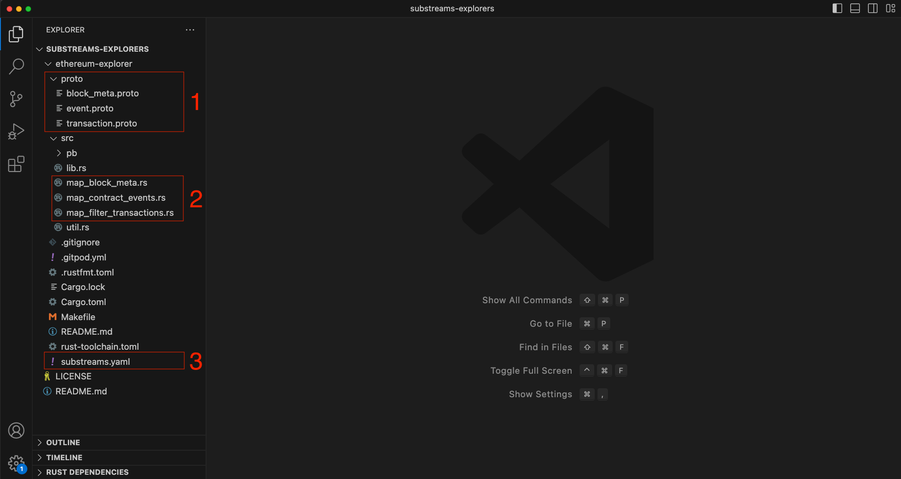
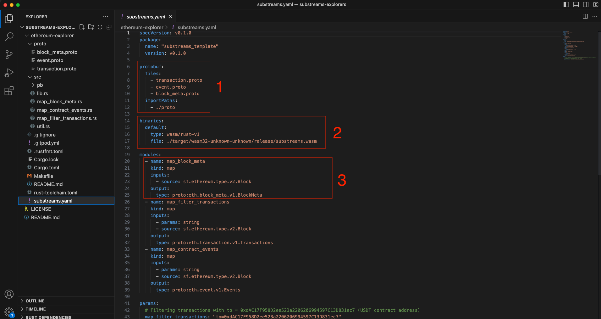

# Substreams Explorers

Getting started with Substreams might feel challenging, but you are not alone! The Substreams Explorers are a set of projects, modules, and code samples that allow you to _explore_ and discover the main features of Substreams.

As you already know, Substreams supports streaming from several blockchains, and every blockchain holds a different data model. This is why the data structures used change from one blockchain to the other. For example, an Ethereum block is represented by the [`sf.ethereum.type.v2.Block`](https://github.com/streamingfast/firehose-ethereum/blob/develop/proto/sf/ethereum/type/v2/type.proto) Rust struct, while a Near block is represented by [`sf.near.type.v1.Block`](https://github.com/streamingfast/firehose-near/blob/develop/proto/sf/near/type/v1/type.proto).

## Before You Begin

Before you start coding, there are several dependencies you must install on your computer.

### The GitHub Repository
The `https://github.com/streamingfast/substreams-explorers` GitHub repository contains all the Substreams Explorers currently available. You can simply clone the repository:

```
$ git clone https://github.com/streamingfast/substreams-explorers
```

### The Substreams CLI

The Substreams CLI allows you to run, package, and visualize your Substreams. Make sure you have the CLI installed by following this [simple tutorial](/getting-started/installing-the-cli.md).

### Substreams Basics

You should be familiar with the basic Substreams terminology, which includes:
- Modules (understanding the difference between a `map` and a `store` module)
- Protobufs (understanding what they are)


## Ethereum Explorer

The Ethereum Explorer consists of several Substreams modules showcasing the most basic operations that you can perform with Substreams on the Ethereum blockchain.

You can find the Ethereum Explorer at [https://github.com/streamingfast/substreams-explorers](https://github.com/streamingfast/substreams-explorers)

### Modules

The modules in this repository answer some interesting questions when developing a blockchain application:

#### How Can You Get the Basic Information of a Block?

For every block, the `map_block_meta` module retrieves the most relevant information of the block (number, hash, and parent hash).

#### How Can You Retrieve Transactions By Their From or To Fields?

Given any combination of two parameters (`from` and `to`), the `map_filter_transactions` filters a transaction among all transactions in the blockchain. This involves:

1. Providing the filters (only the `from` fields, only the `to` field, both `from` and `to` fields, or none)
1. Iterating over all the transactions.
2. Filtering the transactions, according to the parameters provided. For example, `from == tx_from`, `from == tx_from and to == tx_to`.

#### How Can You Retrieve All the Events For a Specific Smart Contract?

Given a smart contract address parameter (`contract_address`), the `map_contract_events` module retrieves all the events related to a specific smart contract. This involves:

1. Iterating over all the logs of a block.
2. Filtering the log, where the `address` field is equal to the smart contract address parameter (`address == contract_address`).

In the following sections, you will go through every module, run the corresponding Substreams, and understand every piece of code. Let's go!

### The Project Structure

<figure><figcaption><p>Ethereum Explorer Project Structure</p></figcaption></figure>

1. The `proto` folder contains the Protobuf definitions for the transformations.
In this example, there are three Protobuf objects, which are the outputs of the Substreams module mentioned in the previous section: BlockMeta (which represents the information of an Ethereum block), Transaction (which is an abstraction for an Ethereum transaction), and Event (an abstraction for an Ethereum event).
2. The `src` folder contains the source code of the Substreams transformations. Every module has its corresponding Rust file.
3. The `substreams.yml` is the Substreams manifest, which defines relevant information, such as the inputs/outputs of every module or the Protobuf files.

#### The Substreams Manifest

Let's take a closer look at the Substreams manifest (`substreams.yml`):

<figure><figcaption><p>Ethereum Explorer Manifest</p></figcaption></figure>

1. The `protobuf` section specifies the location of the Protobuf files used in the Substreams (i.e. where are the files defining the objects that you are going to use as output). In this example, the files are under the `proto` folder.
2. When you run Substreams, you are really executing a Rust application inside a WASM container. Therefore, Substreams needs to know where is the WASM executable. The `binaries` section specifies the location of the WASM executable.
3. Every module must be defined in the manifest, along with its `kind`, `inputs` and `outputs`.
In this example, the `map_block_meta` module is a mapper that takes a raw Ethereum block as input ([`sf.ethereum.type.v2.Block`](https://github.com/streamingfast/firehose-ethereum/blob/develop/proto/sf/ethereum/type/v2/type.proto)) and outputs the `BlockMeta` protobuf. Basically, the `map_block_meta` module returns a reduced version of the Ethereum block.

